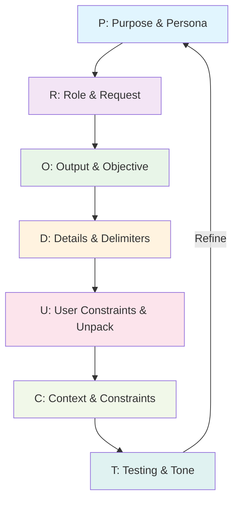
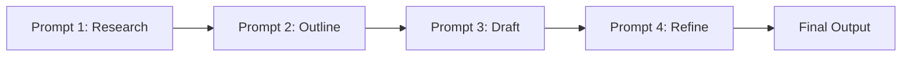

# The P.R.O.D.U.C.T. Prompting Framework

> *"A good prompt is a lever; give it the right fulcrum and it can move an AI."* — *adapted from Archimedes, via Paul Graham‑ish commentary*

---

Getting a large language model to do what you want is like talking to a very smart, very literal, and infinitely patient intern. They have all the knowledge in the world but no context. No idea who you are, what you need, or what "good" looks like.

You have to tell them.

Most people talk to AIs the way they talk to search engines. A few keywords, maybe a question. That works for simple things. But to build things, to get novel and high-quality work, you need to be more explicit. You need to give them a complete picture of the task.

Great software grows from small, sharp insights compounded over time. Most prompts are mush—half‑baked instructions thrown at a large language model. The **P.R.O.D.U.C.T.** framework exists because clarity scales and ambiguity does not.

---

## The Framework Overview

**P.R.O.D.U.C.T.** is a systematic approach to prompt engineering that transforms scattered thoughts into deterministic, high-quality outcomes. Each letter represents a critical pillar of a well-structured prompt:

| Letter | Pillar | Core Question |
| :---: | --- | --- |
| **P** | **Purpose & Persona** | *What's the goal and who should the AI be?* |
| **R** | **Role & Request** | *What authority and what core action?* |
| **O** | **Output & Objective** | *What format and why does success matter?* |
| **D** | **Details & Delimiters** | *What facts and how to structure them?* |
| **U** | **User Constraints & Unpack** | *What rules and how to reason?* |
| **C** | **Context & Constraints** | *What background and what boundaries?* |
| **T** | **Testing & Tone** | *How to validate and how to sound?* |

---

## Framework Flow Visualization



---

## The Anatomy of a P.R.O.D.U.C.T. Prompt

```text
P: <Purpose> · <Persona>
R: <Role> · <Request>
O: <Output spec> · <Objective>
D: <Details & data> · <Delimiters>
U: <User constraints> · <Unpack directive>
C: <Context & continuity> · <Constraints>
T: <Testing hook> · <Tone>
```

---

## **P** – Purpose & Persona

**Purpose** declares the ultimate goal in one declarative line. **Persona** assigns the model a specific identity with domain authority, grounding its vast knowledge in a particular point of view.

### Examples

**Example 1: The Security Expert**
```text
P: Identify security vulnerabilities in the provided code · You are a senior security engineer at Stripe with 10+ years experience in application security and threat modeling.
```

**Example 2: The Marketing Copywriter**
```text
P: Create compelling email subject lines for a product launch · You are a senior copywriter at a direct-to-consumer startup selling premium coffee equipment to discerning aficionados.
```

**Example 3: The Technical Educator**
```text
P: Explain complex physics concepts to beginners · You are a physics professor at a top-tier university with a gift for making difficult topics accessible through clear analogies.
```

---

## **R** – Role & Request

**Role** establishes the model's authority and expertise. **Request** is the core action verb—what you actually want the model to *do*. Be direct and unambiguous.

### Examples

**Example 1: Simple Request**
```text
R: Code reviewer · Write a Python script
```

**Example 2: Specific Request**
```text
R: Marketing strategist · Generate five distinct email subject lines
```

**Example 3: Complex Request**
```text
R: Data analyst · Summarize the dataset, extract key patterns, and generate three actionable recommendations
```

---

## **O** – Output & Objective

**Output Spec** defines the deliverable type, format, and length. **Objective** explains why success matters—the strategic context that helps the model make better micro-decisions.

### Examples

**Example 1: Technical Output**
```text
O: Single Python file with docstrings and type hints · Automate daily CSV processing to save 1 hour of manual work
```

**Example 2: Marketing Output**
```text
O: JSON object with 3 ad variations (headline max 50 chars, body max 200 chars) · Drive pre-order sales for new product launch
```

**Example 3: Executive Output**
```text
O: 250-word Markdown summary with 3-bullet risk list · Enable executive to speak confidently about quarterly results in board meeting
```

---

## **D** – Details & Delimiters

**Details & Data** supply concrete facts, constraints, and examples. **Delimiters** use markers to separate instructions, context, and desired output structure, making prompts machine-readable.

### Examples

**Example 1: Data with Structure**
```text
D: Founders 68%, investor 20%, option pool 12%; SAFE post-money; uncapped MFN clause
### TERM SHEET ###
[Term sheet content here]
### DESIRED OUTPUT ###
[Output format specification]
```

**Example 2: Technical Specifications**
```text
D: Python 3.12, OWASP Top 10 compliance, no hard-coded secrets
```delimited code blocks```
Input: [code diff]
Output: JSON security analysis
```

---

## **U** – User Constraints & Unpack

**User Constraints** encode tone, style, voice, or banned content. **Unpack** forces step-by-step reasoning, like asking a student to show their work.

### Examples

**Example 1: Style Constraints**
```text
U: Tone = candid but optimistic; no legal disclaimers; avoid jargon · Think step-by-step before providing final answer
```

**Example 2: Technical Constraints**
```text
U: No external libraries; severity ∈ {low,medium,high,critical} · First create execution plan, then write code
```

**Example 3: Content Constraints**
```text
U: Casual, friendly tone with contractions; avoid clichés like "game-changer" · Explain reasoning for each recommendation
```

---

## **C** – Context & Constraints

**Context & Continuity** threads background information, prior conversations, and edge cases. **Constraints** set non-negotiable rules—what the model must and must not do.

### Examples

**Example 1: Technical Context**
```text
C: Previous $500k friends-and-family note converts; mention if relevant · Must be ≤ 220 words; no price mentions
```

**Example 2: Security Context**
```text
C: Earlier reviews missed logging misconfigurations—double-check those · Follow OWASP Top 10; max 30 issues
```

**Example 3: Content Context**
```text
C: Third email in 5-part welcome series; first two covered brand story · Under 150 words; no technical jargon
```

---

## **T** – Testing & Tone

**Testing Hook** embeds self-grading rubrics or quality checks. **Tone** prescribes the voice and personality of the output.

### Examples

**Example 1: Quality Gates**
```text
T: Score clarity 0-10 per paragraph; rewrite any below 9 · Direct, professional tone
```

**Example 2: Validation Rubric**
```text
T: Provide summary_risk_score = average(severity→score) where low=1...critical=4 · Terse, technical tone
```

**Example 3: Self-Assessment**
```text
T: Rate output for clarity, accuracy, and actionability (1-10 each) · Conversational but authoritative tone
```

---

## Complete Example: Executive Summary Generator

### P.R.O.D.U.C.T. Prompt

```text
P: Draft a 200‑word executive summary of the attached 30‑page seed‑round term sheet · You are a former YC partner who has evaluated 400+ early‑stage deals.

R: Deal evaluation expert · Summarize key terms and risks

O: Markdown format with two paragraphs plus 3‑bullet risk list · Help founders brief investors quickly and confidently

D: Founders own 68%, investor takes 20%, option pool 12%; SAFE post‑money; uncapped MFN clause
### TERM SHEET ###
[30-page term sheet content]
### OUTPUT FORMAT ###
**Executive Summary**
[Paragraph 1]
[Paragraph 2]
**Key Risks**
1. [Risk 1]
2. [Risk 2]  
3. [Risk 3]

U: Tone = candid but optimistic; no legal advice disclaimers · Think through implications before writing

C: This company previously raised a $500k friends‑and‑family note; mention conversion if relevant · Must be under 220 words total

T: Score each paragraph for clarity 0‑10; rewrite automatically if below 9 · Professional but accessible tone
```

### Generated Output

```markdown
**Executive Summary**

Our seed‑round SAFE allocates 20% post‑money to NewWave Ventures, leaving founders at a healthy 68% and a pre‑approved 12% option pool to hire senior talent. The MFN clause is uncapped, a silent vote of confidence rather than a valuation drag. With $2.5M in new capital the team extends runway to 22 months, converting the prior $500k note seamlessly at the same terms.

The deal structure favors founders while giving investors meaningful upside protection. Standard liquidation preferences and anti‑dilution provisions create alignment without excessive downside protection. Board composition remains founder‑controlled with one investor seat, maintaining operational flexibility during the critical product‑market fit phase.

**Key Risks**
1. MFN exposure if future rounds price lower than $25M post‑money
2. Option pool refresh may dilute founders to <55% by Series A
3. Governance leans founder‑friendly; investor oversight is minimal

> *Clarity scores: P1 = 9.5, P2 = 9.2 — no rewrite triggered.*
```

---

## Advanced Patterns

### Chained P.R.O.D.U.C.T.s

Break massive tasks into sequential prompts, each inheriting context from the previous and mutating the purpose.



### Conditional Logic

Define multiple execution paths based on variables:

```text
U: if audience == "exec": write at grade 10, skip jargon
   if audience == "engineer": dive into stack traces, link RFCs
```

### Dynamic Testing Rubrics

Embed meta-evaluation so the model polices its own output:

```text
T: Validate against rubric: correctness (boolean), efficiency (1-5), readability (1-5) · Provide JSON validation object
```

---

## Common Pitfalls & Solutions

| Anti‑Pattern | Symptom | P.R.O.D.U.C.T. Fix |
| --- | --- | --- |
| Vague **Purpose** | Rambling, unfocused answers | Compress to one declarative sentence |
| Missing **Persona** | Generic, uninspired voice | Assign specific domain expertise |
| Loose **Output** | Wrong format or length | Specify exact schema and constraints |
| Sparse **Details** | Hallucinated information | Feed concrete, verifiable facts |
| Absent **Testing** | No quality control | Add rubrics with numeric thresholds |

---

## Pre-Send Checklist

Before hitting send, verify:

- [ ] **P** is singular and outcome‑based with clear persona
- [ ] **R** has explicit action verb and authority
- [ ] **O** specifies exact format, length, and success criteria
- [ ] **D** includes concrete facts and clear delimiters
- [ ] **U** encodes style rules and reasoning requirements
- [ ] **C** captures background and hard constraints
- [ ] **T** includes validation rubric and tone specification

---

## Conclusion

Most people treat prompts like wishes tossed into a well. Engineers know better: tighten the spec, and you tighten the loop between intention and reality. The **P.R.O.D.U.C.T.** framework isn't magic—it's engineering discipline wrapped in a seven‑letter mnemonic.

Using a structured approach like P.R.O.D.U.C.T. transforms prompting from a guessing game into an engineering discipline. You define the problem so thoroughly that the right answer becomes the most likely outcome. It's more work up front, but it saves you from endless cycles of re-prompting and correction.

It's how you get the model to build for you, not just talk with you. Write once, hit run, ship the future. 