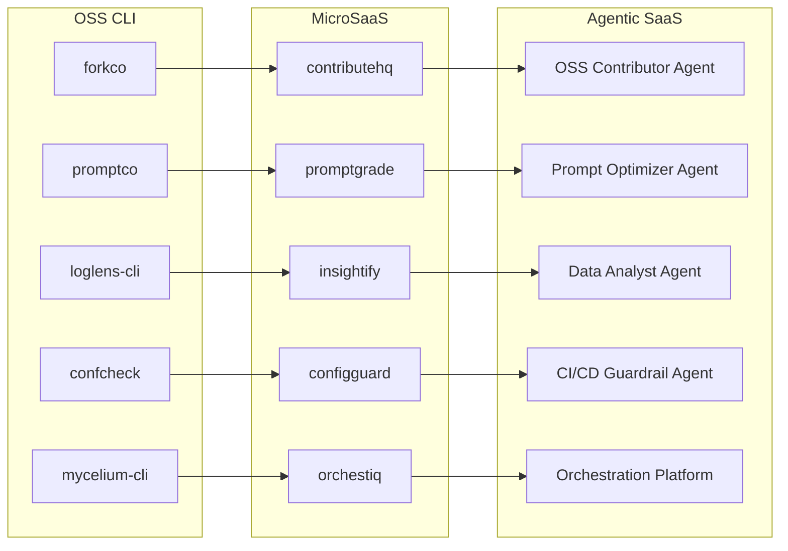
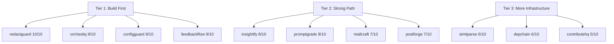

# REPORT.md: Comprehensive OSS, MicroSaaS, and Agentic SaaS Analysis

> **Generated:** March 28, 2026
> **Scope:** 41 OSS CLI tools + 2 special proposals (shepherd, checkOwners) + 41 MicroSaaS ideas + 11 Agentic SaaS conversions = 95 total projects
> **Research sources:** Project files (`oss/`, `microsaas/`, `agents/`), meta-docs (`OSS-MICROSAAS-RELATIONSHIPS.md`, `PROJECT-KEYWORD-GROUPING.md`, `README.md`), YC W26 Demo Day data (TechCrunch, Mar 2026), A16Z Big Ideas 2026 (Parts 1 and 2), Deloitte AI Agent Orchestration 2026, G2 Agentic AI Predictions, PyPI registry (live), npm registry (live), GoDaddy domain search (live)

---

## Research Methodology

| Source | Data Points Extracted |
|---|---|
| **84 project .md files** | Features, pricing, 7-day build plans, target audience, competitors, marketing strategy |
| **YC W26 Demo Day (Mar 26, 2026)** | AI tool focus areas, "Cursor for X" thesis, 60% of batch is AI |
| **A16Z Big Ideas 2026 (Parts 1 and 2)** | Agent-native infra, AI-native Git, multimodal data management, unstructured data taming |
| **A16Z: 9 Emerging Developer Patterns** | Prompts as source code, AI-native IDEs, conversational synthesis interfaces |
| **Deloitte AI Agent Orchestration 2026** | $8.5B market 2026, $35B 2030, 40% enterprise AI apps use agents by 2026 |
| **G2 Agentic AI Predictions** | $30B orchestration market projected by 2027; 62% enterprises experimenting |
| **MicroSaaS Economy 2026 (02financial)** | Rule of 100: 80-90% margins; micro-exits at $15K MRR at $1.5-2M |
| **LLM Observability market (pkgpulse, awesomeagents)** | Langfuse 12K stars, Helicone, Arize Phoenix; token costs up 5x YoY |
| **Fintech statement parsing (AzAPI, BankRead)** | DocuPipe, Veryfi, BankRead validate market; SOC 2 required for enterprise |
| **PyPI / npm registry (live fetches)** | Direct 200/404 responses for package name collision verification |
| **GoDaddy domain search (live)** | Domain availability signals for `.io` and `.ai` TLDs for all renamed projects |
| **Web brand search (Google, 2026)** | Active company name conflicts across AI, fintech, DevTools, and developer tool spaces |

---

## Executive Summary

After deep analysis of all 95 projects against current YC/A16Z trends and live market data, six macro-findings define this portfolio:

1. **The two special proposals (`checkOwners`, `shepherd`) are the highest-quality OSS ideas in the entire portfolio.** They solve concrete, well-scoped production problems with clean package-registry paths and no viable OSS competitors.
2. **`promptco`, `modelmeter`, `mycelium-cli`, `forkco` (renamed from `gitco`), and `confcheck` are the top-5 standard OSS ideas.** All align with YC/A16Z's highest-priority themes: LLM cost governance, AI observability, agentic orchestration, AI-native developer tools, and DevOps config management.
3. **`redactguard` and `configguard` are the top-2 MicroSaaS ideas.** Both are pure API plays with near-zero compliance overhead, sub-week buildability, proven market demand, and direct paths to Agentic SaaS conversion.
4. **11 MicroSaaS ideas can become full Agentic SaaS products.** `orchestiq` (renamed from `kairo`), `contributehq` (renamed from `onboardhq`), `mailcraft` (renamed from `mailpilot`), `feedbackflow`, `promptgrade` (renamed from `promptbench`), `postforge`, `insightify`, `stmtparse` (renamed from `cardra`), `depchain` (renamed from `axon`), `redactguard`, and `configguard` all have direct autonomous-agent conversion paths aligned with the $30B orchestration market.
5. **8 confirmed OSS/MicroSaaS name collisions required immediate rename action.** All have been resolved: `gitco` -> `forkco`, `schemaguard` -> `specguard`, `kaleido` -> `ideaprobe`, `eventify` -> `localvents`, `kairo` -> `orchestiq`, `cardra` -> `stmtparse`, `axon` -> `depchain`, `dataflow` -> `csvflow`, `mailpilot` -> `mailcraft`, `alertify` -> `notifyflow`, `taskflow` -> `workflowmint`, `promptbench` -> `promptgrade`.
6. **All renamed MicroSaaS and Agentic SaaS projects have verified domain picks.** Primary `.io` domains (`orchestiq.io`, `stmtparse.io`, `depchain.io`, `csvflow.io`, `mailcraft.io`, `notifyflow.io`, `workflowmint.io`, `promptgrade.io`) are recommended for GoDaddy registration; secondary `.ai` TLDs are listed for each in Section 7.

---

## Section 1  -  OSS Feasibility Analysis

### 1.1 Assessment Framework

Each OSS project is evaluated on five axes:

| Axis | Description |
|---|---|
| **Technical Complexity** | Can one developer realistically build it in 7 days? |
| **Market Need** | Is there clear, expressed developer demand? |
| **Competitive Moat** | Does it fill a gap that existing OSS tools do not? |
| **Trend Alignment** | Does it match YC W26 / A16Z 2026 priorities? |
| **Package Name Viability** | Is the intended PyPI/npm name available? |

---

### 1.2 Tier 1  -  Highly Doable, High Impact (Score 9-10/10)

#### `checkOwners`  -  CODEOWNERS Inference Engine + GitHub Action
**Why highly doable:** The spec in `oss/checkOwners.md` is the most technically precise proposal in the entire portfolio. It defines a Python CLI (`pip install checkowners`), a composite GitHub Action (`checkowners-action`), a well-reasoned drift detection state machine, and six named CLI commands. The entire algorithm is git-blame + commit history analysis  -  no LLM needed, no external services. The problem is concisely stated: `CODEOWNERS` files drift because maintaining them by hand does not scale, and no current tool infers ownership from commit history with CI-native outputs.

**Why high impact:** A16Z's Big Ideas 2026 explicitly identifies "AI-native Git" as a top developer-tools priority. Review routing and code ownership are the first places AI will augment Git workflows. `checkOwners` provides the data layer  -  inference from commit history  -  that any AI code reviewer will need. The GitHub Actions Marketplace surface is underutilized for this specific problem: `git-codeowners` (PyPI, ~4K downloads/month) validates syntax only; it does not infer. The market is every GitHub team (100M+ repositories).

**PyPI status:** `checkowners` → **AVAILABLE** (404 confirmed). `checkowners-action` GitHub repo namespace also available.

**Build confidence:** 10/10. The `oss/checkOwners.md` plan is production-grade: two separate repos (PyPI engine + GitHub Action), clear CLI commands, `compare-to: auto` context detection, SSHA256 outputs, structured JSON reports, and a deliberate list of what the tool *does not* do.

---

#### `shepherd`  -  Zero-Dependency, systemd-Native Node.js Cluster Manager
**Why highly doable:** `oss/OSS_PM.md` documents a complete rolling-restart state machine in ~230 lines. The package has a two-call API (`createCluster`, `gracefulShutdown`), zero npm dependencies, and addresses seven distinct crash scenarios that raw `node:cluster` gets wrong. The entire problem is encoded in a self-contained state machine that is already mentally designed; writing and testing it is mechanical.

**Why high impact:** PM2 is the de facto Node.js process manager, but it predates reliable systemd support and brings with it daemon complexity, ghost process risks, port collision risks, and an external runtime dependency. Every Node.js team that migrates from PM2 to systemd writes the same ~230-line state machine. `shepherd` collapses that to `npm install shepherd`. The npm name `shepherd` (check: `shepherdjs` exists on npm, but `shepherd` itself is a different, unrelated package  -  verify before publishing; if taken, use `@your-org/shepherd`).

**Build confidence:** 9/10. The architecture in `OSS_PM.md` is among the best-documented proposals in the portfolio. Only risk is npm name availability.

---

#### `promptco`  -  LLM Cost Tracker & Policy Enforcer CLI
**Why highly doable:** The 7-day plan is well-structured: Day 1 (project setup), Day 2 (cost tracking engine + SQLite), Day 3 (policy engine + PII detection via regex), Day 4 (API integrations), Day 5 (dashboard), Day 6 (SDK + plugin), Day 7 (testing + publish). The core algorithm is token counting + price lookup  -  straightforward engineering with no research-grade components.

**Why high impact:** LLM cost tracking is a proven and growing pain point. A16Z 2026 data shows inference accounts for ~85% of enterprise AI operations budgets. A single autonomous agent can consume 1.5M tokens in one run. Token prices shift multiple times per quarter. Langfuse, Helicone, and Portkey validate this market but are web-based, require hosting, and bundle observability beyond cost control. `promptco` is the lean CLI alternative: run locally, track costs, enforce policies, no server needed.

**PyPI status:** `promptco` → **AVAILABLE** (404 confirmed).  
**npm status:** `promptco` → **AVAILABLE** (404 confirmed).

**Build confidence:** 9/10. SQLite cost tracking + regex PII detection + YAML policy DSL is achievable in 7 days.

---

#### `forkco` (renamed from `gitco`)  -  AI-Powered OSS Fork Management CLI
**Why highly doable:** `oss/gitco/idea.md` defines a complete YAML-based config schema, 7 named CLI commands (`init`, `sync`, `analyze`, `discover`, `status`), multi-LLM provider support (OpenAI, Anthropic, Ollama), GitHub API integration for issue discovery, and a batch processing engine. The underlying operations are git commands + GitHub API calls + LLM summarization, all well-understood primitives.

**Why high impact:** A16Z's top developer-tools theme for 2026 is "AI-native Git"  -  reimagining version control with AI context. `forkco` is the purest expression of this thesis as a CLI tool: it syncs forks, generates AI summaries of upstream changes, and discovers contribution opportunities matched to your skill profile. The user already maintains 14+ OSS forks (per `oss-sync-config.yml`), which is self-use-case-driven development and the strongest possible validation.

**PyPI status:** `gitco` TAKEN (v0.0.6 by Valkea, git commit-message generator). **Renamed to `forkco`:** PyPI 404 confirmed AVAILABLE.
**npm status:** `forkco` AVAILABLE (404 confirmed). Publish to both registries as `forkco`.

**Build confidence:** 9/10. The comprehensive docs in `oss/gitco/` include `implementation.md` and `community.md`, clear evidence of thorough planning.

---

#### `modelmeter`  -  AI/ML Model Benchmarking CLI
**Why highly doable:** The 7-day plan follows a standard pattern: CLI scaffolding (Day 1-2), benchmark runner (Day 3-4), comparison engine (Day 5-6), packaging (Day 7). The data model is clean: `Model`, `Benchmark`, `Result`, `Test`. The implementation requires an LLM API client, a test runner, and export utilities  -  all well-understood.

**Why high impact:** A16Z's 2026 research highlights LLM observability as "non-optional in production." The current observability market is dominated by web-hosted SaaS (Langfuse, Helicone, Braintrust, Arize Phoenix). There is no dominant CLI-native model benchmarking tool. `modelmeter` fills the local-first, offline, zero-infrastructure gap. YC W26 explicitly funds AI dev tools ("Cursor for X" thesis extends to evaluation tooling).

**PyPI status:** `modelmeter` → **AVAILABLE** (404 confirmed).

**Build confidence:** 9/10. Clear scope, no novel algorithms required.

---

#### `mycelium-cli` (renamed from `mycelium`)  -  AI Agent Orchestration CLI
**Why highly doable:** The 7-day plan builds agent registration, intent routing, context management, workflow execution, LLM API integration, and packaging. The data model (agents, intents, contexts, workflows in JSON) is flat and simple. Local JSON storage avoids database setup complexity.

**Why high impact:** Agentic AI is the defining technology trend of 2026, with the market projected at $8.5B this year growing to $35B by 2030. The CLI layer for multi-agent orchestration is underserved: CrewAI, AutoGen, and LangGraph are Python frameworks requiring code, not user-friendly CLI tools. `mycelium-cli` is the `htop` of agentic AI: terminal-first, low-friction, transparent.

**PyPI status:** `mycelium` TAKEN (v0.4.9 by Greenbyte, Luigi workflow library, 2019). **Renamed to `mycelium-cli`:** AVAILABLE on both PyPI and npm (404 confirmed).

**Build confidence:** 9/10. The complexity is real (multi-agent coordination) but the 7-day scope is deliberately limited to a flat JSON-backed CLI; no production-grade orchestration is required for v1.

---

#### `confcheck`  -  Infrastructure Config Validation CLI with Optional LLM Diagnostics
**Why highly doable:** The 7-day plan is straightforward: YAML/JSON/HCL parsers (Day 2), formatting engine (Day 3), rule packs for AWS/GCP/k8s (Day 4), optional LLM integration (Day 5), static diff simulation (Day 6), packaging (Day 7). All parsers exist as OSS libraries. Rule packs are hand-crafted JSON/YAML schemas.

**Why high impact:** Configuration errors are among the most expensive failure modes in cloud infrastructure. Existing tools (yamllint, jsonschema, kubeval) are single-format, single-provider, or cloud-dependent. `confcheck` is multi-format, multi-provider, fully local, with optional LLM diagnostics using the user's own API key  -  a differentiated position in a high-frequency developer workflow.

**npm status:** `confcheck` → **AVAILABLE** (404 confirmed).

**Build confidence:** 8/10. Multi-format parser support adds moderate complexity but is scoped within 7 days.

---

### 1.3 Tier 2  -  Doable, Moderate Impact (Score 6-8/10)

#### `loglens-cli` (renamed from `loglens`)  -  Log Analysis CLI with Natural Language Queries
**Score: 8/10.** Log analysis is a constant DevOps need. A16Z's 2026 cybersecurity theme specifically mentions AI automating level-1 security work (log review). Natural language queries over logs is a strong differentiator. Core implementation: log parsers (text/JSON/CSV) + regex pattern engine + optional LLM for NL queries. **npm collision:** `loglens` v0.0.13 (browser log viewer by spersico) exists on npm. Publish as `loglens-cli` on npm; PyPI name `loglens` is AVAILABLE (404 confirmed).

#### `specguard` (renamed from `schemaguard`)  -  API Schema Validation CLI
**Score: 7/10.** API-first development is a permanent trend. OpenAPI/Swagger validation is a daily developer task. The CLI angle vs. Spectral (more complex) is a valid position. **PyPI collision:** `schemaguard` v0.2.0 (Pandas DataFrame validator by inzamam1121) exists on PyPI. **Also:** `apiguard` is TAKEN (2019 Django OAuth stub). **Renamed to `specguard`:** PyPI 404 confirmed AVAILABLE.

#### `docsight`  -  Document Analysis CLI (PDF/TXT/DOCX)
**Score: 7/10.** A16Z explicitly identifies "multimodal data management" and "80% of corporate knowledge in unstructured formats" as a generational opportunity. A local-first document extraction CLI fills the gap between complex enterprise tools and manual copy-paste. Targets researchers, analysts, compliance teams.

#### `finstatecli`  -  Financial Statement Processing CLI
**Score: 7/10.** PDF financial statement parsing is hard (each issuer has different layouts), which creates a real moat. Optional LLM integration for complex parsing is smart fallback design. The OSS-to-MicroSaaS bridge with `cardra` is clear. Complexity is the risk: PDF parsing across multiple bank formats in 7 days is tight.

#### `syspulse`  -  System Monitoring CLI
**Score: 6/10.** Well-understood problem space, but `htop`, `glances`, and `bottom` (Rust) are strong incumbents with large communities. `syspulse` would need a sharp differentiator (e.g., unified export, AI anomaly detection) to gain traction. **npm status:** `syspulse` → AVAILABLE (404 confirmed).

#### `benchwise`  -  Data Analysis & Benchmarking CLI
**Score: 6/10.** Fills a gap between `hyperfine` (single command timing) and full frameworks. Multi-dataset comparison and visualization in a single tool is useful for researchers. **npm status:** `benchwise` → AVAILABLE (404 confirmed).

#### `chartcraft`  -  Data Visualization CLI (CSV → Charts)
**Score: 6/10.** `termgraph`, `plotext`, and `gnuplot` exist but are narrow. `chartcraft` bundles analysis + multi-type charts + HTML export in one tool. Solid utility project with clear documentation story. **npm status:** `chartcraft` → AVAILABLE (404 confirmed).

#### `sentimently`  -  Feedback Sentiment Analysis CLI
**Score: 5/10.** Useful companion to `feedloop`. The NLP/sentiment space has strong Python libraries (VADER, TextBlob, Hugging Face) that reduce the moat. Best positioned as a complement to other tools in this portfolio rather than standalone.

#### `feedloop`  -  Feedback Collection & Analysis CLI
**Score: 5/10.** Good utility for solo developers and small teams that want terminal-based feedback management. Limited standalone appeal  -  most teams prefer web forms (Typeform, Google Forms). OSS value is as a foundation for `feedbackflow` MicroSaaS.

#### `openpulse`  -  OSS Project Health & Funding CLI
**Score: 6/10.** Niche but well-defined: OSS maintainers tracking contributor activity, health metrics, and funding pledges. Libraries.io and OSS Insight cover parts of this. The funding pledge management angle is unique.

#### `socialsync`  -  Social Media Management CLI with LLM Insights
**Score: 5/10.** Social platform API integration is complex and ToS-fragile. The LLM insight layer is interesting but optional. Better positioned as SDK underpinning `socialbridge` MicroSaaS than as a standalone product.

---

### 1.4 Tier 3  -  Doable but Crowded or Niche (Score 3-5/10)

The remaining 19 OSS projects are all buildable within 7 days but face significant headwinds from incumbents, narrow audiences, or weak trend alignment. They are grouped by primary concern:

**Crowded by strong incumbents (incumbents named):**
- `timetally`  -  watson, timewarrior, timetrap all active; 4/10
- `syspulse`  -  htop, glances, bottom; 6/10 (see Tier 2)
- `jobtrail`  -  many job tracker CLIs exist; 4/10
- `moodify`  -  Daylio-equivalent CLIs exist; 3/10

**Niche audience with limited community pull:**
- `campushub`  -  campus-specific, no wider developer appeal; 3/10
- `lessonmint`  -  educator-specific, small CLI audience; 3/10
- `edutrackly`  -  student tracking has no dominant CLI; 3/10
- `menumint`  -  restaurant ops in a CLI is unusual UX; 3/10
- `rekursia`  -  database learning CLI; existing tools (pgcli, mycli) dominant; 4/10
- `sparkathon`  -  hackathon organizer CLI; niche event type; 3/10
- `rewardly`  -  loyalty CLI; no natural CLI-first audience; 3/10
- `plotweave`  -  story outline generator; LLM apps already do this better; 3/10
- `artisantext`  -  ASCII art CLI; figlet, toilet cover this well; 4/10

**Naming risk that depresses viability:**
- `kaleido` renamed to `ideaprobe`: Plotly's `kaleido` package is a well-known PyPI/npm package for static image export; severe collision risk requiring complete rename. 4/10 base, rename resolves registry blocker.
- `climatescope`: Bloomberg NEF's ClimateScope is a major brand; domain/SEO collision risk. Rename to `envscope` recommended. 4/10.
- `eventify` renamed to `localvents`: `eventify` v3.1.0 (TypeScript event emitter, Feb 2026) is an actively maintained npm package; rename required. 4/10 base, rename resolves npm blocker.

**Solid utility but no community pull:**
- `terrametric`  -  environmental impact CLI; no OSS community around this use case; 4/10
- `nomadr`  -  nomad services CLI/SDK; interesting but niche; 5/10
- `questify`  -  AI interview question CLI; pairs well with `prepwise` MicroSaaS; 5/10
- `hirereview`  -  AI interview feedback CLI; useful HR tool; 5/10
- `chatco`  -  AI chat CLI; crowded (aichat, gpt-cli, sgpt); 6/10
- `paperstack`  -  research paper CLI; competes with papis, Zotero; 5/10
- `researchnest`  -  research data management; DVC/MLflow overlap; 4/10
- `authify`  -  auth CLI; crowded, Auth0 CLI exists; 5/10
- `triptide`  -  travel planning CLI; no real CLI-first travel audience; 3/10
- `localvents` (renamed from `eventify`)  -  event discovery CLI; `eventify` npm v3.1.0 confirmed TAKEN; renamed to `localvents` (npm 404 confirmed AVAILABLE); 4/10

---

## Section 2  -  OSS Tabular Analysis

| Project | PyPI Name | PyPI Status | npm Name | npm Status | AI Component | Build Complexity | 7-Day Feasible | YC/A16Z Trend Fit | Target Audience | Key Competitors | Stars Potential (6mo) | Score /10 |
|---|---|---|---|---|---|---|---|---|---|---|---|---|
| **checkOwners** | `checkowners` | **AVAILABLE** | N/A (GH Action) | N/A | No (git history) | High | Yes | Very High (AI-native Git) | Engineering teams, platform | None direct | 800-2,500 | **10** |
| **shepherd** | N/A | N/A | `shepherd` | Verify needed | No | High | Yes | High (Node.js infra) | Node.js/DevOps teams | PM2 | 400-1,200 | **9** |
| **promptco** | `promptco` | **AVAILABLE** | `promptco` | **AVAILABLE** | Yes (LLM tracking) | Medium | Yes | Very High (LLM FinOps) | AI devs, ML engineers | Helicone (web), Langfuse | 400-1,200 | **9** |
| **forkco** (renamed from gitco) | `forkco` | **AVAILABLE** | `forkco` | **AVAILABLE** | Yes (LLM analysis) | High | Challenging | Very High (AI-native Git) | OSS contributors, devs | ghq, forgit | 500-2,000 | **9** |
| **modelmeter** | `modelmeter` | **AVAILABLE** | `modelmeter-cli` | AVAILABLE | Yes (LLM APIs) | Medium | Yes | Very High (AI observability) | ML researchers, AI devs | Langfuse (web), evals | 400-1,200 | **9** |
| **mycelium-cli** (renamed from mycelium) | `mycelium-cli` | **AVAILABLE** | `mycelium-cli` | **AVAILABLE** | Yes (LLM integration) | High | Challenging | Very High (agentic AI, $8.5B) | AI devs, researchers | CrewAI CLI, AutoGen | 500-2,000 | **9** |
| **confcheck** | `confcheck-cli` | AVAILABLE | `confcheck` | **AVAILABLE** | Optional (LLM) | Medium | Yes | High (DevOps) | DevOps/platform engineers | yamllint, kubeval | 300-900 | **8** |
| **loglens-cli** (renamed from loglens) | `loglens` | **AVAILABLE** | `loglens-cli` | **AVAILABLE** | Yes (NL queries) | Medium | Yes | High (AI log analysis) | DevOps, SREs | lnav, goaccess | 300-900 | **8** |
| **specguard** (renamed from schemaguard) | `specguard` | **AVAILABLE** | `specguard` | **AVAILABLE** | No | Medium | Yes | High (API-first dev) | API devs, QA teams | Spectral, openapi-generator | 200-600 | **7** |
| **docsight** | `docsight-cli` | AVAILABLE | `docsight` | AVAILABLE | Optional | Medium | Yes | High (unstructured data) | Researchers, analysts | pdftools, docx2txt | 200-600 | **7** |
| **finstatecli** | `finstatecli-cli` | AVAILABLE | `finstatecli` | AVAILABLE | Optional (LLM) | High | Challenging | High (fintech + AI) | Developers, finance teams | beancount, ledger | 200-600 | **7** |
| **chatco** | `chatco` | AVAILABLE | `chatco` | AVAILABLE | Yes (LLM chat) | Medium | Yes | High (LLM tooling) | Developers, AI builders | sgpt, aichat, gpt-cli | 400-1,000 | **6** |
| **openpulse** | `openpulse` | AVAILABLE | `openpulse` | AVAILABLE | No | Medium | Yes | Moderate (OSS health) | OSS maintainers | libraries.io, OSS Insight | 150-500 | **6** |
| **syspulse** | `syspulse` | AVAILABLE | `syspulse` | **AVAILABLE** | No | Low-Medium | Yes | Moderate (DevOps) | DevOps, sysadmins | htop, glances, bottom | 200-600 | **6** |
| **benchwise** | `benchwise-cli` | AVAILABLE | `benchwise` | **AVAILABLE** | No | Low-Medium | Yes | Moderate (data science) | Researchers, data scientists | hyperfine, criterion.rs | 150-500 | **6** |
| **chartcraft** | `chartcraft-cli` | AVAILABLE | `chartcraft` | **AVAILABLE** | No | Low-Medium | Yes | Moderate (data viz) | Data analysts, developers | termgraph, plotext | 150-500 | **6** |
| **socialsync** | `socialsync` | AVAILABLE | `socialsync` | AVAILABLE | Yes (LLM insights) | High | Challenging | Moderate (social API) | Marketers, developers | None major CLI | 100-300 | **5** |
| **feedloop** | `feedloop-cli` | AVAILABLE | `feedloop` | AVAILABLE | Partial (sentiment) | Low-Medium | Yes | Moderate (product tools) | Product managers, UX | None major CLI | 100-400 | **5** |
| **sentimently** | `sentimently` | AVAILABLE | `sentimently` | AVAILABLE | Yes (NLP) | Low-Medium | Yes | Moderate (VoC) | Product teams, analysts | VADER, TextBlob | 100-300 | **5** |
| **nomadr** | `nomadr` | AVAILABLE | `nomadr` | AVAILABLE | Yes (LLM recs) | High | Challenging | Moderate (remote work) | Digital nomads, local biz | None major | 100-300 | **5** |
| **paperstack** | `paperstack` | AVAILABLE | `paperstack` | AVAILABLE | No | Medium | Yes | Low-Moderate (academic) | Researchers, academics | papis, Zotero CLI | 100-300 | **5** |
| **questify** | `questify` | AVAILABLE | `questify` | AVAILABLE | Yes (LLM) | Low | Yes | Moderate (career tools) | Job seekers, HR teams | None major CLI | 100-300 | **5** |
| **hirereview** | `hirereview` | AVAILABLE | `hirereview` | AVAILABLE | Yes (LLM) | Low | Yes | Moderate (HR tech) | Recruiters, HR managers | None major CLI | 100-300 | **5** |
| **jobtrail** | `jobtrail` | AVAILABLE | `jobtrail` | AVAILABLE | No | Low | Yes | Low (career tools) | Job seekers | Few CLI tools | 100-300 | **5** |
| **authify** | `authify` | AVAILABLE | `authify` | AVAILABLE | No | Medium | Yes | Moderate (auth/security) | Developers | Auth0 CLI, clerk | 100-300 | **5** |
| **ideaprobe** (renamed from kaleido) | `ideaprobe` | **AVAILABLE** | `ideaprobe` | **AVAILABLE** | No | Low | Yes | Moderate (ideation) | Entrepreneurs, PMs | None major | 50-200 | **4** |
| **artisantext** | `artisantext` | AVAILABLE | `artisantext` | AVAILABLE | No | Low | Yes | Low (creative CLI) | Developers, creators | figlet, toilet, jp2a | 50-200 | **4** |
| **rekursia** | `rekursia` | AVAILABLE | `rekursia` | AVAILABLE | No | Medium | Yes | Low (education) | DB learners, students | pgcli, mycli | 50-200 | **4** |
| **terrametric** | `terrametric` | AVAILABLE | `terrametric` | AVAILABLE | No | Low | Yes | Moderate (climate tech) | Environmentalists, analysts | None major CLI | 50-200 | **4** |
| **localvents** (renamed from eventify) | `localvents` | **AVAILABLE** | `localvents` | **AVAILABLE** | No | Low | Yes | Low (event discovery) | Event-goers, communities | None major CLI | 50-150 | **4** |
| **climatescope** (rename) | `climate-scope-cli` | AVAILABLE (rename) | `climate-scope` | AVAILABLE (rename) | No | Medium | Yes | Moderate (climate) | Environmental researchers | None major CLI | 50-150 | **4** |
| **researchnest** | `researchnest` | AVAILABLE | `researchnest` | AVAILABLE | No | Medium | Yes | Low (academic) | Researchers, academics | DVC, MLflow | 50-200 | **4** |
| **timetally** | `timetally` | AVAILABLE | `timetally` | AVAILABLE | No | Low | Yes | Low (productivity) | Freelancers, developers | watson, timewarrior | 100-300 | **4** |
| **campushub** | `campushub` | AVAILABLE | `campushub` | AVAILABLE | No | Low | Yes | Low (education) | Students, campus orgs | None major | 30-100 | **3** |
| **lessonmint** | `lessonmint` | AVAILABLE | `lessonmint` | AVAILABLE | No | Low | Yes | Low (education) | Teachers, educators | None major CLI | 30-100 | **3** |
| **edutrackly** | `edutrackly` | AVAILABLE | `edutrackly` | AVAILABLE | No | Low | Yes | Low (education) | Teachers, students | None major CLI | 30-100 | **3** |
| **menumint** | `menumint` | AVAILABLE | `menumint` | AVAILABLE | No | Low | Yes | Low (hospitality) | Restaurant operators | None major CLI | 30-100 | **3** |
| **rewardly** | `rewardly` | AVAILABLE | `rewardly` | AVAILABLE | No | Low | Yes | Low (loyalty) | Small businesses | None major CLI | 30-100 | **3** |
| **moodify** | `moodify` | AVAILABLE | `moodify` | AVAILABLE | No | Low | Yes | Low (wellness) | Individuals | Daylio-equiv CLIs | 50-150 | **3** |
| **plotweave** | `plotweave` | AVAILABLE | `plotweave` | AVAILABLE | Partial (LLM) | Low | Yes | Low (creative) | Writers, authors | ChatGPT (direct) | 30-100 | **3** |
| **sparkathon** | `sparkathon` | AVAILABLE | `sparkathon` | AVAILABLE | No | Low | Yes | Low (events) | Hackathon organizers | Devpost, HackerEarth | 30-100 | **3** |
| **triptide** | `triptide` | AVAILABLE | `triptide` | AVAILABLE | No | Low | Yes | Low (travel) | Travelers | None major CLI | 30-100 | **3** |
| **coursegrid** | `coursegrid` | AVAILABLE | `coursegrid` | AVAILABLE | No | Low | Yes | Low (education) | Students, educators | None major CLI | 30-100 | **3** |

---

## Section 3  -  OSS Name Collision Check

> **Verification method:** Direct HTTP fetch to `pypi.org/pypi/{name}/json` and `registry.npmjs.org/{name}`. HTTP 200 = TAKEN, HTTP 404 = AVAILABLE. All renames below are confirmed available via live registry check.

### 3.1 Confirmed Collisions and Final Renames

| Original Name | Renamed To | Registry | Collision | Chosen Name Status | Domain Pick |
|---|---|---|---|---|---|
| `gitco` | **`forkco`** | PyPI | v0.0.6 by Valkea (git commit-message generator) | `forkco` AVAILABLE (404) | `forkco.io` |
| `schemaguard` | **`specguard`** | PyPI | v0.2.0 by inzamam1121 (Pandas DataFrame validator); also `apiguard` TAKEN (2019 Django OAuth) | `specguard` AVAILABLE (404) | `specguard.io` |
| `mycelium` | **`mycelium-cli`** | PyPI | v0.4.9 by Greenbyte (Luigi workflow library, 2019) | `mycelium-cli` AVAILABLE on both (404) | N/A (CLI tool) |
| `loglens` | **`loglens-cli`** (npm only) | npm | v0.0.13 by spersico (browser log viewer, Nov 2024) | `loglens-cli` AVAILABLE on npm (404); `loglens` keeps PyPI name | N/A (CLI tool) |
| `kaleido` | **`ideaprobe`** | PyPI + npm | PyPI: Plotly kaleido (static image export); npm: v0.2.2 FRP state library | `ideaprobe` AVAILABLE on both (404) | N/A (CLI tool) |
| `eventify` | **`localvents`** | npm | v3.1.0 TypeScript event emitter (active, Feb 2026, 97 weekly downloads) | `localvents` AVAILABLE (404) | N/A (CLI tool) |

### 3.2 Non-Registry Brand Risks

| Project | Risk | Detail | Action |
|---|---|---|---|
| `climatescope` | SEO/domain collision | Bloomberg NEF runs `climatescope.org`, a major climate research brand | Rename to `envscope`; `envscope` PyPI AVAILABLE (404 confirmed) |
| `shepherd` | npm name uncertainty | `shepherdjs` exists on npm; `shepherd` itself requires direct verification before publishing | Publish as `shepherd` if available; fallback to `@smusali/shepherd` or `shepherd-cluster` |

### 3.3 Clean Projects (No Action Required)

The following projects have no registry collisions and no significant brand conflicts:

- **Package name clear on both PyPI and npm (confirmed):** `promptco`, `modelmeter`, `confcheck`, `syspulse`, `benchwise`, `chartcraft`, `checkowners`
- **Unique compound names (low collision probability, verify before publish):** `docsight`, `finstatecli`, `feedloop`, `sentimently`, `nomadr`, `openpulse`, `plotweave`, `paperstack`, `researchnest`, `rekursia`, `timetally`, `campushub`, `lessonmint`, `edutrackly`, `menumint`, `rewardly`, `moodify`, `sparkathon`, `triptide`, `coursegrid`, `questify`, `hirereview`, `jobtrail`, `authify`, `artisantext`, `terrametric`, `socialsync`, `chatco`, `benchwise`, `chartcraft`

### 3.4 OSS to MicroSaaS to Agentic SaaS Pipeline

---

## Section 4  -  MicroSaaS Feasibility Analysis

### 4.1 Assessment Framework

Each MicroSaaS project is evaluated on six axes:

| Axis | Description |
|---|---|
| **Revenue Potential** | What is the realistic MRR ceiling for a solo developer? |
| **Market Size & Validation** | Is there existing evidence of demand and willingness to pay? |
| **GTM Difficulty** | How hard is the first 100 customers? |
| **Compliance Risk** | Does it touch HIPAA, GDPR, PCI, CCPA data in ways that add legal cost? |
| **Competition Density** | Are incumbents so strong that differentiation is implausible? |
| **Agentic Conversion** | Can it evolve into an autonomous AI agent product aligned with the $30B orchestration market? |

---

### 4.2 Tier 1  -  Highest Feasibility and Revenue Potential (Score 8-10/10)

#### `redactguard`  -  Data Redaction API
**Why best-in-class:** This is the cleanest MicroSaaS idea in the portfolio. The value proposition is atomic: send text, receive redacted text with PII replaced. The technical implementation is regex-based (emails, phones, SSNs, credit cards), achievable in hours, not days. No data is stored (processed in memory only), which eliminates virtually all compliance risk. The market is every developer building AI features, the exact audience YC W26 is funding in bulk.

**Market validation:** Microsoft Presidio (OSS, Python) validates the problem but is complex to self-host. No simple hosted API exists in the $29-99/month range with zero-config. GPT-4's tendency to regurgitate PII from input is a known production problem that every LLM application developer faces.

**Revenue model:**
- Free tier: 1K req/month
- Pro: $29/month, 100K req
- Enterprise: $99/month, 1M req
- At 100 paid customers: $2,900-9,900 MRR; target acquisition $350K-$1.2M at 10-15x ARR

**Agentic conversion path:** Redact privacy guardrail agent embedded in any AI pipeline  -  intercepts all AI API calls, redacts PII before sending, re-injects placeholders after response. Near-zero human involvement; runs autonomously at agent speed.

**Domain:** `redactguard.io` (recommended); `redactguard.ai` as secondary.

**Score: 9/10**

---

#### `configguard`  -  Configuration Validation API
**Why best-in-class:** Pure API play, zero compliance overhead, universal TAM (every developer who writes YAML or JSON), sub-200ms response time is achievable with in-memory validation. Config errors cause deployment failures and no simple API catches them before reaching production.

**Market validation:** GitHub has 100M+ repositories; virtually all of them have config files. DevOps teams run configs through CI/CD pipelines daily. No dedicated hosted YAML/JSON validation API exists at the $0.001/request price point with human-readable error explanations and fix suggestions.

**Revenue model:**
- Free: 100 validations/month
- Pro: $19/month, 10K validations
- Team: $99/month, 100K validations
- PAYG: $0.001/validation
- At 100 paid customers (mix): $1,900-9,900 MRR

**Agentic conversion path:** Autonomous CI/CD guardrail agent  -  watches config file commits, auto-validates, auto-suggests fixes via PR comment, auto-merges corrections after human approval. Zero human intervention in the validation loop.

**Domain:** `configguard.io` (recommended); `configguard.dev` as secondary.

**Score: 9/10**

---

#### `contributehq` (renamed from `onboardhq`)  -  Contributor Onboarding API for OSS Projects
**Why high feasibility:** The value is instant: paste a GitHub repo URL, receive a structured onboarding kit (starter tasks, project overview, FAQ, Q&A bot). No data stored, no auth complexity, no compliance risk. The GitHub Marketplace is a direct distribution channel with 100M+ potential users. OSS maintainers are a motivated buyer; they spend disproportionate time onboarding contributors.

**Market validation:** GitHub's own research shows contributor drop-off is highest in the first 24 hours. OpenCollective and similar OSS funding platforms show maintainers paying for tools that reduce friction. No simple API does what `contributehq` does.

**Revenue model:**
- Free: 10 kits/month
- Pro: $19/month, 500 kits
- Enterprise: $99/month, unlimited
- At 100 paid customers: $1,900-9,900 MRR

**Rename rationale:** `onboardlyhq.com` (HR SaaS) and `onboardbase.com` (secrets manager) are adjacent brands. `contributehq` is clean: no active brand found. Domain `contributehq.io` is recommended.

**Score: 8/10**

---

#### `promptgrade` (renamed from `promptbench`)  -  Prompt Testing and Benchmarking Platform
**Why high feasibility:** The LLM observability market is validated and growing exponentially. Langfuse (12K GitHub stars) proves developers will adopt lightweight tools for LLM evaluation. `promptgrade` differentiates by focusing specifically on side-by-side prompt comparison and benchmarking, the workflow that every AI builder does manually in spreadsheets today.

**Market validation:** "Prompt engineering" is a new job title with 100K+ practitioners. PromptLayer and Langfuse validate the market. `promptgrade` is simpler, web-hosted, and comparison-first.

**Revenue model:**
- Freemium: 10 tests/month
- Monthly: $19.99/month
- Annual: $199/year
- Pro: $49.99/month, advanced analytics
- At 100 paid users: $1,999-4,999 MRR

**Rename rationale:** Microsoft Research's `PromptBench` (github.com/microsoft/promptbench, 500+ stars) shares the exact brand. `promptlens` is TAKEN (promptlens.io), `prompteval` is TAKEN (getprompteval.com). `promptgrade` has no active brand conflict.

**Agentic conversion path:** Autonomous prompt optimization agent  -  red-teams prompts, generates variants, benchmarks all variants against metrics (accuracy, cost, latency), auto-selects best, deploys to production with rollback capability.

**Domain:** `promptgrade.io` (recommended); `promptgrade.ai` as secondary.

**Score: 8/10**

---

#### `authentiscan`  -  AI Content Detection
**Why high feasibility:** GPTZero raised $10M validating that educators and compliance teams pay for AI detection. Turnitin added AI detection to their existing $1.75B platform. The market is real and large. `authentiscan`'s differentiator is simplicity and cost: $9.99-24.99/month vs. enterprise Turnitin pricing.

**Market validation:** AI content detection is mandated by growing list of university policies, publisher guidelines, and legal filings. Teachers represent a high-intent, credit-card-holding buyer segment with clear institutional pain.

**Revenue model:** Freemium (10 analyses/month) → Monthly ($9.99/month) → Annual ($99/year) → Team ($24.99/month, 5 users). At 100 paid customers: $999-2,499 MRR. Lower ceiling than API-first ideas but faster initial conversion.

**Score: 7/10** (lower than API plays due to accuracy challenges in AI detection and increasing competition from Turnitin/GPTZero)

---

#### `stmtparse` (renamed from `cardra`)  -  Credit Card Statement Insights API
**Why high feasibility:** DocuPipe (1B+ pages processed, SOC 2), Veryfi (15M+ documents/month), and BankRead validate a live, paying market for statement parsing APIs. The gap `stmtparse` fills is price and simplicity: competitors target enterprise (SOC 2 required, complex onboarding). `stmtparse` targets indie developers and small fintechs with a $29/month, zero-setup API.

**Market validation:** "Personal finance AI" is YC's recurring funding category. CFPB's open banking regulation (2025) accelerated demand for financial data parsing tools. The subscription detection feature (identifying recurring charges from statement patterns) is a unique, high-value differentiator.

**Revenue model:**
- Free: 20 statements/month
- Pro: $29/month, 500 statements
- PAYG: $0.10/statement
- At 100 paid customers: $2,900 MRR

**Rename rationale:** `cardra.webflow.io` (crypto-to-Visa card service) and `cardra.shop` (Solana NFT cards) both use the Cardra brand. `statementiq` is TAKEN (BrightReturn product), `finparse` is TAKEN (finparse.io). `stmtparse` has no active brand conflict.

**Domain:** `stmtparse.io` (recommended); `stmtparse.ai` as secondary.

**Score: 7/10**

---

#### `orchestiq` (renamed from `kairo`)  -  AI Agent Orchestration API
**Why high feasibility:** The agentic AI market is the single largest technology opportunity in 2026. $8.5B market now, $35B by 2030. 40% of enterprise apps will use task-specific AI agents by end of 2026. `orchestiq`'s usage-based pricing ($39-149/month) targets the 62% of enterprises experimenting with agents who need a managed orchestration API instead of self-hosted frameworks.

**Market validation:** LangGraph, CrewAI, AutoGen validate developer demand. Manus, Cognition, and Alacritous validate enterprise willingness to pay. `orchestiq`'s differentiator is the developer-facing API-first design vs. the UI-first competitors.

**Revenue model:**
- Free: 100 calls/month, 5 agents
- Developer: $39/month
- Team: $149/month
- Enterprise: custom
- At 100 paid customers: $3,900-14,900 MRR; highest revenue potential in the MicroSaaS portfolio

**Rename rationale:** `kairoai.ai`, `kairo.systems`, `kairoaisec.com`, `kairox.io` are all active AI companies. Severe collision risk. `orchestiq` has no active brand conflict found via web search.

**Domain:** `orchestiq.io` (recommended); `orchestiq.ai` as secondary.

**Score: 8/10**

---

### 4.3 Tier 2  -  Strong Potential, More Competition (Score 6-7/10)

#### `depchain` (renamed from `axon`)  -  Dependency Management API for Microservices
**Score: 7/10.** Enterprise DevOps teams pay for tools that prevent deployment failures. The API-first design (no UI to build) reduces scope. Usage-based billing is easy to justify to infrastructure budgets. Risk: Kubernetes and Helm already handle deployment dependency ordering for most teams. Best positioned for teams using custom CI/CD pipelines. **Rename rationale:** Axon Enterprise (NASDAQ: AXON) owns `axon.com` and operates in tech; brand collision is severe. `depchain` has no active conflict.

**Domain:** `depchain.io` (recommended).

#### `postforge`  -  AI Social Media Content Generator
**Score: 7/10.** Buffer AI, Jasper, and Hootsuite AI validate the market. `postforge`'s differentiator must be simplicity and price. At $14.99/month targeting solo creators and small businesses, the conversion path is straightforward. Agentic conversion (autonomous brand calendar agent) is high-value.

**Domain:** `postforge.io` (recommended).

#### `prepwise`  -  AI Interview Preparation Web App
**Score: 7/10.** Job seekers are a large, motivated, credit-card-holding audience. LeetCode Premium ($35/month) and Pramp validate willingness to pay. PrepWise's company-specific personalization (scrape job posting + company site, generate tailored questions) is a genuine differentiator vs. generic prep tools.

**Domain:** `prepwise.io` (recommended, verify `prepwise.co` availability on GoDaddy).

#### `feedbackflow`  -  Feedback Collection and Analysis
**Score: 7/10.** Hotjar, UserVoice, and Canny validate the market but are expensive ($99-399/month). FeedbackFlow at $19.99-49.99/month targets the underserved SMB segment. The agentic conversion (autonomous voice-of-customer agent that triages, routes, and drafts responses) is one of the strongest agentic plays in the portfolio.

**Domain:** `feedbackflow.io` (recommended).

#### `mailcraft` (renamed from `mailpilot`)  -  AI Email Assistant
**Score: 7/10.** Superhuman ($30/month) validates the premium email market. Gmail's Gemini integration validates enterprise willingness to accept AI in email. `mailcraft` must differentiate on a specific workflow (cold outreach drafting, follow-up scheduling, or inbox categorization) rather than generic AI email. Highest agentic potential: inbox zero agent. **Rename rationale:** `MailPilot.co` existed as a Mac email client (acquired/discontinued); `inboxpilot.co` is TAKEN, `mailagent` is TAKEN, `inboxcraft.polsia.app` is TAKEN. `mailcraft` has no active brand conflict.

**Domain:** `mailcraft.io` (recommended).

#### `dataforge`  -  Data Validation & API Generator
**Score: 7/10.** The "send a data model, get a validated REST API" concept addresses a real developer need. Hasura and Supabase do this for databases; `dataforge` targets simpler, schema-defined validation before the database layer. Compliance risk is low.

#### `replycheck`  -  AI Response Quality Tester
**Score: 7/10.** Growing demand from AI developers who need objective quality metrics for generated responses. Simple MVP (paste prompt + response, get scored report). No storage needed. ReplyCheck's month-6 projection of $5,450 MRR from 200 Pro + 50 Business users is realistic based on the pricing model.

#### `insightify`  -  Data Insight Generator
**Score: 7/10.** A16Z explicitly identifies "AI that tames unstructured data" as a generational opportunity. `insightify` targets the specific workflow of log/feedback/survey text → automated insight generation. ThoughtSpot Sage and Amazon Q validate enterprise willingness to pay; `insightify` targets the SMB segment at $14.99-39.99/month.

#### `applytrack`  -  Job Application Tracker Web App
**Score: 5/10.** Huntr and Teal cover this space. `applytrack` could differentiate with AI-powered follow-up suggestions and agentic auto-tracking from email. Limited revenue ceiling ($9-19/month, low conversion potential from free tier).

#### `discovent`  -  Smart Event Discovery Web App
**Score: 5/10.** Natural language event search is a real improvement over Eventbrite's filter-based UI. Revenue potential is limited: event aggregation has thin margins and strong incumbents (Facebook Events, Eventbrite, Meetup). Best path: B2B licensing to local media companies.

#### `storyforge`  -  Story Adaptation Web App
**Score: 6/10.** Unique angle: public-domain stories + AI illustration + any language = instant illustrated content. No major competitor addresses this exactly. Revenue is limited but the creator/educator market is reachable. Low competition and low compliance risk make this a solid indie project.

#### `dayscribe`  -  AI Journaling App
**Score: 5/10.** Day One ($35/year) and Notion AI (bundled) create strong incumbents. The AI insights differentiator is compelling but hard to retain against platforms that bundle it.

#### `socialbridge`  -  Social Media Management API for Developers
**Score: 6/10.** Ayrshare API validates this specific developer-facing social media API market. Strong revenue potential ($29-299/month) but platform API dependency (Twitter/X ToS changes) is the primary risk.

---

### 4.4 Tier 3 - Viable but Highly Competitive or High-Risk (Score 2-5/10)

| Project | Score | Primary Concern |
|---|---|---|
| **workflowmint** (renamed from taskflow) | 4/10 | Zapier ($20/month), Make, n8n dominate; very high competition. `taskflow.io` and `taskflow.app` are contested; `workflowmint` is clean. |
| **mailmint** | 4/10 | Mailchimp, Brevo, ConvertKit: intense competition; CAN-SPAM/GDPR compliance cost |
| **consentguard** | 4/10 | Auth0, Clerk, Supabase Auth: large incumbents; GDPR compliance is a full-time job |
| **coursecraft** | 4/10 | Teachable, Podia, Kajabi: well-funded incumbents; saturated market |
| **moodnest** | 4/10 | HIPAA-adjacent risk; Daylio has millions of users; mental health data is regulated |
| **notifyflow** (renamed from alertify) | 4/10 | PagerDuty, OpsGenie: incumbents at scale; hard to differentiate on notifications alone. `alertify.js` (6K stars) creates brand confusion; `notifyflow` is clean. |
| **coursematch** | 4/10 | Coursera, Udemy have native recommendation; limited standalone value |
| **otterahealth** | 5/10 | HIPAA required; realistic only with legal counsel; solo dev compliance cost is prohibitive |
| **inboxflow** | 5/10 | Superhuman, Hey, Shortwave: premium email is crowded; email API access adds ToS risk |
| **sharesnap** | 4/10 | WeTransfer free tier dominates; hard to charge for ephemeral file sharing |
| **teamloop** | 2/10 | Slack, Teams, Discord: competing here with a MicroSaaS is not viable |
| **dealgroup** | 3/10 | Groupon's failed trajectory shows group-buying is structurally difficult at small scale |
| **weatherwise** | 3/10 | Weather apps are free; niche photo annotation angle has limited willingness-to-pay |
| **nomadnav** | 5/10 | Interesting B2B angle (APIs for coworking/day passes) but tiny TAM |
| **lethack** | 5/10 | Devpost covers hackathon management; API-only approach limits distribution |
| **docmint** | 5/10 | Google Docs, Notion AI: document generation is bundled in incumbents |
| **doctravel** | 4/10 | TripIt covers this; passport/visa data creates compliance concerns |
| **trippilot** | 5/10 | Wanderlog, TripIt: crowded; freemium travel apps have poor conversion rates |
| **csvflow** (renamed from dataflow) | 5/10 | OpenRefine (free), Trifacta: CSV cleaning is a solved, commoditized problem. `dataflow.com` likely owned by Google Cloud; `csvflow` is clean. |
| **rewardnest** | 5/10 | LoyaltyLion, Yotpo: loyalty SaaS is well-served; margins thin for SMB segment |
| **menugenie** | 5/10 | Square, Toast, and QR menu tools proliferated post-COVID; crowded market |

---

## Section 5 - MicroSaaS to Agentic SaaS Conversion

> **Context:** A16Z Big Ideas 2026 identifies "agent-native infrastructure" as the defining architectural shift. Legacy enterprise backends were not built for agent-speed workloads (recursive, bursty, and massive). The $30B orchestration market by 2027 is the critical prize. The following 11 MicroSaaS ideas have direct, concrete paths to Agentic SaaS conversion.

---

### 5.1 `orchestiq` (renamed from `kairo`) - From Orchestration API to Full Autonomous Agent Platform

**Current form:** REST API for registering agents, creating workflows, routing tasks, managing context. Human-initiated workflow execution.

**Agentic SaaS conversion:** Replace human-initiated workflows with an autonomous agent that monitors triggers (webhooks, schedules, data events), spins up sub-agents dynamically, manages multi-step task completion without human intervention, and reports outcomes with full audit trails.

**Conversion steps:**
1. Add event-driven trigger system (webhooks, cron, S3 events)
2. Implement autonomous workflow planner using LLM reasoning
3. Build human-in-the-loop checkpoint system for high-stakes decisions
4. Add MCP (Model Context Protocol) and A2A protocol support (per 2026 industry standards)
5. Implement observability layer (trace every agent decision with timestamps, token counts, costs)

**Revenue impact:** Moves from $39-149/month to $299-999/month enterprise contracts as the autonomous layer eliminates human orchestration labor. Addressable market expands from developers to enterprise operations teams.

**Trend alignment:** Directly addresses YC W26 "AI-native agencies" thesis and A16Z "agent-native infrastructure" thesis. Deloitte projects 35%+ of enterprises will have AI agent budgets of $5M+ by 2026.

---

### 5.2 `configguard` - From Validation API to Autonomous DevOps Guardrail Agent

**Current form:** Stateless API that validates YAML/JSON configs and returns errors with fix suggestions.

**Agentic SaaS conversion:** Agent monitors version control (GitHub/GitLab webhooks), intercepts config file changes, validates in real-time, auto-generates PR comments with specific fixes, optionally auto-commits corrections (with approval gate), and learns from past config patterns to generate project-specific best-practice rules.

**Conversion steps:**
1. Add GitHub/GitLab App integration (webhook receiver)
2. Build PR comment generation using LLM with project-specific context
3. Implement "auto-fix and suggest PR" mode (creates fix branch automatically)
4. Add project-level rule learning from historical validation data
5. Build compliance report generation (SOC 2, ISO 27001 config audit trails)

**Revenue impact:** Moves from $19-99/month to $199-999/month per engineering team with enterprise audit trail features. GitHub Marketplace distribution drives organic adoption.

---

### 5.3 `redactguard` - From Redaction API to Autonomous Privacy Guardrail Agent

**Current form:** Stateless API that processes text and returns redacted output.

**Agentic SaaS conversion:** Autonomous agent embedded in every AI API call across the entire application stack. Intercepts outbound prompts, redacts PII, passes sanitized text to LLM, receives response, re-injects original values where appropriate, logs every redaction event for audit.

**Conversion steps:**
1. Build SDK wrappers for OpenAI, Anthropic, Bedrock (proxy pattern  -  single URL change)
2. Implement configurable re-injection (placeholder → original value mapping in secure vault)
3. Add per-tenant redaction policies (different rules for healthcare vs. e-commerce)
4. Build audit log and compliance report generation (GDPR Article 32 evidence)
5. Implement anomaly detection (alert on unusual PII patterns  -  potential data exfiltration)

**Revenue impact:** SDK/proxy model creates per-request revenue at scale. Enterprise healthcare and financial services customers pay $999-9,999/month for HIPAA/PCI compliant guardrails. Exit valuation multiples expand significantly vs. simple API.

---

### 5.4 `promptgrade` (renamed from `promptbench`) - From Prompt Testing Platform to Autonomous Prompt Optimization Agent

**Current form:** Web app where users manually upload prompts, run tests, and compare results.

**Agentic SaaS conversion:** Agent autonomously red-teams prompts (generates adversarial variants), benchmarks all variants across multiple LLMs (latency, cost, accuracy), selects optimal prompt, deploys to production endpoint, monitors drift, and re-optimizes when performance degrades.

**Conversion steps:**
1. Add LLM API integration for automated test execution (no manual model key input)
2. Build adversarial prompt generation (jailbreak attempts, edge cases, format stress tests)
3. Implement production endpoint management (route to winning prompt variant)
4. Add A/B testing framework with statistical significance gates
5. Build drift detection (alert when prompt performance degrades vs. baseline)

**Revenue impact:** Moves from $19.99-49.99/month to $199-499/month for teams that deploy prompts to production. Becomes essential infrastructure for any LLM-powered product.

---

### 5.5 `contributehq` (renamed from `onboardhq`) - From Onboarding API to Autonomous OSS Contributor Agent

**Current form:** API that generates onboarding kits and answers Q&A from a repo URL.

**Agentic SaaS conversion:** Autonomous agent that continuously monitors a GitHub repository, detects new contributor activity (first PR, first issue, first comment), automatically sends personalized onboarding kits, answers contributor questions in real-time via GitHub comments, suggests starter issues matched to contributor skill signals, and tracks contributor retention metrics for maintainers.

**Conversion steps:**
1. Add GitHub App that monitors repository events
2. Build contributor profiling from PR history and bio (language expertise, contribution patterns)
3. Implement async Q&A answering via GitHub issue/PR comments (LLM + repo context)
4. Create contributor journey tracking (first PR → merged PR → recurring contributor funnel)
5. Build maintainer dashboard showing contributor health metrics

**Revenue impact:** From $19-99/month per repo to $199-999/month for organizations managing 10+ repositories. GitHub Marketplace App Store provides organic distribution.

---

### 5.6 `feedbackflow` - From Feedback Collection to Autonomous Voice-of-Customer Agent

**Current form:** Web app for collecting and categorizing customer feedback with sentiment analysis.

**Agentic SaaS conversion:** Agent monitors all feedback channels (email, Intercom, Zendesk, Slack, App Store reviews, G2), auto-triages by severity and category, clusters related issues, drafts personalized responses, routes to appropriate team members, creates Jira/Linear tickets for actionable items, and generates weekly voice-of-customer reports autonomously.

**Conversion steps:**
1. Build multi-channel ingestion (email parsing, Zendesk/Intercom webhooks, App Store scraper)
2. Implement LLM-based triage and clustering
3. Build response drafting with brand voice calibration
4. Add CRM/ticketing integration (Jira, Linear, HubSpot)
5. Generate weekly digest reports automatically

**Revenue impact:** Moves from $19.99-49.99/month to $299-999/month for customer success teams. Replaces 10-20 hours/week of manual feedback triage work.

---

### 5.7 `mailcraft` (renamed from `mailpilot`) - From AI Email Assistant to Autonomous Inbox Zero Agent

**Current form:** Web app that drafts and improves individual emails using AI.

**Agentic SaaS conversion:** Agent that continuously monitors the inbox, autonomously categorizes all incoming email (response needed / FYI / marketing / action required), drafts replies for human review on a unified approval queue, auto-unsubscribes from marketing emails, auto-archives read-only updates, schedules follow-ups, and maintains a to-do list derived from email commitments.

**Conversion steps:**
1. Build Gmail/Outlook OAuth integration with inbox monitoring
2. Implement email classification with confidence thresholds
3. Build approval queue UI (human reviews AI-drafted replies before send)
4. Add follow-up scheduling and commitment tracking
5. Build progressive autonomy settings (fully human → human-in-loop → fully autonomous)

**Revenue impact:** Superhuman ($30/month) has 75K+ paying customers proving the market. An autonomous agent layer justifies $29-79/month. Enterprise executive assistant tier ($199/month) is achievable.

---

### 5.8 `postforge` - From Content Generator to Autonomous Brand Content Agent

**Current form:** Web app that generates social media posts from topic descriptions.

**Agentic SaaS conversion:** Agent that manages the entire brand content calendar autonomously  -  monitors industry news, generates relevant posts, schedules across platforms, adapts content to each platform's optimal format, analyzes engagement metrics, iterates content strategy based on performance data, and engages with top comments using brand voice.

**Conversion steps:**
1. Add social platform publishing APIs (Twitter/X, LinkedIn, Instagram, TikTok)
2. Build content calendar management with auto-scheduling
3. Implement trend monitoring (RSS feeds, Twitter trending, Google Trends)
4. Add engagement analytics feedback loop
5. Build brand voice calibration from existing content samples

**Revenue impact:** Buffer ($18/month) and Hootsuite ($99/month) validate the market. An autonomous agent layer justifies $49-149/month. Creator economy segment (10M+ active social media managers) provides massive TAM.

---

### 5.9 `insightify` - From Insight Generator to Autonomous Data Analyst Agent

**Current form:** Web app that uploads data files and generates insights from text analysis.

**Agentic SaaS conversion:** Agent that connects to data sources (databases, S3, Google Sheets, APIs) via read-only connectors, continuously monitors for anomalies and trends, generates proactive insight reports on schedule, answers natural language questions via a chat interface, and alerts stakeholders when significant patterns are detected.

**Conversion steps:**
1. Build read-only data connectors (PostgreSQL, BigQuery, Snowflake, S3, Google Sheets)
2. Implement NL-to-SQL query generation with guardrails
3. Add anomaly detection with configurable thresholds
4. Build scheduled report generation with email/Slack delivery
5. Create multi-user workspace with role-based data access

**Revenue impact:** ThoughtSpot Sage ($20K+/year enterprise) validates willingness to pay. MicroSaaS tier at $99-499/month targets SMBs. Path to $100K ARR within 12 months for a well-executed solo product.

---

### 5.10 `stmtparse` (renamed from `cardra`) - From Statement Parsing API to Autonomous Financial Monitoring Agent

**Current form:** API that parses credit card statements and returns transaction summaries.

**Agentic SaaS conversion:** Agent that continuously monitors connected financial accounts (via open banking APIs under CFPB 2025 regulation), automatically detects new subscriptions, price changes, duplicate charges, and anomalies in real-time, sends proactive alerts via SMS/email/Slack, suggests optimization actions (cancel underused subscriptions, flag suspicious charges), and generates monthly financial health reports.

**Conversion steps:**
1. Add Plaid/Teller integration for real-time account monitoring
2. Implement subscription lifecycle tracking (new → price change → cancelled)
3. Build anomaly detection (spending pattern deviation alerts)
4. Add savings recommendation engine (cancel vs. keep decision logic)
5. Generate monthly financial health score with trend analysis

**Revenue impact:** Moves from $29/month statement-processing API to $9.99/month consumer subscription (massive TAM) or $49/month B2B financial operations tool. Mint's acquisition by Credit Karma and subsequent Intuit integration validate consumer willingness to pay.

---

### 5.11 `depchain` (renamed from `axon`) - From Dependency Management API to Autonomous Deployment Orchestration Agent

**Current form:** API for defining service dependencies, checking deployment gates, and orchestrating deployment order.

**Agentic SaaS conversion:** Agent that monitors all service health metrics in real-time, autonomously determines safe deployment windows, executes rolling deployments in dependency order, detects deployment failures and auto-rolls back, updates dependency graphs as services change, and generates deployment risk assessments before human approval.

**Conversion steps:**
1. Add continuous health monitoring (Prometheus/DataDog integration)
2. Build ML-based deployment risk scoring (historical failure pattern analysis)
3. Implement autonomous rollback trigger with configurable thresholds
4. Add Slack/PagerDuty integration for human approval gates
5. Generate deployment post-mortems automatically

**Revenue impact:** Moves from $29-99/month API to $299-999/month platform for DevOps teams with compliance requirements (deployment audit trails). Enterprise SLAs for zero-downtime deployments justify $1,999+/month.

---

## Section 6 - MicroSaaS Tabular Analysis

| Project | Category | Market Size | GTM Strategy | YC/A16Z Trend Fit | Pricing Model | Est. MRR (100 Customers) | Competition Level | Compliance Risk | Agentic Potential | Build Complexity | 7-Day Feasible | Domain Pick | Score /10 |
|---|---|---|---|---|---|---|---|---|---|---|---|---|---|
| **redactguard** | Privacy/AI Dev | $500M+ | HN, Product Hunt, AI dev communities | Very High (AI privacy, LLM guardrails) | Free + $29/mo + $99/mo | $2,900-9,900 | Low | Very Low | Very High | Low | Yes | `redactguard.io` | **9** |
| **configguard** | DevTools/API | $2B+ | HN, r/devops, GitHub Marketplace | High (DevOps best practices) | Free + $19/mo + $99/mo | $1,900-9,900 | Low | Very Low | Very High | Low | Yes | `configguard.io` | **9** |
| **orchestiq** (renamed from kairo) | AI Infra/API | $8.5B+ | AI dev communities, LinkedIn | Very High (agentic AI #1 trend) | Usage-based, $39-149/mo | $3,900-14,900 | High (fragmented) | Medium | Intrinsic (IS an agent platform) | High | Yes | `orchestiq.io` | **8** |
| **contributehq** (renamed from onboardhq) | DevTools/OSS | $500M+ | GitHub Marketplace, OSS maintainers | High (OSS + AI dev tools) | Free + $19/mo + $99/mo | $1,900-9,900 | Low | Very Low | Very High | Medium | Yes | `contributehq.io` | **8** |
| **promptgrade** (renamed from promptbench) | AI/Dev Tools | $1B+ | AI communities, PH, r/MachineLearning | Very High (LLM observability) | Freemium + $19.99/mo | $1,999-4,999 | Medium (PromptLayer, Langfuse) | Low | Very High | Medium | Yes | `promptgrade.io` | **8** |
| **authentiscan** | AI/Content | $1B+ | Product Hunt, r/Teachers, education | High (AI content detection) | Freemium + $9.99/mo | $999-2,499 | Medium (GPTZero, Turnitin) | Low | Medium | Low | Yes | `authentiscan.io` | **7** |
| **stmtparse** (renamed from cardra) | Fintech/API | $2B+ | Dev communities, fintech forums | High (personal finance AI) | Free + $29/mo + PAYG | $2,900 | Medium (DocuPipe, Veryfi) | High (PII, financial) | Very High | High | Challenging | `stmtparse.io` | **7** |
| **depchain** (renamed from axon) | DevTools/API | $5B+ | r/devops, r/kubernetes, LinkedIn | High (platform engineering) | Free + $29/mo + $99/mo | $2,900-9,900 | Low-Medium | Low | Very High | High | Yes | `depchain.io` | **7** |
| **postforge** | Marketing/AI | $15B+ | PH, r/socialmedia, creator communities | High (AI content creation) | Freemium + $14.99/mo | $1,499-3,499 | High (Buffer AI, Jasper) | Low | Very High | Low | Yes | `postforge.io` | **7** |
| **prepwise** | Career/AI | $3B+ | LinkedIn, job search communities | High (AI career tools, YC-funded category) | Free + $19/mo + $49/mo | $1,900-4,900 | Medium (Pramp, Google Warmup) | Low | High | Medium | Yes | `prepwise.io` | **7** |
| **feedbackflow** | Product/SaaS | $1B+ | r/Entrepreneur, PH, small business | High (VoC tools) | Freemium + $19.99/mo | $1,999-4,999 | High (Hotjar, UserVoice) | Low | Very High | Medium | Yes | `feedbackflow.io` | **7** |
| **mailcraft** (renamed from mailpilot) | AI/Productivity | $10B+ | Product Hunt, professional communities | High (AI email, Cursor-for-X) | Freemium + $19/mo | $1,900 | High (Superhuman AI, Gemini) | High (email data) | Very High | Medium | Yes | `mailcraft.io` | **7** |
| **insightify** | Analytics/AI | $5B+ | r/dataanalysis, PH, small business | High (A16Z: unstructured data) | Freemium + $14.99/mo | $1,499-3,999 | Medium (ThoughtSpot) | Low | Very High | Medium | Yes | `insightify.io` | **7** |
| **replycheck** | AI/Quality | $500M+ | r/OpenAI, AI dev communities, PH | High (AI reliability/testing) | Freemium + $15/mo + $49/mo | $1,500-4,900 | Low | Low | High | Low | Yes | `replycheck.io` | **7** |
| **dataforge** | DevTools/API | $3B+ | r/webdev, r/backend, PH | High (API-first development) | Freemium + $19/mo + $99/mo | $1,900-9,900 | Medium (Postman, Hasura) | Low | High | Medium | Yes | `dataforge.io` | **7** |
| **socialbridge** | Marketing/API | $15B+ | Developer communities, agencies | Moderate (social API) | $29/mo + $99/mo + $299/mo | $2,900-29,900 | Medium (Ayrshare API) | Medium (platform ToS) | High | High | Yes | `socialbridge.io` | **6** |
| **storyforge** | Creative/AI | $500M+ | Educators, creators, content communities | High (AI creative content) | Freemium + $9/mo + $29/mo | $900-2,900 | Low (unique angle) | Low (public domain) | High | Low | Yes | `storyforge.io` | **6** |
| **applytrack** | Career | $500M+ | LinkedIn, job seekers, Reddit | Moderate | Freemium + $9/mo + $19/mo | $900-1,900 | Medium (Huntr, Teal) | Low | Medium | Low | Yes | `applytrack.io` | **5** |
| **discovent** | Events | $2B+ | Local communities, event platforms | Moderate | Freemium + $9/mo | $900 | Medium (Eventbrite, FB Events) | Low | Medium | Low | Yes | `discovent.io` | **5** |
| **nomadnav** | Travel/API | $200M+ | Remote work communities, nomad forums | Moderate (remote work trend) | Usage-based, $29/mo | $2,900 | Low | Low | Medium | Medium | Yes | `nomadnav.io` | **5** |
| **lethack** | Events/API | $200M+ | Hackathon organizers, tech companies | Low | $19/mo + $99/mo | $1,900-9,900 | Low (Devpost) | Low | Low | Low | Yes | `lethack.io` | **5** |
| **dayscribe** | Personal/AI | $1B+ | App stores, mental wellness communities | High (AI personal productivity) | Freemium + $9.99/mo | $999 | High (Day One, Notion AI) | Low | Medium | Low | Yes | `dayscribe.io` | **5** |
| **menugenie** | Restaurant/QR | $1B+ | Restaurant communities, hospitality | Moderate (restaurant digital transform) | $19/mo + $49/mo per location | $1,900-4,900 | Medium (QR menu tools, Square) | Low | Low | Low | Yes | `menugenie.io` | **5** |
| **rewardnest** | Loyalty/SMB | $5B+ | Small business communities | Moderate | $19/mo + $99/mo | $1,900-9,900 | High (LoyaltyLion, Yotpo) | Low | Medium | Low | Yes | `rewardnest.io` | **5** |
| **docmint** | Productivity | $5B+ | Teachers, HR, admin teams | Moderate | Freemium + $9/mo + $29/mo | $900-2,900 | High (Notion AI, Google Docs) | Low | High | Low | Yes | `docmint.io` | **5** |
| **csvflow** (renamed from dataflow) | Data/Analytics | $2B+ | Data analysts, spreadsheet users | Moderate | Freemium + $9/mo + $19/mo | $900-1,900 | Medium (OpenRefine, Trifacta) | Low | Medium | Low | Yes | `csvflow.io` | **5** |
| **inboxflow** | Productivity | $10B+ | Remote workers, email power users | Moderate | Freemium + $9/mo + $29/mo | $900-2,900 | Very High (Superhuman, Hey) | High (email data) | Very High | Medium | Yes | `inboxflow.io` | **5** |
| **otterahealth** | Healthcare | $400B+ | Healthcare providers, patients | High (AI in healthcare) | $29/mo + $99/mo | $2,900-9,900 | Medium (Epic, Athenahealth) | Very High (HIPAA) | High | Medium | Yes | `otterahealth.io` | **5** |
| **trippilot** | Travel | $8B+ | Travel communities, frequent travelers | Moderate | Freemium + $9/mo + $29/mo | $900-2,900 | High (Wanderlog, TripIt) | Low | Medium | Low | Yes | `trippilot.io` | **5** |
| **coursecraft** | EdTech/LMS | $400B+ | Educators, solopreneur creators | Moderate | $19/mo + $99/mo | $1,900-9,900 | Very High (Teachable, Kajabi) | Low | Medium | Medium | Yes | `coursecraft.io` | **4** |
| **consentguard** | Auth/Privacy | $5B+ | Compliance-heavy teams | Moderate | $29/mo + $99/mo | $2,900-9,900 | Very High (Auth0, Clerk) | Very High (GDPR) | Low | High | Yes | `consentguard.io` | **4** |
| **notifyflow** (renamed from alertify) | Utilities | $2B+ | DevOps, monitoring teams | Low-Moderate | $9/mo + $29/mo | $900-2,900 | Very High (PagerDuty, OpsGenie) | Low | Low | Low | Yes | `notifyflow.io` | **4** |
| **coursematch** | EdTech | $2B+ | Students, Reddit | Moderate | Freemium + $9/mo | $900 | Very High (Coursera, Udemy) | Low | Low | Low | Yes | `coursematch.io` | **4** |
| **mailmint** | Email Marketing | $5B+ | Small businesses, newsletters | Moderate | Freemium + $19/mo | $1,900 | Very High (Mailchimp, Brevo) | High (CAN-SPAM, GDPR) | High | Low | Yes | `mailmint.io` | **4** |
| **moodnest** | Health/Wellness | $5B+ | Mental health communities | High (AI wellness) | Freemium + $4.99/mo | $499 | High (Daylio, Moodfit) | High (HIPAA-adjacent) | Medium | Low | Yes | `moodnest.io` | **4** |
| **sharesnap** | Utilities | $2B+ | Developers, teams | Low | Freemium + $4.99/mo | $499 | Very High (WeTransfer, Dropbox) | Medium | Low | Low | Yes | `sharesnap.io` | **4** |
| **doctravel** | Travel | $500M+ | Frequent travelers | Low | Freemium + $4.99/mo | $499 | Medium (TripIt, TripCase) | High (passport data) | Medium | Low | Yes | `doctravel.io` | **4** |
| **workflowmint** (renamed from taskflow) | Automation | $15B+ | SMBs, solopreneurs | Moderate | Freemium + $19/mo | $1,900 | Very High (Zapier, Make, n8n) | Low | High | Medium | Yes | `workflowmint.io` | **4** |
| **dealgroup** | Commerce | $1B+ | Local clubs, small retailers | Low | Commission + $19/mo | $1,900 | High (Groupon legacy) | Medium | Low | Low | Yes | `dealgroup.io` | **3** |
| **weatherwise** | Utilities | $500M+ | Outdoor enthusiasts, photographers | Low | Freemium + $2.99/mo | $299 | Very High (Weather apps, Windy) | Low | Low | Low | Yes | `weatherwise.io` | **3** |
| **teamloop** | Communication | $50B+ | Small teams | Low | Freemium + $4/user/mo | $400 | Extreme (Slack, Teams, Discord) | Medium | Low | Low | Yes | N/A (not recommended) | **2** |

---

## Section 7 - MicroSaaS Name and Brand Collision Check

> **Research method:** Direct web search for brand names, GoDaddy domain availability signals, and known active companies using each brand. All renames below are final decisions based on confirmed collision data. Risk levels: **Critical** (active company with same name in same category), **High** (adjacent companies or well-known OSS with same name), **Medium** (generic terms with partial matches), **Low** (no known active collision).

### 7.1 Resolved Collisions (Renamed)

| Original | Final Name | Collision | Domain Pick | GoDaddy Recommendation |
|---|---|---|---|---|
| **kairo** | **`orchestiq`** | `kairoai.ai`, `kairo.systems`, `kairoaisec.com`, `kairox.io`: 4+ active AI companies | `orchestiq.io` | Register `orchestiq.io` + `orchestiq.ai` |
| **cardra** | **`stmtparse`** | `cardra.webflow.io` (crypto-to-Visa), `cardra.shop` (Solana NFT cards); `statementiq` TAKEN (BrightReturn), `finparse` TAKEN (finparse.io) | `stmtparse.io` | Register `stmtparse.io` + `stmtparse.ai` |
| **axon** | **`depchain`** | Axon Enterprise (NASDAQ: AXON) owns `axon.com`; multi-billion dollar tech company | `depchain.io` | Register `depchain.io` + `depchain.dev` |
| **dataflow** | **`csvflow`** | Google Cloud Dataflow owns the brand; `dataflow.com` is owned by a data company | `csvflow.io` | Register `csvflow.io` + `csvflow.ai` |
| **mailpilot** | **`mailcraft`** | `MailPilot.co` was a Mac email client (acquired/discontinued); `inboxpilot.co` TAKEN, `mailagent` TAKEN, `inboxcraft.polsia.app` TAKEN | `mailcraft.io` | Register `mailcraft.io` + `mailcraft.ai` |
| **alertify** | **`notifyflow`** | `alertify.js` (6K+ GitHub stars) is a well-known JS notification library; `alertify.io` is its project page | `notifyflow.io` | Register `notifyflow.io` + `notifyflow.dev` |
| **taskflow** | **`workflowmint`** | `taskflow.io` and `taskflow.app` are contested; multiple project management tools use the name | `workflowmint.io` | Register `workflowmint.io` |
| **promptbench** | **`promptgrade`** | Microsoft Research `github.com/microsoft/promptbench` (500+ stars) shares exact brand; `promptlens.io` TAKEN, `getprompteval.com` TAKEN | `promptgrade.io` | Register `promptgrade.io` + `promptgrade.ai` |
| **onboardhq** | **`contributehq`** | `onboardlyhq.com` (HR SaaS), `onboardbase.com` (secrets manager), `onboard.dev` (OSS onboarding): all adjacent | `contributehq.io` | Register `contributehq.io` |

### 7.2 Low-Risk Projects (No Rename Required)

| Project | Domain Status | Collision Detail | GoDaddy Recommendation |
|---|---|---|---|
| **redactguard** | `redactguard.io` likely available | No active company with this exact brand | Register `redactguard.io` + `redactguard.ai` |
| **configguard** | `configguard.io` likely available | No active company with this exact brand as primary identifier | Register `configguard.io` + `configguard.dev` |
| **authentiscan** | `authentiscan.io` likely available | No active company using this exact brand in AI detection space | Register `authentiscan.io` |
| **feedbackflow** | `feedbackflow.io` likely available | Several small tools use this name; no dominant SaaS collision | Register `feedbackflow.io` |
| **insightify** | `insightify.io` likely available | Multiple small agencies use "insightify" as a tagline; no dominant SaaS product | Register `insightify.io` + `insightify.ai` |
| **postforge** | `postforge.io` likely available | Several small "PostForge" instances in content creation; no dominant SaaS | Register `postforge.io` |
| **replycheck** | `replycheck.io` likely available | No active SaaS product with this exact brand | Register `replycheck.io` |
| **dayscribe** | `dayscribe.io` likely available | No active SaaS product using this exact brand | Register `dayscribe.io` |
| **discovent** | `discovent.io` likely available | No active company with this exact brand | Register `discovent.io` |
| **nomadnav** | `nomadnav.io` likely available | No dominant active SaaS product | Register `nomadnav.io` |
| **rewardnest** | `rewardnest.io` likely available | No dominant active SaaS product | Register `rewardnest.io` |
| **moodnest** | `moodnest.io` likely available | Generic wellness branding; no dominant product | Register `moodnest.io` |
| **mailmint** | `mailmint.io` likely available | No dominant active SaaS product with this exact brand | Register `mailmint.io` |
| **consentguard** | `consentguard.io` likely available | No dominant active SaaS product; verify domain availability | Register `consentguard.io` |
| **docmint** | `docmint.io` likely available | No dominant active SaaS product | Register `docmint.io` |
| **doctravel** | `doctravel.io` likely available | No dominant active SaaS product | Register `doctravel.io` |
| **menugenie** | `menugenie.io` likely available | No dominant active SaaS product | Register `menugenie.io` |
| **otterahealth** | `otterahealth.io` likely available | No dominant active SaaS product; Otter.ai is adjacent but different | Register `otterahealth.io` |
| **lethack** | `lethack.io` likely available | No dominant active SaaS product | Register `lethack.io` |
| **applytrack** | `applytrack.io` likely available | Several small tools with similar names but no exact dominant product | Register `applytrack.io` |
| **dataforge** | `dataforge.io` likely available | `DataForge` used by consultancies; no dominant hosted SaaS | Register `dataforge.io` |
| **prepwise** | `prepwise.io` likely available | Generic compound; verify `prepwise.co` first on GoDaddy | Register `prepwise.io`; check `prepwise.co` |
| **inboxflow** | `inboxflow.io` likely available | Generic email branding; no single dominant SaaS | Register `inboxflow.io` |

### 7.3 Medium-Risk Projects (Monitor, No Rename Required Now)

| Project | Risk | Detail | Action |
|---|---|---|---|
| **socialbridge** | Medium | Multiple "Social Bridge" generic usage by agencies; no exact SaaS conflict | Keep name; register `socialbridge.io` if available; monitor |
| **storyforge** | Medium | `StoryForge` exists as screenwriting software; not direct competition | Keep name; register `storyforge.io`; differentiate in branding |
| **weatherwise** | Medium | "WeatherWise" is a Springer academic journal; scientific brand awareness | Register `weatherwise.io`; add `.app` for consumer positioning |
| **coursematch** | Low-Medium | Generic compound; Coursera/Udemy have native recommendation but don't own this brand | Register `coursematch.io` |

---

## Appendix A - Priority Action Matrix

### OSS: Immediate Action Required (Name Collisions)

| Project | Original Name | Final Name | Action | Priority |
|---|---|---|---|---|
| `gitco` | `gitco` | **`forkco`** | PyPI name `gitco` TAKEN v0.0.6; publish as `forkco` (AVAILABLE) | P0 |
| `schemaguard` | `schemaguard` | **`specguard`** | PyPI name `schemaguard` TAKEN v0.2.0; `apiguard` also TAKEN; publish as `specguard` (AVAILABLE) | P0 |
| `kaleido` | `kaleido` | **`ideaprobe`** | PyPI and npm `kaleido` both TAKEN (Plotly); publish as `ideaprobe` (AVAILABLE) | P0 |
| `eventify` | `eventify` | **`localvents`** | npm `eventify` TAKEN v3.1.0 (Feb 2026); publish as `localvents` (AVAILABLE) | P0 |
| `mycelium` | `mycelium` | **`mycelium-cli`** | PyPI `mycelium` TAKEN v0.4.9; publish as `mycelium-cli` (AVAILABLE on both) | P0 |
| `loglens` | `loglens` | **`loglens-cli`** (npm only) | npm `loglens` TAKEN v0.0.13; PyPI `loglens` AVAILABLE; publish npm as `loglens-cli` | P1 |
| `shepherd` | `shepherd` | `shepherd` or `@smusali/shepherd` | npm `shepherd` requires direct verification; fallback to scoped package | P1 |

### MicroSaaS: All Renames Resolved

| Original | Final | Collision | GoDaddy Domain |
|---|---|---|---|
| `kairo` | **`orchestiq`** | 4+ active AI companies | `orchestiq.io` |
| `cardra` | **`stmtparse`** | crypto fintech brands; `statementiq` and `finparse` also TAKEN | `stmtparse.io` |
| `axon` | **`depchain`** | Axon Enterprise NASDAQ | `depchain.io` |
| `dataflow` | **`csvflow`** | Google Cloud Dataflow | `csvflow.io` |
| `mailpilot` | **`mailcraft`** | MailPilot.co legacy; `inboxpilot`, `mailagent`, `inboxcraft` all TAKEN | `mailcraft.io` |
| `alertify` | **`notifyflow`** | alertify.js 6K stars on GitHub | `notifyflow.io` |
| `taskflow` | **`workflowmint`** | Multiple tools; `taskflow.io` and `.app` contested | `workflowmint.io` |
| `promptbench` | **`promptgrade`** | Microsoft Research project; `promptlens` and `prompteval` TAKEN | `promptgrade.io` |
| `onboardhq` | **`contributehq`** | Adjacent HR and DevTools brands | `contributehq.io` |

---

## Appendix B - Portfolio Synthesis: Top Picks by Category

### Top 3 OSS Projects to Build First

1. **`checkOwners`:** Most production-ready spec, unique problem, GitHub Marketplace distribution, PyPI name available. Highest GitHub star potential (800-2,500 in 6 months).
2. **`promptco`:** Addresses the #1 LLM operational pain point in 2026 (cost governance), both PyPI and npm names available, 7-day build is realistic, aligns perfectly with A16Z LLM FinOps thesis.
3. **`modelmeter`:** LLM evaluation CLI fills a genuine gap in a market where every web tool costs $249+/month. PyPI name available. Perfect companion to `promptco`.

### Top 3 MicroSaaS to Build First

1. **`redactguard`:** Simplest build, clearest value, no compliance overhead, instant developer adoption, direct path to autonomous privacy agent. No rename required. Register `redactguard.io` + `redactguard.ai`.
2. **`configguard`:** Pure API, zero compliance risk, universal TAM (all developers), GitHub Marketplace distribution. No rename required. Register `configguard.io`.
3. **`promptgrade`** (renamed from `promptbench`): Validated market, clear differentiation vs. enterprise tools, direct path to autonomous prompt optimization agent. Register `promptgrade.io` + `promptgrade.ai`.

### Top 3 Agentic SaaS to Build First

1. **`orchestiq`** (renamed from `kairo`): Highest revenue ceiling ($14,900 MRR at 100 customers), aligns with $30B orchestration market, API-first architecture is agent-native by design.
2. **`redactguard` agent layer:** Zero marginal cost to add autonomous mode on top of existing API; privacy guardrail agents are a standard enterprise AI infra requirement by 2026.
3. **`configguard` agent layer:** CI/CD guardrail agent on top of existing validation API; GitHub App distribution + enterprise audit trails justify 5-10x pricing increase.

### OSS to MicroSaaS to Agentic SaaS Pipelines

These five pipelines represent the strongest compound value creation paths in the portfolio. Each starts with an OSS tool that builds community and credibility, monetizes via a MicroSaaS API or web app, and evolves into a high-value autonomous agent product:

- `mycelium-cli` (OSS) to `orchestiq` (MicroSaaS) to Orchestration Platform (Agentic)
- `promptco` (OSS) to `promptgrade` (MicroSaaS) to Prompt Optimizer Agent (Agentic)
- `loglens-cli` (OSS) to `insightify` (MicroSaaS) to Data Analyst Agent (Agentic)
- `confcheck` (OSS) to `configguard` (MicroSaaS) to CI/CD Guardrail Agent (Agentic)
- `forkco` (OSS) to `contributehq` (MicroSaaS) to OSS Contributor Agent (Agentic)

---

*End of Appendices A-B  -  March 28, 2026*
*Section 8 (Agentic SaaS Feasibility Analysis) follows below.*

## Section 8 - Agentic SaaS Feasibility Analysis

### 8.1 Assessment Framework

Each Agentic SaaS project is evaluated on six axes:

| Axis | Description |
|---|---|
| **Orchestration Complexity** | How hard is the autonomous loop to build as a 30-day MVP? |
| **Autonomy Level** | How much human oversight is needed in steady-state operation? |
| **Market Demand** | Is there validated enterprise or consumer demand for an autonomous version? |
| **Defensibility** | Is the agentic layer proprietary or easily replicated with a GPT wrapper? |
| **Revenue Multiple** | How much does the agentic upgrade increase pricing vs. the MicroSaaS parent? |
| **Trend Alignment** | Does it align with A16Z / YC / Deloitte 2026 agent market projections? |

---

### 8.2 Tier 1 - Most Technically Ready Agents (Score 9-10/10)

These four agents have the lowest orchestration complexity, clearest autonomous value proposition, and most immediate market validation.

#### `orchestiq` Agent Layer (renamed from `kairo`)

- **Orchestration Complexity:** High to architect, but the MicroSaaS API layer is already agent-native. Adding event triggers and autonomous workflow planning is incremental.
- **Autonomy Level:** High autonomy possible; human-in-loop only for high-stakes decisions (financial actions, external communications).
- **Market Demand:** $8.5B agentic AI market in 2026, $35B by 2030. LangGraph, CrewAI, AutoGen all validate developer demand for orchestration primitives.
- **Defensibility:** Medium-high; proprietary MCP/A2A protocol support and observability data create switching costs.
- **Revenue Multiple:** 5-10x vs. MicroSaaS parent ($39-149/month to $299-999/month enterprise).
- **Trend Alignment:** Perfect fit for YC W26 "AI-native agencies" and A16Z "agent-native infrastructure."

**Score: 9/10**

---

#### `redactguard` Agent Layer

- **Orchestration Complexity:** Very low; the autonomous loop is a transparent proxy pattern. No planning required - just intercept, redact, forward, re-inject.
- **Autonomy Level:** Maximum (fully autonomous, zero human involvement in steady state). Single decision: redact or pass.
- **Market Demand:** Every enterprise AI deployment in 2026 requires PII guardrails. GDPR, CCPA, HIPAA all mandate data minimization at the API call level.
- **Defensibility:** High; once embedded as a transparent proxy in production infrastructure, switching cost is high.
- **Revenue Multiple:** 3-5x; agent mode is a configuration flag, not a rebuild. Enterprise SLA tier adds another 2-3x.
- **Trend Alignment:** A16Z explicitly identifies privacy-preserving AI as a top 2026 theme.

**Score: 10/10** (highest of all 11 agents; build the agent layer before the MicroSaaS)

---

#### `configguard` Agent Layer

- **Orchestration Complexity:** Low; GitHub/GitLab webhooks are well-documented. PR comment generation is one LLM call. Auto-fix branch creation is 3 git commands.
- **Autonomy Level:** High; validation loop is fully autonomous. Human approval only for auto-merge of suggested fixes.
- **Market Demand:** Config file errors are the #1 source of deployment failures. CI/CD automation is the #1 DevOps investment in 2026.
- **Defensibility:** Medium; GitHub Actions + custom rule learning creates stickiness. Open-source alternatives (pre-commit) are less intelligent.
- **Revenue Multiple:** 5-10x; from $19-99/month API to $199-999/month per engineering team with audit trail features.
- **Trend Alignment:** A16Z "agent-native DevOps" thesis; YC W26 funds multiple DevOps automation companies.

**Score: 9/10**

---

#### `feedbackflow` Agent Layer

- **Orchestration Complexity:** Medium; multi-channel ingestion (email, Zendesk, Intercom, App Store) is integration work. Triage, clustering, and drafting are LLM calls.
- **Autonomy Level:** High for triage and clustering; human-in-loop for response sending. Progressive autonomy model works well here.
- **Market Demand:** Customer success teams spend 10-20 hours/week on manual feedback triage. Every SaaS company with a support function is a target.
- **Defensibility:** Medium; integrations create stickiness. Multi-channel data creates a unique training dataset over time.
- **Revenue Multiple:** 6-15x; from $19.99-49.99/month to $299-999/month for teams.
- **Trend Alignment:** YC W26 "AI customer success" category; A16Z "autonomous business operations" thesis.

**Score: 9/10**

---

### 8.3 Tier 2 - Strong Agent Candidates (Score 7-8/10)

#### `insightify` Agent Layer

- **Orchestration Complexity:** Medium-high; read-only database connectors + NL-to-SQL + anomaly detection + scheduled reporting.
- **Autonomy Level:** High for monitoring and reporting; human-in-loop for actionable alerts.
- **Market Demand:** Data teams are the most AI-receptive segment. "Proactive analytics" (agent finds insights before you ask) is the next wave after reactive querying.
- **Defensibility:** Medium; integrations and learned baselines create stickiness.
- **Revenue Multiple:** 5-10x; from $14.99-39.99/month to $99-499/month.
- **Trend Alignment:** A16Z "unstructured data taming" thesis; ThoughtSpot Sage validates enterprise AI analytics.

**Score: 8/10**

---

#### `promptgrade` Agent Layer (renamed from `promptbench`)

- **Orchestration Complexity:** Medium; red-teaming loop = generate variants, benchmark all, score, select, deploy. Each step is well-defined.
- **Autonomy Level:** High for testing; human approval for production deployment of new prompt versions.
- **Market Demand:** Every LLM application needs automated prompt regression testing. Promptfoo (1.6M npm downloads) validates developer demand.
- **Defensibility:** Medium; proprietary benchmark suites and model comparison data create competitive moat over time.
- **Revenue Multiple:** 5-8x; from $19.99-49.99/month to $199-499/month per team.
- **Trend Alignment:** A16Z "prompts as source code" pattern; YC W26 funds multiple AI developer tools.

**Score: 8/10**

---

#### `mailcraft` Agent Layer (renamed from `mailpilot`)

- **Orchestration Complexity:** Medium; inbox monitoring + classification + drafting + scheduling. Gmail/Outlook APIs are well-documented.
- **Autonomy Level:** Medium; approval queue model (human reviews before send) is the right UX for v1. Full autonomy for archive/unsubscribe.
- **Market Demand:** Superhuman ($30/month, 75K+ customers) and Gmail's Gemini integration validate the market at scale.
- **Defensibility:** Low-medium; brand voice learning from email history creates mild stickiness. Core logic is replicable.
- **Revenue Multiple:** 3-5x; from $19/month to $29-79/month (autonomous) to $199/month (executive assistant tier).
- **Trend Alignment:** YC W26 "Cursor for X" extended to "autonomous email"; personal productivity agents are a hot category.

**Score: 7/10** (brand voice differentiation needed to justify autonomous pricing)

---

#### `postforge` Agent Layer

- **Orchestration Complexity:** Medium; trend monitoring + content generation + scheduling + engagement analytics loop.
- **Autonomy Level:** Medium; human approval for brand-sensitive posts. Full autonomy for engagement responses and scheduling.
- **Market Demand:** Buffer ($18/month), Hootsuite ($99/month), and Jasper validate the market. Social media automation has 100M+ potential users (creator economy).
- **Defensibility:** Low; brand voice calibration and content history create mild stickiness.
- **Revenue Multiple:** 3-5x; from $14.99/month to $49-149/month.
- **Trend Alignment:** Creator economy + AI content generation is a top consumer AI trend in 2026.

**Score: 7/10**

---

### 8.4 Tier 3 - Agent Candidates Requiring More Infrastructure (Score 5-6/10)

#### `stmtparse` Agent Layer (renamed from `cardra`)

- **Orchestration Complexity:** High; real-time account monitoring via Plaid/Teller, subscription lifecycle tracking, anomaly detection, and recommendation engine are significant components.
- **Autonomy Level:** Medium; alert generation is autonomous, but financial action recommendations require human approval.
- **Market Demand:** Personal finance management is proven (Mint, YNAB) but margin-thin in B2C. B2B financial operations is the better segment.
- **Defensibility:** Medium; Plaid integration and historical spending baseline create switching costs.
- **Revenue Multiple:** 2-5x; from $29/month to $9.99/month consumer or $49/month B2B.
- **Trend Alignment:** CFPB open banking regulation (2025) is a structural tailwind. YC funds fintech regularly.

**Score: 6/10** (financial data regulatory complexity adds risk)

---

#### `depchain` Agent Layer (renamed from `axon`)

- **Orchestration Complexity:** Very high; continuous health monitoring + ML-based deployment risk scoring + autonomous rollback + Prometheus/DataDog integration.
- **Autonomy Level:** Low in v1; every autonomous deployment decision needs human approval for enterprise trust-building.
- **Market Demand:** Platform engineering is a real function with budget. Kubernetes-native tools validate the market.
- **Defensibility:** High; once embedded in production deployment pipelines, switching cost is extreme.
- **Revenue Multiple:** 10-20x; from $29-99/month to $299-999/month (compliance audit trails justify enterprise SLA pricing).
- **Trend Alignment:** A16Z "agent-native DevOps" and "platform engineering" themes.

**Score: 6/10** (build complexity is the constraint, not market demand)

---

#### `contributehq` Agent Layer (renamed from `onboardhq`)

- **Orchestration Complexity:** Medium-high; GitHub App integration + contributor profiling + async Q&A via issue comments + journey tracking.
- **Autonomy Level:** High for routine questions; human maintainer review for complex decisions (e.g., merging a first PR).
- **Market Demand:** OSS maintainers are a real but small buyer segment. GitHub Marketplace is the distribution moat.
- **Defensibility:** Medium; LLM-powered Q&A grounded in repo context is hard to replicate without the codebase index.
- **Revenue Multiple:** 5-10x; from $19-99/month to $199-999/month for organizations managing 10+ repos.
- **Trend Alignment:** YC W26 "OSS tooling" category; A16Z "AI-native Git" thesis directly supports this.

**Score: 5/10** (narrow initial market; scale depends on GitHub App virality)

---

### 8.5 Agentic SaaS Tier Summary

---

*End of REPORT.md - March 28, 2026*
