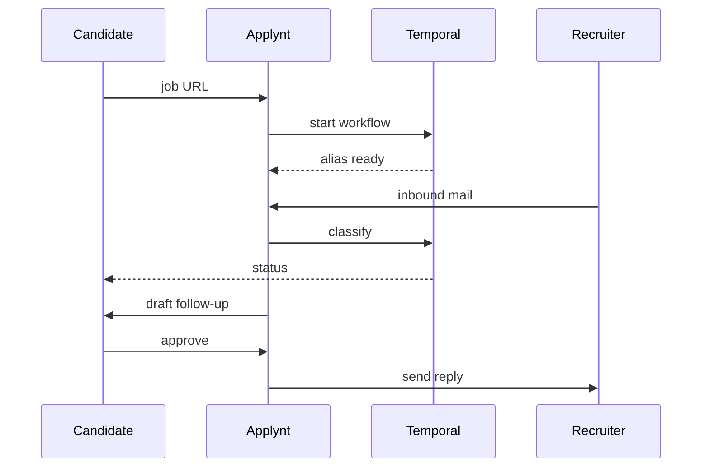

# Applynt Agent

*Temporal-backed CandidateOps that provisions a private alias inbox per application, auto-triages recruiter emails, drafts follow-ups for human approval, and orchestrates the full hiring workflow from first submit to offer or close.*

> **Domain:** `applynt.io` (primary), `applynt.dev` (secondary)
> **Agentic Tier:** Tier 1, score 9/10
> **Market:** Career tech; volatile 2026 hiring market plus AI adoption elevation drives demand for autonomous candidate workflow tooling

---

## Agentic Opportunity

Applynt starts a Temporal `ApplicationWorkflow` per job: it provisions a dedicated alias email for each submission, classifies every inbound recruiter message, updates application status, creates interview prep tasks, drafts follow-ups with approval gates, and closes the loop with structured feedback request links, all without the candidate polling a dashboard or copying text between tabs.

---

## Problem Statement

- Application context scatters across job URLs, resume versions, notes, contacts, and email threads
- Status ambiguity after submission goes undetected for weeks because no job watches the inbox
- Follow-up, scheduling, and feedback request emails repeat across dozens of applications at high admin cost
- Generic LLM drafts lack bounded context; match advice without a job snapshot drifts into hallucination

---

## Interaction Sequence



**Event Triggers:**
- **Email:** SMTP webhook on inbound to candidate alias address
- **Candidate actions**
  - Job URL paste starts a new ApplicationWorkflow
  - "Request feedback" click sends secure employer link
- **Timers**
  - Follow-up windows at configurable intervals post-submission (+3d, +7d, +14d)
  - Stale pipeline sweep weekly for threads with no activity

**Human-in-the-Loop Gates:** Job ingestion, match scoring, inbound classification, and task creation run fully autonomously. All outbound sends (follow-ups, feedback requests, replies) require explicit candidate approval or edit before the alias dispatches. Mock interview sessions are fully manual by design: no auto-submit, no auto-score publish without review.

---

## 7-Day Agentic MVP Build Plan

| Day | Focus | Deliverable |
|-----|-------|-------------|
| 1 | Profile and ingest | Resume parse; URL fetch; structured job spec JSON |
| 2 | Alias email | SMTP inbound webhook plus per-application alias routing |
| 3 | Temporal scaffold | ApplicationWorkflow with signals, timers, and activities |
| 4 | Inbox triage agent | Classify inbound plus extract next steps plus status update |
| 5 | Follow-up agent | Timer-triggered draft with approval gate |
| 6 | Match and gap | Score dimensions plus evidence list from profile graph |
| 7 | Distribution | HN launch, SWE and PM communities, Temporal showcase post |

---

## Simple Data Model

```
Candidate:
  id, email, password_hash, target_roles, preferences, created_at

Profile:
  id, candidate_id, resume_json, skills_json, evidence_json, created_at

JobPostingSnapshot:
  id, url, structured_json, fetched_at, created_at

Application:
  id, candidate_id, snapshot_id, status, alias_email, workflow_id, created_at

EmailMessage:
  id, application_id, direction, subject, body_hash, signals_json, created_at

Task:
  id, application_id, type, due_at, status, created_at

FeedbackRequest:
  id, application_id, token, state, rubric_json, created_at
```

---

## Revenue Model

| Tier | Price | Includes |
|-----|-------|----------|
| Free | $0 | Five active applications, alias inbox, basic tracking |
| Pro | $19/month | Unlimited applications, follow-up automation, match scoring |
| Coach | $59/month | Twenty candidate seats, cohort dashboard |
| Enterprise | Custom | ATS integration, SSO, SLA |

---

## Stack

- **Workflow:** Temporal Cloud or self-hosted Temporal cluster with Python worker SDK
- **API:** Python (FastAPI) plus Celery for heavy PDF and URL parsing jobs
- **LLM:** GPT-4o class for job parse, match scoring, inbox triage, and draft with structured JSON outputs
- **Email:** Postfix or AWS SES for alias routing; Mailgun or similar transactional for outbound
- **Database:** PostgreSQL for canonical entities; pgvector for job and profile embeddings
- **Deploy:** Fly.io or Railway with separate Temporal worker service

---

## Success Metrics

- Active applications per candidate (median): target 25 by month 2
- Alias email activation rate per new application: target 70% or higher
- Follow-up draft acceptance without edit: target 60% or higher
- Paid candidates: target 200 by month 2
- Offer rate improvement versus self-reported pre-tool baseline: track from month 3
