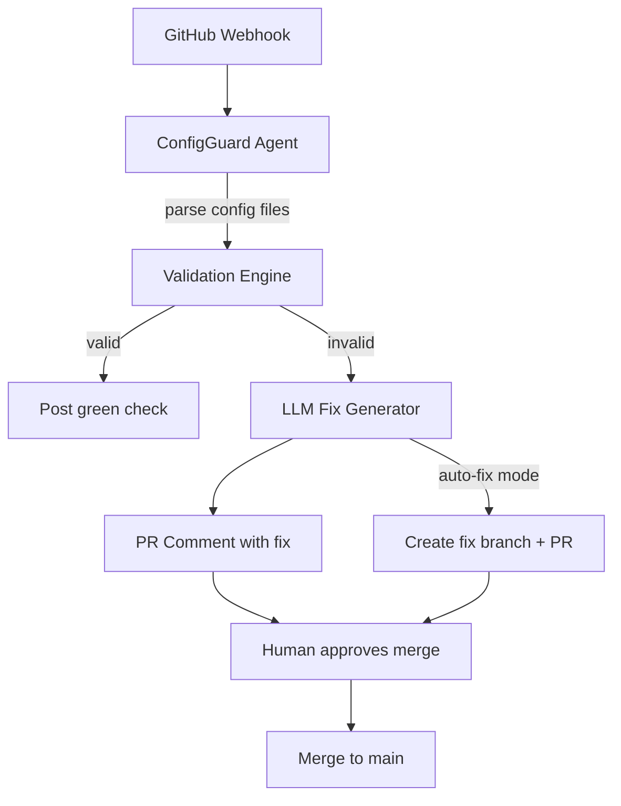

# **ConfigGuard** - Autonomous CI/CD Guardrail Agent (Agentic SaaS)

*Watches config file commits, validates, generates fix PRs, and optionally auto-merges corrections - zero human involvement in the validation loop.*

> **Parent MicroSaaS:** `configguard`
> **Domain:** `configguard.io` (primary), `configguard.dev` (secondary)
> **Agentic Tier:** Tier 1 - Score 9/10
> **Market:** 100M+ GitHub repositories; every DevOps team with config files in CI/CD

---

## Agentic Opportunity

The MicroSaaS parent validates configs on-demand via API. The Agentic SaaS layer runs continuously in every repository: it watches for config file changes via GitHub/GitLab webhooks, validates automatically, posts PR comments with human-readable fixes, and optionally creates fix branches and commits for human approval.

---

## Problem Statement

- Config errors (YAML typos, invalid schema, missing required fields) are the #1 source of deployment failures
- Developers only discover config errors when deployments fail, not when they commit
- No GitHub App automatically validates config files in PRs with context-aware fix suggestions
- Enterprise teams need audit trails of all config changes for SOC 2 and ISO 27001 compliance

---

## Autonomy Architecture



**Event Triggers:**
- GitHub/GitLab webhook on every PR and push touching config files
- Scheduled full-repo audit (weekly or on-demand)

**Human-in-Loop Gates:** PR comment mode (human reviews comment, applies manually) or auto-fix mode (agent creates fix branch, human approves merge). Auto-merge available for low-risk fixes (whitespace, comment formatting).

---

## 7-Day Agentic MVP Build Plan

| Day | Focus | Deliverable |
|---|---|---|
| 1 | GitHub App setup | OAuth app registration; webhook receiver for PR and push events |
| 2 | Config file detection | Detect YAML/JSON/TOML/HCL files in PR diff |
| 3 | Validation engine | Multi-format parser; schema rule packs for AWS/GCP/k8s/Docker |
| 4 | LLM fix generation | GPT-4o generates human-readable error explanations + specific fix suggestions |
| 5 | PR comment posting | Inline PR comments with code block fixes; GitHub check status |
| 6 | Auto-fix branch mode | Create fix branch + commit + open draft PR |
| 7 | Audit trail + install flow | GitHub Marketplace listing; one-click install; compliance CSV export |

---

## Simple Data Model

```
Installation:
  id, github_org, repos_enabled[], plan, created_at

ValidationRun:
  id, installation_id, repo, pr_number, commit_sha, files_checked, errors_found, timestamp

ConfigError:
  id, run_id, file_path, line_number, error_type, message, suggested_fix, auto_fixed (bool)

AuditEntry:
  id, installation_id, event_type, actor, target_file, before_hash, after_hash, timestamp
```

---

## Revenue Model

| Tier | Price | Includes |
|---|---|---|
| Free | $0 | 1 repo, public repos only |
| Pro | $19/month | 10 repos, private repos, PR comments |
| Team | $99/month | 100 repos, auto-fix mode, audit trail |
| Enterprise | Custom | Unlimited repos, SOC 2 compliance export, custom rule packs, SLA |

**vs. MicroSaaS parent ($19-99/month API):** GitHub App drives organic viral distribution; enterprise audit trail features justify $199-999/month contracts. Revenue multiple: 5-10x.

---

## Stack Recommendations

- **GitHub App:** Node.js (Probot framework) or Python (Flask + PyGithub)
- **Validation:** Python `pydantic`, `jsonschema`, `ruamel.yaml`, `python-hcl2`
- **LLM:** GPT-4o for fix suggestion generation; structured output mode for JSON error format
- **Database:** PostgreSQL for audit trails; Redis for webhook queue
- **Deploy:** Railway or Render (GitHub App requires always-on server)

---

## Success Metrics

- Repositories with ConfigGuard installed (target: 100 by month 3)
- Config errors caught before deployment (target: 500/week by month 6)
- Auto-fix acceptance rate (target: over 85% of auto-fix suggestions accepted)
- Enterprise installations with SOC 2 audit export active (target: 5 by month 9)
- GitHub Marketplace rating (target: 4.5+ stars)
