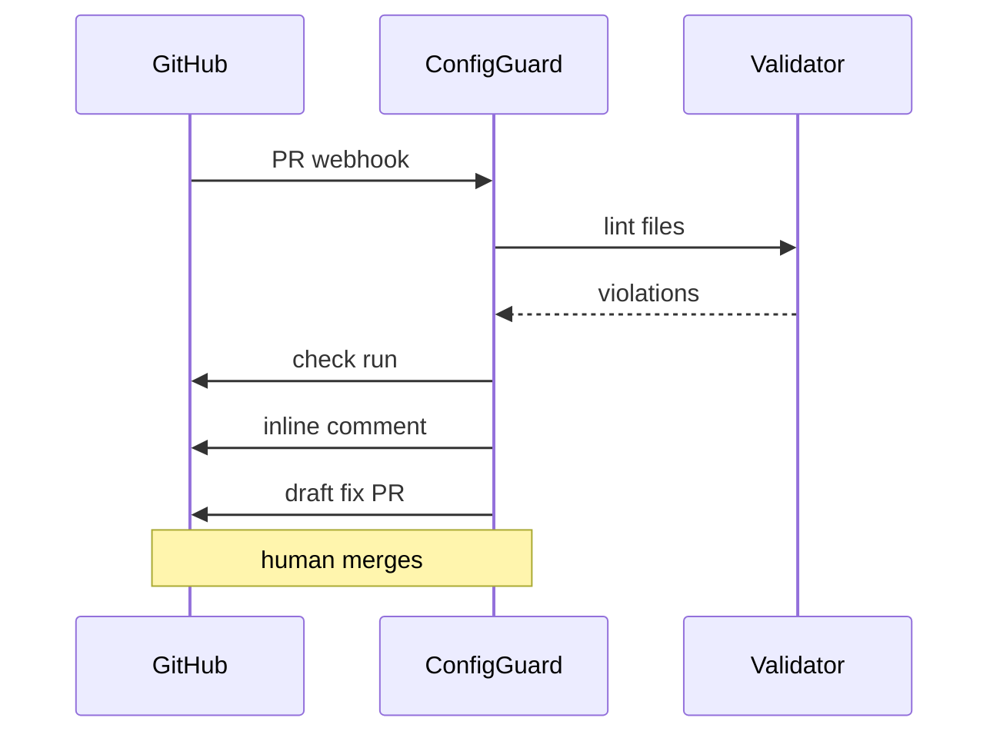

# ConfigGuard Agent

*GitHub App that validates config and spec changes on every PR, posts fixes, and opens draft PRs with optional human merge gates.*

> **Domain:** `configguard.io` (primary), `configguard.dev` (secondary)
> **Agentic Tier:** Tier 1, score 9/10
> **Market:** 100M+ GitHub repos; platform teams enforcing infra and API standards in CI (2026)

---

## Agentic Opportunity

ConfigGuard Agent runs continuously: it watches PR and push events for YAML, JSON, HCL, and OpenAPI paths, validates against rule packs, posts inline annotation results, drafts LLM explanations on failure, and opens fix branches so humans merge without polling a separate dashboard.

---

## Problem Statement

- Invalid configs often ship because API checks run only in deploy pipelines, not at authoring time
- Reviewers miss subtle schema drift across large diffs without machine assistance
- Teams want the same rules in CI and in chat, not two divergent copies maintained by hand
- Auditors expect immutable records tying each merge to validation outcomes for SOC 2 style reviews

---

## Interaction Sequence



**Event Triggers:**
- GitHub webhook on pull requests and pushes touching config or OpenAPI paths
- Nightly scheduled full-repo scan per installation (optional)

**Human-in-the-Loop Gates:** Inline comments and check runs are autonomous. Opening draft PRs with auto-fixes is autonomous; merging to default branch always requires a human maintainer. Optional auto-merge exists only for allowlisted low risk rules (whitespace, sorted keys) if the org enables it.

---

## 7-Day Agentic MVP Build Plan

| Day | Focus | Deliverable |
|-----|-------|-------------|
| 1 | GitHub App | OAuth app, webhook receiver for PR events |
| 2 | Path filters | Detect YAML, JSON, TOML, HCL, OpenAPI in diffs |
| 3 | Validation engine | Rule packs for k8s, Terraform subset, OpenAPI |
| 4 | LLM explanations | Structured JSON errors plus short human text |
| 5 | Check runs | GitHub Checks API with file and line annotations |
| 6 | Draft fix PR | Bot branch from suggestion, open draft |
| 7 | Distribution | GitHub Marketplace listing, one-click install, CSV audit export |

---

## Simple Data Model

```
Installation:
  id, github_org, repos_enabled, plan, created_at

ValidationRun:
  id, installation_id, repo, pr_number, commit_sha, files_checked, errors_found, timestamp

ConfigError:
  id, run_id, file_path, line_number, error_type, message, suggested_fix, auto_fixed, timestamp

AuditEntry:
  id, installation_id, event_type, actor, target_file, before_hash, after_hash, timestamp
```

---

## Revenue Model

| Tier | Price | Includes |
|-----|-------|----------|
| Free | $0 | 1 repo, public only, PR comments |
| Pro | $29/month | 10 private repos, Checks API, LLM explain |
| Team | $99/month | 100 repos, draft fix PRs, audit CSV |
| Enterprise | Custom | Unlimited repos, custom packs, SLA, SSO |

---

## Stack

- **GitHub App:** Node.js (Probot) or Python (FastAPI + PyGithub)
- **Validation:** jsonschema, ruamel.yaml, python-hcl2, OpenAPI validators
- **LLM:** GPT-4o or Claude with structured output for fix snippets
- **Database:** PostgreSQL for runs and audit; Redis for webhook queue
- **Deploy:** Railway or Render (always-on webhook receiver)

---

## Success Metrics

- Repos with app installed: target 120 by month 3
- Violations caught pre-merge: target 500 per week by month 6
- Draft fix merge rate: target 80% or higher when offered
- Enterprise tenants with audit CSV enabled: target 5 by month 9
- GitHub Marketplace rating: target 4.5 stars or higher
