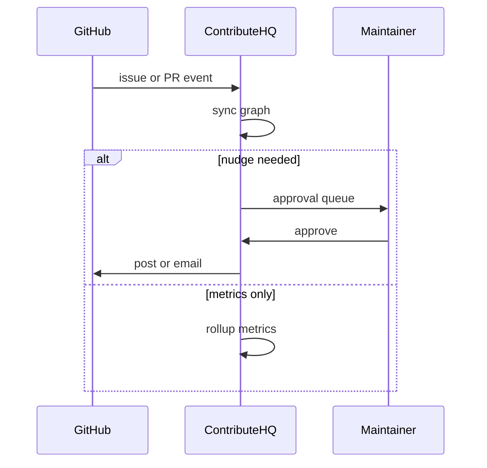

# ContributeHQ Agent

*GitHub-connected maintainer partner that keeps starter issues fresh, matches skills to issues, and sends timed nudges and digests from live repo activity.*

> **Domain:** `contributehq.io` (primary), `contributehq.dev` (secondary)
> **Agentic Tier:** Tier 1, score 9/10
> **Market:** DevRel and OSPO programs where maintainer time on onboarding and triage is scarce (2026)

---

## Agentic Opportunity

ContributeHQ Agent installs as a GitHub App, listens to issue and PR webhooks, refreshes stale labels on a schedule, proposes skill-matched issues to new contributors, drafts first reply copy for maintainers to approve, and ships recurring digests without someone exporting CSVs each week.

---

## Problem Statement

- Starter issue labels rot; newcomers land on blocked or outdated tasks
- Maintainers juggle agreements, build docs, and routing in scattered places
- Sponsors want impact signals beyond stars; manual reporting does not scale
- One off scripts for nudges fail when tokens expire or rate limits shift

---

## Interaction Sequence



**Event Triggers:**
- **Connectors:** Issue, PR, and comment webhooks after GitHub App install
- **Schedules**
  - Nightly job to flag stale `good first issue` and similar labels
  - Weekly digest window per org timezone

**Human-in-the-Loop Gates:** Internal classification and metrics run unattended. Emails or DMs to contributors, and bulk label rewrites on default branch, wait for maintainer or policy approval unless you allowlist low risk templates.

---

## 7-Day Agentic MVP Build Plan

| Day | Focus | Deliverable |
|-----|-------|-------------|
| 1 | App install | GitHub App OAuth plus repo scope checklist |
| 2 | Webhooks | Verified receiver writing normalized events |
| 3 | Stale sweep | Job comparing label age to last activity |
| 4 | Matcher | Skill to issue ranking from labels plus optional survey |
| 5 | Nudge drafts | LLM templates grounded in issue body and kit links |
| 6 | Approval UI | Queue for send, edit, or skip per batch |
| 7 | Distribution | GitHub Marketplace listing draft, install README, maintainer one pager |

---

## Simple Data Model

```
Org:
  id, name, owner_user_id, created_at

Repo:
  id, org_id, full_name, install_id, created_at

Contributor:
  id, github_login, skills_json, created_at

Kit:
  id, repo_id, steps_json, created_at

Nudge:
  id, contributor_id, repo_id, template_id, status, sent_at, created_at

AgentRun:
  id, repo_id, event_type, result_json, started_at, completed_at
```

---

## Revenue Model

| Tier | Price | Includes |
|-----|-------|----------|
| Free | $0 | One repo, capped autonomous actions |
| Pro | $59/month | Ten repos, webhooks, nudge queue |
| OSPO | $199/month | Fifty repos, digests, higher volume |
| Enterprise | Custom | Dedicated workers, SLA, custom policies |

---

## Stack

- **GitHub App:** Node (Probot) or Python (FastAPI) with PyGithub
- **Workers:** Celery or RQ for sweeps and digests
- **LLM:** GPT-4o class for short drafts with structured JSON checks
- **Database:** PostgreSQL for orgs, repos, events, nudge state
- **Email:** Transactional provider with bounce handling
- **Deploy:** Fly.io or Railway with always-on webhook service

---

## Success Metrics

- Repos with agent enabled: target 300 by month 3
- Stale starter issues relabeled or closed per week: target 200 plus by month 6
- Nudge send approval rate: target 80% or higher without heavy edits
- Click to opened PR from suggested issue: target 20% on pilot cohorts
- Paid orgs on agent tier: target 14 by month 3
