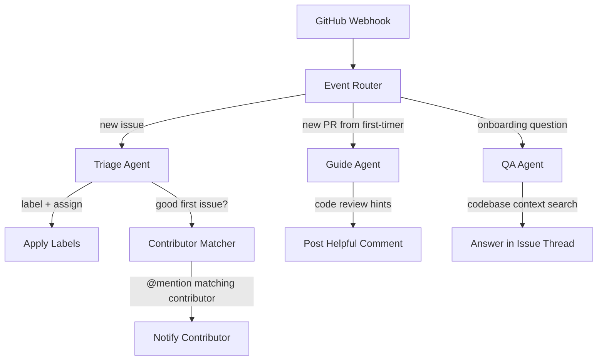

# **ContributeHQ** - Autonomous OSS Contributor Agent (Agentic SaaS)

*Indexes your OSS repositories, matches contributors to appropriate issues, answers onboarding questions in real-time via issue comments, and tracks first-contribution journeys autonomously.*

> **Parent MicroSaaS:** `contributehq` (renamed from `onboardhq`)
> **Domain:** `contributehq.io` (primary)
> **Agentic Tier:** Tier 3 - Score 5/10
> **Market:** OSS maintainers (GitHub: 100M+ repos); GitHub Marketplace distribution moat

---

## Agentic Opportunity

The MicroSaaS parent generates static onboarding kits from a repo URL. The Agentic SaaS layer runs as a persistent GitHub App: it monitors new issues and PRs in real-time, answers contributor questions by querying the codebase context, labels and triages incoming issues, matches first-time contributors to appropriate starter tasks, and tracks contributor journey metrics for maintainers.

---

## Problem Statement

- 56% of first-time contributors never submit a second PR (GitHub research)
- OSS maintainers spend 20+ hours/week on contributor onboarding and issue triage
- New contributors ask the same onboarding questions repeatedly (maintainers answer manually)
- No tool automatically matches contributor skills to open issues and guides them through first contribution

---

## Autonomy Architecture



**Autonomy levels:**
- Issue triage and labeling: fully autonomous
- Answering factual questions: autonomous (grounded in codebase context)
- Suggesting starter tasks to contributors: autonomous
- Merging PRs: always requires maintainer approval

---

## 7-Day Agentic MVP Build Plan

| Day | Focus | Deliverable |
|---|---|---|
| 1 | GitHub App setup | OAuth app; webhook receiver for issue, PR, and comment events |
| 2 | Codebase indexer | Clone repo; chunk source files; embed with OpenAI embeddings; store in vector DB |
| 3 | QA agent | RAG-based Q&A over codebase; answer factual questions in issue comments |
| 4 | Issue triage agent | Classify issues: bug/feature/question/documentation; apply labels |
| 5 | Good-first-issue detector | Score issues by complexity; suggest to maintainer for tagging |
| 6 | Contributor matcher | Match issue requirements to contributor skills from PR/commit history |
| 7 | Contributor journey tracker | Dashboard for maintainer: first-timers, second contributions, drop-off points |

---

## Simple Data Model

```
Repository:
  id, installation_id, github_repo_id, full_name, indexed_at, embedding_model

CodeChunk:
  id, repo_id, file_path, start_line, end_line, content, embedding, created_at

Issue:
  id, repo_id, github_issue_number, title, labels[], complexity_score, is_good_first_issue, assigned_contributor_id

Contributor:
  id, github_username, skills_inferred[], open_issues_assigned[], prs_merged, first_contribution_at

QAInteraction:
  id, repo_id, question_issue_number, question_text, answer_text, helpful_reactions_count, timestamp
```

---

## Revenue Model

| Tier | Price | Includes |
|---|---|---|
| Open Source | Free | 1 public repo, basic triage, QA agent |
| Maintainer | $19/month | 5 repos (public + private), contributor journey tracking |
| Organization | $99/month | 20 repos, contributor matching, weekly digest, team dashboard |
| Enterprise | Custom | Unlimited repos, SSO, compliance, on-premise option |

**vs. manual maintainer time ($2,000+/month in lost engineering productivity):** ContributeHQ targets the OSS maintainer who is also a developer at a company - expense is justified by retained contributor quality. Revenue multiple vs. MicroSaaS parent: 5-10x for Organization tier.

---

## Stack Recommendations

- **GitHub App:** Python (Flask) + PyGithub for GitHub API; Node.js (Probot) as alternative
- **Embeddings:** OpenAI `text-embedding-3-small`; store in pgvector (PostgreSQL extension)
- **RAG Engine:** LlamaIndex or LangChain for codebase-grounded QA
- **LLM:** GPT-4o for triage classification and QA answer generation
- **Storage:** PostgreSQL + pgvector for embeddings; S3 for code snapshot archives
- **Deploy:** Railway or Fly.io (GitHub App requires persistent server)

---

## Success Metrics

- Repositories with ContributeHQ installed (target: 200 by month 6)
- Second-contribution rate improvement (target: 30% higher vs. repos without ContributeHQ)
- Issue triage accuracy (target: over 90% label agreement with maintainer)
- QA questions answered without maintainer involvement (target: over 70%)
- Time-to-first-response for new contributors (target: under 30 minutes with agent, vs. 48+ hours manual)
