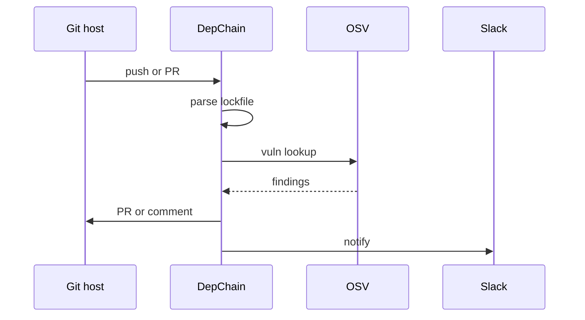

# DepChain Agent

*CI watcher that ingests lockfiles and SBOMs on every push, joins OSV data, opens safe bump PRs, and escalates zero days to on call.*

> **Domain:** `depchain.io` (primary), `depchain.dev` (secondary)
> **Agentic Tier:** Tier 1, score 8/10
> **Market:** Supply chain security and SBOM expectations in regulated and growth stage SaaS (2026)

---

## Agentic Opportunity

DepChain Agent wires into GitHub or GitLab events, rebuilds the dependency graph on each default branch update, evaluates policy YAML continuously, posts concise risk comments on dependency PRs, opens patch-level bump PRs when CI is green, and pages or Slack-alerts when severity crosses thresholds you configure.

---

## Problem Statement

- Raw `npm ls` style output is noisy; teams want summarized risk per commit
- License clashes surface late; legal review then blocks release
- Transitive upgrades break builds without a small diff story for reviewers
- Full SCA suites price out indie services that still need continuous signal

---

## Interaction Sequence



**Event Triggers:**
- Git
  - Push to default branch, PR opened or updated, merge queue success
- Schedules
  - Nightly full rescan for long running branches
  - OSV feed poll for new CVEs against last known SBOM

**Human-in-the-Loop Gates:** Patch and minor bumps with passing checks can auto merge per repo policy. Major upgrades, license denials, and first time contributors to `package.json` style files route to required reviewers. Alert only mode never opens PRs without opt in.

---

## 7-Day Agentic MVP Build Plan

| Day | Focus | Deliverable |
|-----|-------|-------------|
| 1 | Ingest | Webhook plus upload path writing `Scan` rows |
| 2 | Parsers | npm lockfile v2 plus one second ecosystem |
| 3 | OSV | Client with caching and severity normalization |
| 4 | Policy | YAML evaluator hooked to scan results |
| 5 | PR bot | Comment template with top findings table |
| 6 | Auto PR | Patch bump flow behind feature flag |
| 7 | Distribution | GitHub Action sample, docs site, security one pager |

---

## Simple Data Model

```
User:
  id, email, password_hash, created_at

Scan:
  id, user_id, ecosystem, hash, result_json, created_at

Policy:
  id, user_id, yaml, created_at

Diff:
  id, user_id, from_scan_id, to_scan_id, delta_json, created_at

AgentRun:
  id, repo_id, trigger, action, pr_url, status, created_at

APIKey:
  id, user_id, key_hash, tier, created_at
```

---

## Revenue Model

| Tier | Price | Includes |
|-----|-------|----------|
| Free | $0 | Fifty scans, public repos, comment only bot |
| Pro | $49/month | Two thousand scans, private repos, PR comments |
| Team | $149/month | Ten thousand scans, org policies, auto PR flag |
| Enterprise | Custom | SSO, air gapped export, SLA |

---

## Stack

- **Ingest and policy:** Go or Rust service behind signed webhooks
- **Vuln data:** OSV API with disk cache
- **Database:** PostgreSQL for scans, diffs, policies, audit runs
- **Git host:** GitHub App or GitLab token with least privilege
- **Notifications:** Slack webhooks plus optional PagerDuty on Enterprise
- **Deploy:** Fly.io or similar with worker queue for rescans

---

## Success Metrics

- Scans per month: target 25k by month 1
- Auto opened PRs merged without revert: target 60% or higher on pilot repos
- Mean time from CVE publish to repo alert: target under 4 hours for watched packages
- Paid orgs: target 18 by day 30
- False positive reports per 1k findings: target under 30
