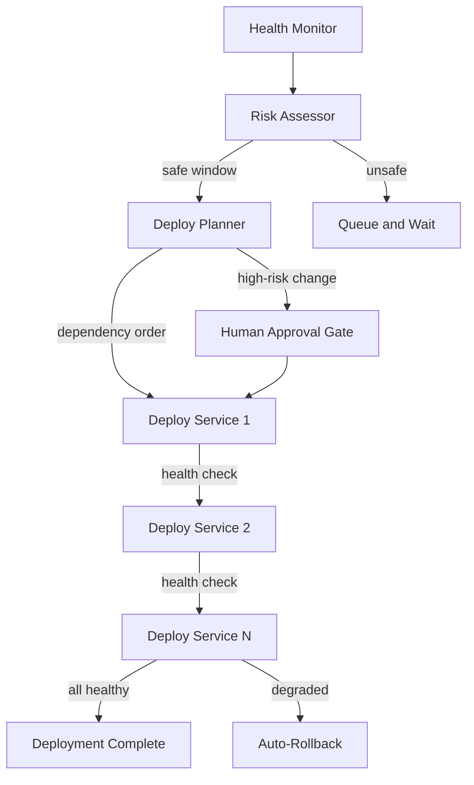

# **DepChain** - Autonomous Deployment Orchestration Agent (Agentic SaaS)

*Monitors service health in real-time, determines safe deployment windows, executes rolling deployments in dependency order, and auto-rolls back on failure - with human approval gates for enterprise trust.*

> **Parent MicroSaaS:** `depchain` (renamed from `axon`)
> **Domain:** `depchain.io` (primary), `depchain.dev` (secondary)
> **Agentic Tier:** Tier 3 - Score 6/10
> **Market:** Platform engineering teams; enterprise DevOps with microservices; $5B+ TAM

---

## Agentic Opportunity

The MicroSaaS parent provides a REST API for defining service dependencies and checking deployment gates. The Agentic SaaS layer monitors health continuously, determines optimal deployment windows autonomously, executes rolling deployments in safe dependency order, and rolls back automatically when health metrics degrade - without requiring a human to manually coordinate services.

---

## Problem Statement

- Microservice deployments fail because services are deployed in wrong order
- Platform engineers manually coordinate deployments across 10-50 services - error-prone and slow
- Current tools (Argo CD, Flux) handle GitOps but not intelligent dependency-aware ordering
- No tool uses real-time health data to determine if now is a safe time to deploy

---

## Autonomy Architecture



**Autonomy levels (configurable by environment):**
- Development: fully autonomous (no gates)
- Staging: autonomous with notification
- Production: human approval gate on deployment plan; autonomous execution and rollback

---

## 7-Day Agentic MVP Build Plan

| Day | Focus | Deliverable |
|---|---|---|
| 1 | Health monitoring integration | Prometheus metrics scraper; health endpoint polling |
| 2 | Dependency graph engine | YAML-defined service dependencies; topological sort for deploy order |
| 3 | Risk assessor | ML-based deployment risk score from health metrics, time of day, recent incidents |
| 4 | Deployment executor | Sequential rolling deployment via Kubernetes API or custom webhooks |
| 5 | Health gate and rollback | Post-deploy health checks with configurable thresholds; auto-rollback trigger |
| 6 | Human approval gate | Slack slash command for deploy plan approval; timeout with escalation |
| 7 | Audit trail + DORA metrics | Track deployment frequency, change failure rate, MTTR, lead time |

---

## Simple Data Model

```
Service:
  id, name, health_endpoint, metrics_endpoint, dependencies[], deploy_webhook, environment

HealthSnapshot:
  id, service_id, timestamp, status (healthy|degraded|down), error_rate, latency_p99, cpu_pct

DeploymentPlan:
  id, services_ordered[], created_at, risk_score, approved_by, status (pending|approved|executing|complete|rolled_back)

DeploymentStep:
  id, plan_id, service_id, order, started_at, completed_at, health_before, health_after, rolled_back (bool)

Incident:
  id, service_id, deployment_id, started_at, resolved_at, cause, resolution
```

---

## Revenue Model

| Tier | Price | Includes |
|---|---|---|
| Starter | $29/month | Up to 10 services, 1 environment, basic health checks |
| Team | $99/month | Up to 50 services, 3 environments, auto-rollback, DORA metrics |
| Enterprise | $299/month | Unlimited services, all environments, SOC 2 audit trail, SLA, Slack integration |
| Enterprise Plus | Custom | Multi-cloud, on-premise deployment, custom integrations, dedicated support |

**vs. manual coordination (free but slow and error-prone):** Prevents even one failed production deployment per quarter - worth $10K+ in engineering time saved. Revenue multiple vs. MicroSaaS parent: 10-20x for Enterprise tier with compliance audit trails.

---

## Stack Recommendations

- **Kubernetes:** kubernetes Python client for rolling deployments
- **Health Monitoring:** Prometheus client + Grafana for metrics; custom health endpoint polling
- **Risk Model:** scikit-learn logistic regression on deployment history features
- **Alerts + Approval:** Slack Bolt SDK for interactive approval messages
- **Backend:** Python (FastAPI); Go alternative for lower latency in hot path
- **Storage:** PostgreSQL + TimescaleDB for time-series health data

---

## Success Metrics

- Services monitored (target: 500 by month 6)
- Deployments orchestrated (target: 1,000/month by month 6)
- Zero deployment ordering failures (target: 100% correct ordering)
- Auto-rollback accuracy (target: over 95% of degradations caught within 5 minutes)
- DORA metric improvement for customers (target: 50% improvement in deployment frequency)
