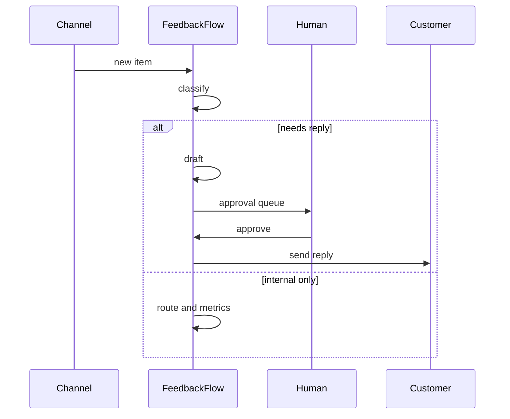

# FeedbackFlow Agent

*24/7 ingestion and triage across support, reviews, and forms: classify, cluster, route, and draft replies behind an approval queue.*

> **Domain:** `feedbackflow.io` (primary), `feedbackflow.dev` (secondary)
> **Agentic Tier:** Tier 1, score 9/10
> **Market:** Every SaaS team with multi-channel feedback; PM and CX time on triage remains high (2026)

---

## Agentic Opportunity

FeedbackFlow Agent connects to Zendesk, Intercom, app reviews, and webhooks, classifies each feedback item as it arrives, clusters themes automatically, routes findings to the right Slack channel or queue, drafts customer-safe replies, and holds public sends until a human approves in a single unified inbox.

---

## Problem Statement

- Feedback splinters across five or more surfaces so nobody sees the full trend line
- Manual tagging burns 10 to 20 hours per week for small teams before anyone prioritizes a roadmap
- Drafting answers twice (internal notes, then customer text) doubles handle time
- Executives discover spikes days late because no job watches volumes overnight

---

## Interaction Sequence



**Event Triggers:**
- Webhooks from Zendesk, Intercom, and custom HTTP sources
- Polling jobs for app stores or RSS where APIs allow compliant use

**Human-in-the-Loop Gates:** Classification, clustering, and internal routing run unattended. Any outbound message to customers requires explicit approval unless you allowlist low-risk auto-replies with caps.

---

## 7-Day Agentic MVP Build Plan

| Day | Focus | Deliverable |
|-----|-------|-------------|
| 1 | Connectors | Two webhook receivers plus secret verification |
| 2 | Classifier | LLM JSON schema for bug, idea, question, praise, spam |
| 3 | Clustering | Embeddings plus daily theme rollup job |
| 4 | Routing | YAML rules mapping labels to Slack destinations |
| 5 | Draft agent | Grounded reply draft with ticket context |
| 6 | Approval UI | Single queue with approve, edit, reject |
| 7 | Distribution | Trend dashboard export, template onboarding doc |

---

## Simple Data Model

```
FeedbackItem:
  id, workspace_id, channel, external_id, text_hash, classification, cluster_id, sentiment, created_at

Cluster:
  id, workspace_id, label, item_count, first_seen, last_seen, trend, created_at

DraftResponse:
  id, item_id, draft_text, model, status, approved_by, sent_at, created_at

Integration:
  id, workspace_id, channel_type, credentials_enc, last_synced_at, created_at
```

---

## Revenue Model

| Tier | Price | Includes |
|-----|-------|----------|
| Free | $0 | Two channels, capped items, branding |
| Pro | $49/month | More channels, drafts, routing |
| Team | $149/month | High volume, Slack, shared workspace |
| Enterprise | Custom | SSO, DPA, custom models, SLA |

---

## Stack

- **Backend:** Python (FastAPI) plus Celery for ingestion and clustering
- **Embeddings:** OpenAI `text-embedding-3-small` or equivalent; pgvector storage
- **LLM:** GPT-4o class for classify and draft with policy prompts
- **Database:** PostgreSQL with pgvector
- **Frontend:** React approval queue or embeddable widget
- **Deploy:** Fly.io or Railway with worker dynos

---

## Success Metrics

- Items processed per day: target 10k by month 6
- Classifier agreement with human spot checks: target 92% or higher
- Draft acceptance without edit: target 75% or higher
- Median time from arrival to triage label: target under 5 minutes
- Paying workspaces: target 50 by month 6
