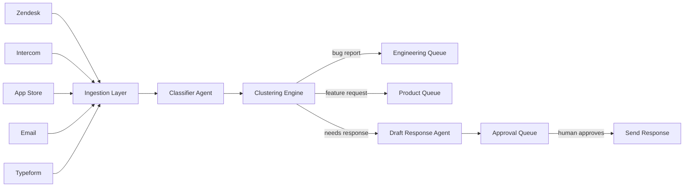

# **FeedbackFlow** - Autonomous Voice-of-Customer Agent (Agentic SaaS)

*Continuously ingests, triages, clusters, and drafts responses to all customer feedback channels without human involvement in the processing loop.*

> **Parent MicroSaaS:** `feedbackflow`
> **Domain:** `feedbackflow.io` (primary)
> **Agentic Tier:** Tier 1 - Score 9/10
> **Market:** Every SaaS company with a support function; replaces 10-20 hours/week of manual triage

---

## Agentic Opportunity

The MicroSaaS parent collects and analyzes feedback manually. The Agentic SaaS layer runs 24/7: it connects to all feedback channels (Zendesk, Intercom, App Store reviews, Typeform, email), classifies every incoming piece of feedback, clusters related items into themes, routes to the right team, and drafts responses for human review on a unified approval queue.

---

## Problem Statement

- Customer feedback arrives in 5+ channels simultaneously: email, support tickets, App Store reviews, social media, NPS surveys
- Support and product teams spend 10-20 hours/week manually reading, categorizing, and routing feedback
- No tool connects all channels, clusters by theme, and drafts responses in one autonomous workflow
- Product managers lack real-time signal on top issues blocking their users

---

## Autonomy Architecture



**Autonomy levels:**
- Classification + clustering: fully autonomous
- Response drafting: autonomous (human approves before send)
- Routing to internal teams: autonomous
- Public response publishing: requires human approval

---

## 7-Day Agentic MVP Build Plan

| Day | Focus | Deliverable |
|---|---|---|
| 1 | Integration connectors | Zendesk + Intercom webhook receivers; App Store RSS parser |
| 2 | Classification engine | LLM-based classification: bug/feature/compliment/question/spam |
| 3 | Clustering engine | Embedding-based semantic clustering; auto-label themes |
| 4 | Routing rules engine | YAML-defined routing: bug -> eng@, feature -> product@, urgent -> slack |
| 5 | Draft response agent | GPT-4o generates contextually appropriate draft responses |
| 6 | Approval queue UI | Web UI: review drafts, 1-click approve/edit/reject; batch mode |
| 7 | Dashboard + insights | Theme trend chart; volume by channel; top issues by week |

---

## Simple Data Model

```
FeedbackItem:
  id, channel, external_id, content, author, created_at, classification, cluster_id, sentiment_score

Cluster:
  id, label, item_count, top_themes[], first_seen, last_seen, trend (rising|stable|falling)

DraftResponse:
  id, feedback_id, draft_text, model_used, approved_by, approved_at, sent_at, status

Integration:
  id, workspace_id, channel_type, credentials_encrypted, last_synced_at, items_ingested
```

---

## Revenue Model

| Tier | Price | Includes |
|---|---|---|
| Starter | $19.99/month | 2 channels, 500 items/month, clustering |
| Growth | $49.99/month | All channels, 5,000 items/month, draft responses |
| Team | $149/month | Unlimited channels, 50K items/month, routing rules, Slack integration |
| Enterprise | $299-999/month | White-label, API access, SLA, custom routing, compliance export |

**vs. Hotjar/UserVoice ($99-399/month for manual tools):** Autonomous processing justifies Team and Enterprise pricing. Revenue multiple vs. MicroSaaS parent: 6-15x.

---

## Stack Recommendations

- **Backend:** Python (FastAPI) + Celery for async ingestion
- **Embeddings:** OpenAI `text-embedding-3-small` for clustering; FAISS for vector search
- **LLM:** GPT-4o for classification and draft response generation
- **Database:** PostgreSQL for structured data; pgvector extension for embeddings
- **Frontend:** React + Tailwind for approval queue UI
- **Queue:** Redis + Celery beat for scheduled polling integrations

---

## Success Metrics

- Feedback items processed per day (target: 10,000 by month 6)
- Classification accuracy (target: over 92% on standard categories)
- Draft response acceptance rate (target: over 75% approved without edit)
- Time-to-triage reduction vs. baseline (target: 80% reduction)
- Active workspaces (target: 50 by month 6)
