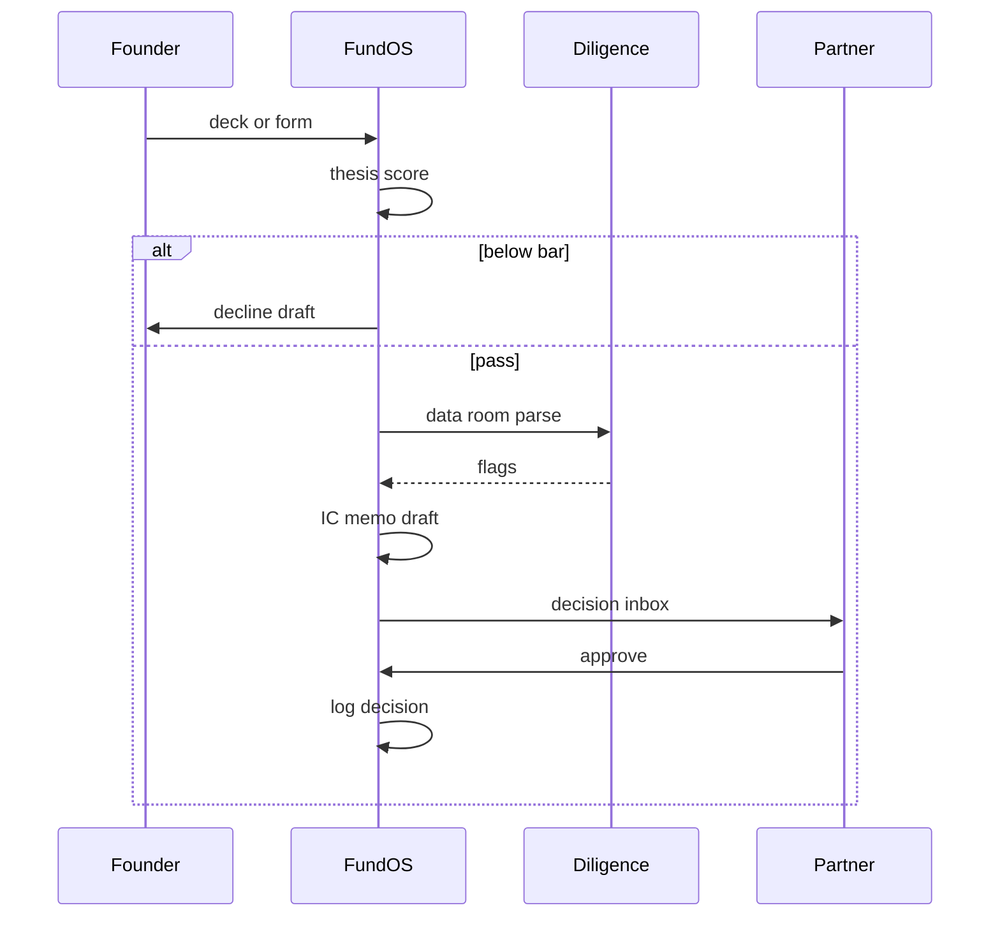

# FundOS Agent

*Playbook-governed multi-squad agent that monitors inbound, runs founder intake, reads data rooms, drafts evidence-linked IC memos, and collects portfolio updates without partner intervention.*

> **Domain:** `fundos.io` (primary), `fundos.dev` (secondary)
> **Agentic Tier:** Tier 1, score 10/10
> **Market:** Seed to Series A funds and solo GPs where bandwidth is the primary constraint on deal quality (2026)

---

## Agentic Opportunity

FundOS Agent runs continuously: a Radar sub-agent monitors curated feeds and email inbound against the fund thesis, a Gatekeeper sub-agent runs adaptive founder intake flows, a Diligence Squad parses data rooms with evidence-linked anomaly flags, a Memo Drafter produces IC-ready briefs where every claim cites a source page, and a Portfolio Liaison nudges portfolio companies for monthly updates, all surfaced in a Decision Inbox requiring one click per action.

---

## Problem Statement

- GPs spend more time filtering noise than evaluating conviction opportunities
- Diligence consistency degrades across partners without a shared, versioned rubric
- Data rooms take weeks of manual review with the same checklist rebuilt per deal
- Portfolio monitoring arrives as unstructured PDFs; LP reporting is a quarterly scramble

---

## Interaction Sequence



**Event Triggers:**
- **Inbound**
  - Email and form submissions via Gatekeeper widget
  - Founder-submitted deck uploads with shared thesis link
- **Feeds:** Curated source monitors with configurable RSS or export imports
- **Schedules**
  - Monthly portfolio update nudge cadence
  - Weekly deal digest to partner email

**Human-in-the-Loop Gates:** Thesis scoring, classification, and data room parsing run fully autonomously. Auto-decline drafts with feedback require one-click send or suppress. IC memo drafts and outbound messages to founders require explicit partner approval. Portfolio update collection runs unattended; LP report drafts require partner review before send.

---

## 7-Day Agentic MVP Build Plan

| Day | Focus | Deliverable |
|-----|-------|-------------|
| 1 | Feed monitor | Thesis matcher on configurable sources |
| 2 | Gatekeeper | Smart form to screener pipeline |
| 3 | Dossier | Enrichment agent plus Fit Score with evidence |
| 4 | Data room | PDF and XLS reader with anomaly flagging |
| 5 | IC memo | Evidence-linked draft with assumption labels |
| 6 | Portfolio nudge | Monthly structured update collector |
| 7 | Distribution | VC ops Slack communities, GCP Marketplace draft |

---

## Simple Data Model

```
Thesis:
  id, fund_id, yaml, version, created_at

Deal:
  id, fund_id, company, fit_score, status, created_at

Evidence:
  id, deal_id, source_doc_id, claim, page_ref, confidence, created_at

IcMemo:
  id, deal_id, body_md, status, approved_by, sent_at, created_at

PortfolioCompany:
  id, fund_id, name, stage, created_at

PortfolioUpdate:
  id, company_id, period, structured_json, created_at

AgentRun:
  id, deal_id, squad, action, result, created_at
```

---

## Revenue Model

| Tier | Price | Includes |
|-----|-------|----------|
| Free | $0 | Pitch Deck Grader, Gatekeeper widget, basic scoring |
| Pro | $499/month | Scout plus vetting squads, IC brief, audit log |
| Team | $1,499/month | Diligence squad, portfolio liaison, playbook versioning |
| Enterprise | Custom | Dedicated tenant, SSO, SLA, custom connectors |

---

## Stack

- **Agents:** Python plus GCP Agent Development Kit or LangGraph for multi-squad orchestration
- **LLM:** Gemini plus GPT-4o with routing per squad for cost control
- **Evidence retrieval:** pgvector or Vertex AI Vector Search for claim-to-source citation
- **Database:** PostgreSQL for deals, memos, runs, and audit trail
- **Orchestration:** Cloud Tasks plus Pub/Sub or Temporal for durable runs
- **Deploy:** GCP Cloud Run with auto-scaling worker pools

---

## Success Metrics

- Deals auto-processed per week per fund: target 50 by month 3
- IC brief generation time from data room access: target under 4 hours
- Evidence link ratio in generated memos: target 90% of claims with a source citation
- GP active time on screening per deal: target under 15 minutes versus hours previously
- Paid fund workspaces: target 10 by month 3
