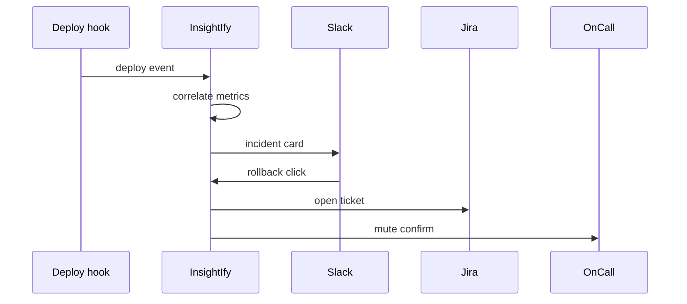

# InsightIfy Agent

*SRE bot that correlates deploys with metric shifts, posts rollback shortcuts to Slack, opens tickets with top log lines, and auto mutes noisy services until a human confirms.*

> **Domain:** `insightify.io` (primary), `insightify.dev` (secondary)
> **Agentic Tier:** Tier 1, score 8/10
> **Market:** Teams that outgrew grep but want lighter cost than full APM (2026)

---

## Agentic Opportunity

InsightIfy Agent listens to deploy hooks from Vercel, GitHub Actions, or Argo, aligns deployment timestamps with error-rate z-scores from the ingest pipeline, threads correlated log snippets into one Slack message with mute and rollback buttons, creates Linear or Jira issues prefilled with query IDs, and applies temporary mute rules when repeated false positives hit a service until on-call acknowledges.

---

## Problem Statement

- Full APM bills climb while small services only need cheap anomaly hints
- Cron parsers over logs are fragile; static thresholds rot
- Developers want one POST for events plus actionable context for pages
- On call wants example lines, not a bare threshold breach

---

## Interaction Sequence



**Event Triggers:**
- Telemetry
  - Existing ingest API batches and rollups
  - Webhook alerts from parent rules engine
- Change
  - Deploy started or finished events from CI or CD
  - Optional Kubernetes rollout signals on Enterprise

**Human-in-the-Loop Gates:** Correlation and ticketing can run unattended. Rollback buttons execute only after explicit Slack confirmation. Auto mute expires after a window unless a human extends the policy.

---

## 7-Day Agentic MVP Build Plan

| Day | Focus | Deliverable |
|-----|-------|-------------|
| 1 | Deploy webhook | Normalized deploy event schema |
| 2 | Correlator | Join deploy ids to metric windows |
| 3 | Slack app | Block kit card with snippet and links |
| 4 | Ticketing | Linear or Jira OAuth plus template body |
| 5 | Mute policy | Flap counter with decaying mute state |
| 6 | Runbooks | Store markdown links per service |
| 7 | Distribution | SRE Discord template, sample Terraform module |

---

## Simple Data Model

```
User:
  id, email, password_hash, created_at

Project:
  id, user_id, name, created_at

IngestBatch:
  id, project_id, bytes, created_at

MetricBucket:
  id, project_id, key, ts, value

Alert:
  id, project_id, rule_id, payload_json, created_at

Rule:
  id, project_id, config_json, created_at

DeployEvent:
  id, project_id, service, version, ts, source, created_at

MuteWindow:
  id, project_id, service, until_ts, reason, created_at

APIKey:
  id, user_id, key_hash, tier, created_at
```

---

## Revenue Model

| Tier | Price | Includes |
|-----|-------|----------|
| Free | $0 | One project, agent in read only digest mode |
| Pro | $39/month | Slack plus ticketing, standard ingest |
| Team | $119/month | Higher volume, SSO roadmap |
| Enterprise | Custom | VPC, unlimited retention options |

---

## Stack

- **API:** Go or Python service extending parent ingest paths
- **Time series:** ClickHouse or TimescaleDB for rollups
- **Queue:** Redis lists for alert fanout
- **Chat:** Slack Bolt with signing secret
- **Issue trackers:** REST clients with OAuth
- **Deploy:** Fly.io or AWS with regional workers

---

## Success Metrics

- Projects with agent features on: target 120 by month 2
- Median time from alert to ticket with context: target under 3 minutes
- Rollback button clicks that succeed: track and target 80% of attempts
- Thumbs down on alert noise: target under 15% of delivered cards
- Paid accounts: target 16 by day 30
