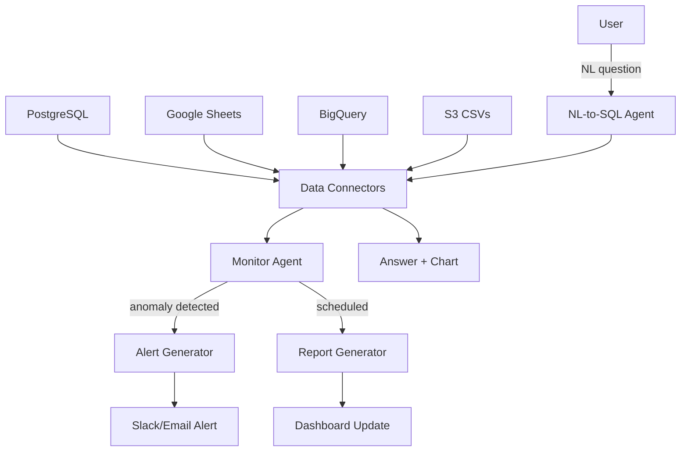

# **Insightify** - Autonomous Data Analyst Agent (Agentic SaaS)

*Connects to your data sources, monitors for anomalies and trends, and delivers proactive insight reports without human initiation.*

> **Parent MicroSaaS:** `insightify`
> **Domain:** `insightify.io` (primary), `insightify.ai` (secondary)
> **Agentic Tier:** Tier 2 - Score 8/10
> **Market:** SMB data teams; replaces ThoughtSpot Sage-equivalent value at $99-499/month vs. $20K+/year enterprise tools

---

## Agentic Opportunity

The MicroSaaS parent requires users to upload data and ask questions. The Agentic SaaS layer connects directly to data sources, monitors continuously, detects anomalies proactively, generates scheduled insight reports, and answers natural language questions via a chat interface - all without requiring users to manually upload or query.

---

## Problem Statement

- SMB data teams lack the engineering resources to build BI pipelines and maintain dashboards
- Most analytics tools are reactive (you query, they answer) not proactive (they alert you first)
- Enterprise AI analytics (ThoughtSpot Sage, Amazon Q) cost $20K+/year - out of reach for SMBs
- NL-to-SQL requires data modeling expertise that most small teams don't have

---

## Autonomy Architecture



**Continuous monitoring:** Baseline metrics learned from first 7 days of data; anomaly = deviation beyond 2 sigma from rolling mean.

---

## 7-Day Agentic MVP Build Plan

| Day | Focus | Deliverable |
|---|---|---|
| 1 | Data connector scaffolding | Read-only PostgreSQL + Google Sheets connectors |
| 2 | Schema explorer | Auto-detect tables, columns, data types; generate semantic index |
| 3 | NL-to-SQL agent | GPT-4o with structured output; safe read-only query guardrails |
| 4 | Anomaly detection | Baseline calculation; z-score alerting with configurable thresholds |
| 5 | Scheduled report generator | Weekly/daily insights email with auto-generated charts |
| 6 | Slack integration | Alert + report delivery to Slack channels |
| 7 | Workspace UI | Connector management; query history; report schedule settings |

---

## Simple Data Model

```
DataSource:
  id, workspace_id, type (postgres|sheets|bigquery|s3), credentials_encrypted, schema_cache, last_synced

MetricBaseline:
  id, datasource_id, metric_name, query, mean, std_dev, last_updated

AnomalyEvent:
  id, baseline_id, detected_at, observed_value, expected_range, severity, alerted_at

InsightReport:
  id, workspace_id, generated_at, delivery_channel, content_json, charts_urls[]

NLQuery:
  id, workspace_id, question, generated_sql, result_preview, latency_ms, timestamp
```

---

## Revenue Model

| Tier | Price | Includes |
|---|---|---|
| Starter | $14.99/month | 1 data source, 10 NL queries/day, weekly reports |
| Growth | $39.99/month | 5 data sources, unlimited NL queries, daily reports, anomaly alerts |
| Team | $99/month | 20 data sources, multi-user, custom metrics, Slack integration |
| Business | $499/month | Unlimited sources, API access, white-label reports, SLA |

**vs. ThoughtSpot Sage ($20K+/year):** Insightify targets SMBs with self-serve onboarding. Revenue multiple vs. MicroSaaS parent: 5-10x for Business tier.

---

## Stack Recommendations

- **Backend:** Python (FastAPI) + SQLAlchemy for multi-database abstraction
- **NL-to-SQL:** OpenAI GPT-4o with function calling; Vanna.ai as open-source alternative
- **Anomaly Detection:** statsmodels for baseline computation; Prophet for time-series
- **Connectors:** SQLAlchemy (PostgreSQL), gspread (Google Sheets), google-cloud-bigquery, boto3 (S3)
- **Charts:** Plotly (server-side PNG generation); Chart.js (client-side)
- **Frontend:** React + Recharts for dashboard UI

---

## Success Metrics

- Data sources connected (target: 500 by month 6)
- NL queries answered per day (target: 5,000 by month 6)
- NL-to-SQL accuracy (target: over 85% correct on first try)
- Anomalies detected before user noticed (target: over 60% proactive)
- Active workspaces (target: 100 by month 6)
