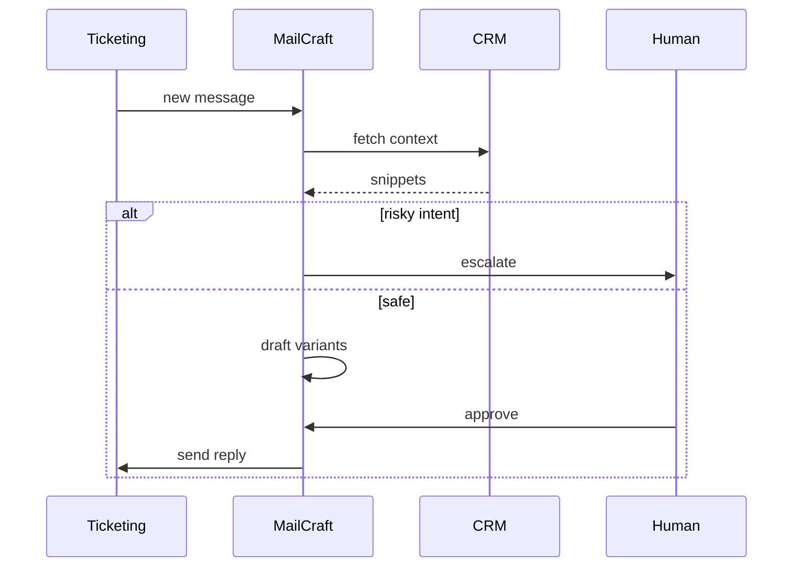

# MailCraft Agent

*Inbox copilot that drafts first replies from ticket context, blocks risky legal phrases, proposes voice YAML updates from thumbs up edits, and nudges when threads go silent.*

> **Domain:** `mailcraft.io` (primary), `mailcraft.dev` (secondary)
> **Agentic Tier:** Tier 1, score 9/10
> **Market:** Generative workplace writing where GTM and support want APIs plus guardrails (2026)

---

## Agentic Opportunity

MailCraft Agent binds to Zendesk, Intercom, or Gmail via read-only scopes, classifies each new thread on arrival, pulls order and policy snippets from CRM hooks, generates three on-brand reply variants with banned phrase scans, holds outbound sends until a human clicks approve or edit, and learns which closing lines win from labeled feedback to suggest voice YAML tweaks weekly.

---

## Problem Statement

- Support macros rot; copy paste from generic LLMs adds unsafe promises
- Marketing wants fast variants; legal wants disclaimers enforced structurally
- Playgrounds leak PII; teams need redaction or preflight hooks
- Shared rubrics for tone and clarity rarely span locales without automation

---

## Interaction Sequence



**Event Triggers:**
- **Ticketing:** Webhooks on new message or assignment
- **Schedules**
  - Silence detector for open threads past SLA hours
  - Weekly voice diff summary from accepted edits

**Human-in-the-Loop Gates:** Classification and draft generation can run in shadow mode showing suggestions inline. Customer facing sends always require a human click unless you enable a narrow auto send policy with amount and topic caps reviewed quarterly.

---

## 7-Day Agentic MVP Build Plan

| Day | Focus | Deliverable |
|-----|-------|-------------|
| 1 | OAuth | Zendesk or Intercom read scopes plus token vault |
| 2 | Classifier | Intent tags mapped to MailCraft API intents |
| 3 | Draft bridge | Fan out three variants with scores |
| 4 | Approval UI | Browser extension or embedded iframe approve bar |
| 5 | Risk rules | Legal keyword escalate path with audit log |
| 6 | Learning job | Aggregate thumbs up edits into YAML diff proposals |
| 7 | Distribution | Security review packet, SOC friendly architecture one pager |

---

## Simple Data Model

```
User:
  id, email, password_hash, created_at

VoiceProfile:
  id, user_id, yaml, created_at

DraftJob:
  id, user_id, intent, input_json, output_json, created_at

Score:
  id, draft_job_id, variant_id, metrics_json, created_at

TicketBinding:
  id, user_id, external_id, provider, last_message_at, created_at

AgentRun:
  id, ticket_binding_id, action, result, created_at

APIKey:
  id, user_id, key_hash, tier, created_at
```

---

## Revenue Model

| Tier | Price | Includes |
|-----|-------|----------|
| Free | $0 | Shadow drafts only, one voice |
| Pro | $39/month | Connected inbox, five voices, credits bundle |
| Team | $99/month | Review workflow API, higher credits |
| Enterprise | Custom | VPC, retention controls, SLA |

---

## Stack

- **Integrations:** Python (FastAPI) or Node workers per provider SDK
- **LLM:** OpenAI or Anthropic with routing and prompt hashing
- **Safety:** Banned phrase engine plus optional RedactGuard style preflight id
- **Database:** PostgreSQL for drafts, bindings, audit
- **Frontend:** Lightweight approve surface or partner native buttons
- **Deploy:** Fly.io with per tenant queue isolation on Enterprise

---

## Success Metrics

- Tickets with at least one draft: target 60% of connected volume by month 2
- Median time to first response after agent on: target drop of 25% vs baseline
- Banned phrase blocks per 1k drafts: track and keep under policy threshold
- Accepted variant without edit: target 55% by month 3
- Paid workspaces: target 18 by day 30
