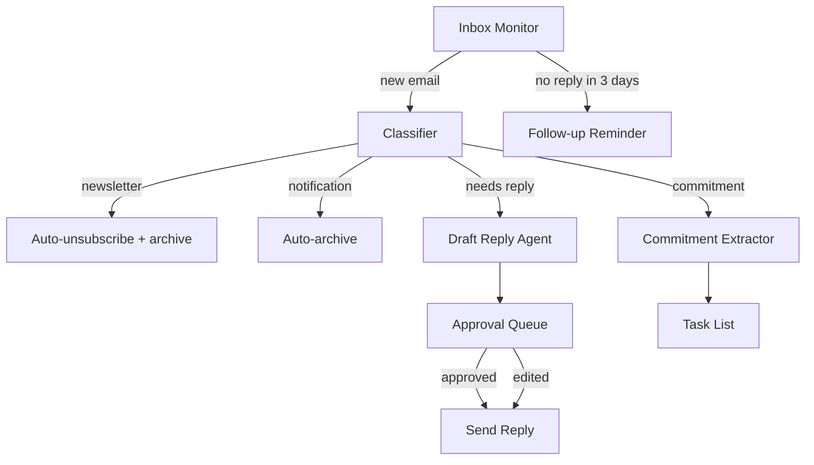

# **MailCraft** - Autonomous Inbox Zero Agent (Agentic SaaS)

*Monitors your inbox, categorizes all email, drafts replies for your review, auto-archives low-signal mail, and maintains a commitment tracker - with progressive autonomy controls.*

> **Parent MicroSaaS:** `mailcraft` (renamed from `mailpilot`)
> **Domain:** `mailcraft.io` (primary), `mailcraft.ai` (secondary)
> **Agentic Tier:** Tier 2 - Score 7/10
> **Market:** $30/month Superhuman segment (75K+ customers); executive assistant tier at $199/month

---

## Agentic Opportunity

The MicroSaaS parent drafts individual emails on demand. The Agentic SaaS layer runs continuously in the inbox: it classifies all incoming mail, auto-handles low-signal emails (newsletters, automated notifications), drafts replies for the approval queue, schedules follow-ups, and extracts commitments from email threads into a to-do list.

---

## Problem Statement

- Knowledge workers spend 28% of their workweek reading and answering email (McKinsey)
- Superhuman and Hey prove a large premium market exists for email productivity tools
- No tool achieves inbox zero autonomously - current tools still require manual action on every email
- Follow-ups and commitments buried in email threads are routinely missed

---

## Autonomy Architecture



**Autonomy settings (user-configurable):**
- Level 1: Classify only (human handles all actions)
- Level 2: Classify + archive low-signal (human replies to all important mail)
- Level 3: Classify + archive + draft replies for approval
- Level 4: Full autonomy with approval queue (default recommended)
- Level 5: Full autonomy (send replies without approval - executive trust mode)

---

## 7-Day Agentic MVP Build Plan

| Day | Focus | Deliverable |
|---|---|---|
| 1 | Gmail OAuth integration | Inbox monitoring via Gmail API; real-time push notifications |
| 2 | Email classification | GPT-4o classification: urgent/action/FYI/newsletter/spam/automated |
| 3 | Auto-archive + unsubscribe | Safe auto-archive for newsletters; List-Unsubscribe header handler |
| 4 | Draft reply agent | GPT-4o generates contextual reply using conversation history and user's writing style |
| 5 | Approval queue UI | Web UI: inbox zero view, review drafts, 1-click approve/edit/reject |
| 6 | Commitment extractor | Extract action items from email threads; add to tasks with due dates |
| 7 | Follow-up scheduler | Track emails awaiting reply; send follow-up reminders after configurable days |

---

## Simple Data Model

```
EmailAccount:
  id, user_id, provider (gmail|outlook), credentials_encrypted, autonomy_level, writing_style_cache

Email:
  id, account_id, thread_id, subject, from_address, classification, archived (bool), processed_at

DraftReply:
  id, email_id, draft_text, approved_by, approved_at, sent_at, status (pending|approved|rejected|sent)

Commitment:
  id, email_id, action_text, due_date, completed (bool), created_at

FollowUp:
  id, email_id, scheduled_for, sent_at, resolved (bool)
```

---

## Revenue Model

| Tier | Price | Includes |
|---|---|---|
| Personal | $19/month | 1 inbox, classification + archiving + drafts (approval required) |
| Power | $49/month | 2 inboxes, commitment tracking, follow-ups, writing style tuning |
| Executive | $199/month | 5 inboxes, full autonomy mode, calendar integration, delegation |
| Team | $99/user/month | Shared approval queues, team commitment tracking, admin dashboard |

**vs. Superhuman ($30/month manual):** Autonomous drafting and archiving justify 1.5-6x premium. Revenue multiple vs. MicroSaaS parent: 3-5x.

---

## Stack Recommendations

- **Email APIs:** Gmail API (OAuth 2.0 with push notifications); Microsoft Graph API for Outlook
- **LLM:** GPT-4o for classification and draft generation; fine-tune on user writing samples for style matching
- **Storage:** PostgreSQL for email metadata and drafts; never store full email content (privacy-first)
- **Frontend:** React + Tailwind for approval queue; browser extension for native Gmail integration
- **Privacy:** Process email content in memory only; no persistent storage of email body text

---

## Success Metrics

- Active email accounts connected (target: 1,000 by month 6)
- Emails processed per day (target: 100,000 by month 6)
- Classification accuracy (target: over 94%)
- Draft acceptance rate (target: over 70% approved without edit)
- Inbox zero achievement rate (target: over 60% of users reach inbox zero within 7 days)
