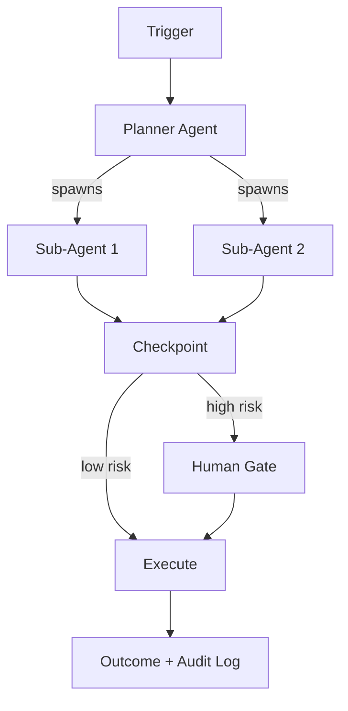

# **Orchestiq** - AI Agent Orchestration Platform (Agentic SaaS)

*Autonomous AI agent lifecycle management: register, route, monitor, and scale multi-agent workflows without human intervention.*

> **Parent MicroSaaS:** `orchestiq` (renamed from `kairo`)
> **Domain:** `orchestiq.io` (primary), `orchestiq.ai` (secondary)
> **Agentic Tier:** Tier 1 - Score 9/10
> **Market:** $8.5B (2026) growing to $35B (2030) - Deloitte AI Agent Orchestration Report

---

## Agentic Opportunity

The MicroSaaS parent (`orchestiq`) is a human-initiated orchestration API. The Agentic SaaS layer removes the human from the workflow initiation loop entirely: agents run on schedule, on event triggers, and in response to data signals - with humans only involved at configurable approval gates.

---

## Problem Statement

- Organizations want to run multi-agent AI workflows but lack infrastructure for autonomous execution
- Existing frameworks (LangGraph, CrewAI, AutoGen) require engineers to write orchestration code
- No API-first platform enables event-driven, fully autonomous agent execution with audit trails
- Enterprise AI teams need MCP (Model Context Protocol) and A2A (Agent-to-Agent) protocol support out of the box

---

## Autonomy Architecture



**Event Triggers:**
- Webhook (POST to `/webhooks/{workflow_id}`)
- Cron schedule (YAML-defined)
- Data events (S3 upload, database row insert, queue message)
- Agent-to-agent calls (A2A protocol)

**Human-in-Loop Gates:** Configurable by workflow step - low-stakes steps run autonomously; high-stakes steps (external API writes, financial actions, customer communications) pause for human approval via Slack or email.

---

## 7-Day Agentic MVP Build Plan

| Day | Focus | Deliverable |
|---|---|---|
| 1 | Event trigger system | Webhook receiver + cron scheduler |
| 2 | Autonomous workflow planner | LLM-based task decomposition from trigger payload |
| 3 | Human-in-loop checkpoint | Slack/email approval gate with timeout and auto-escalate |
| 4 | MCP + A2A protocol support | Standard agent communication adapters |
| 5 | Observability layer | Trace every agent decision: timestamp, tokens used, cost, outcome |
| 6 | Audit trail and compliance export | JSON/CSV export of all agent actions for SOC 2 / ISO 27001 |
| 7 | SDK packaging and docs | Python + Node.js SDKs; OpenAPI spec; deploy to orchestiq.io |

---

## Simple Data Model

```
Workflow:
  id, name, trigger_config, steps[], created_at, owner_id

Run:
  id, workflow_id, trigger_payload, status, started_at, completed_at, cost_usd

Step:
  id, run_id, agent_id, input, output, tokens_used, latency_ms, checkpoint_required, approved_by

Agent:
  id, name, model_provider, model_name, system_prompt, capabilities[], tools[]
```

---

## Revenue Model

| Tier | Price | Includes |
|---|---|---|
| Developer | $39/month | 1,000 autonomous runs/month, 10 agents |
| Team | $149/month | 10,000 runs/month, 50 agents, audit trails |
| Enterprise | Custom | Unlimited runs, SLA, custom MCP integrations, compliance reports |
| PAYG overage | $0.05/run | Above plan limits |

**vs. MicroSaaS parent ($39-149/month):** Agentic tier targets enterprise at $299-999/month once autonomous value is proven. Revenue multiple: 5-10x.

---

## Stack Recommendations

- **Backend:** Python (FastAPI) + Celery for async agent execution
- **Queue:** Redis or SQS for event-driven triggers
- **Storage:** PostgreSQL for audit trails; S3 for large payloads
- **LLM:** OpenAI GPT-4o (planning), Anthropic Claude (execution) - configurable
- **Protocols:** MCP (Model Context Protocol) + A2A (Agent-to-Agent) as of 2026 standards

---

## Success Metrics

- Autonomous runs per day (target: 1,000 by month 3)
- Human gate intervention rate (target: under 10% of steps)
- Average agent workflow cost (target: under $0.50/run)
- Audit trail completeness (target: 100% of steps logged)
- Enterprise customers with MCP integration (target: 5 by month 6)
