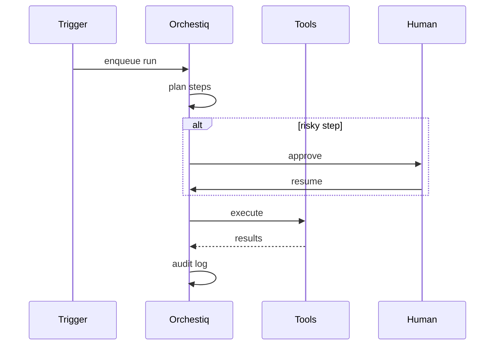

# Orchestiq Agent

*Hosted orchestrator that turns webhooks and schedules into running multi-step agent DAGs with checkpoints, cost caps, and full audit logs.*

> **Domain:** `orchestiq.io` (primary), `orchestiq.dev` (secondary)
> **Agentic Tier:** Tier 1, score 9/10
> **Market:** Agent orchestration spend growing from roughly $8.5B in 2026 toward tens of billions by 2030 (analyst estimates)

---

## Agentic Opportunity

Orchestiq Agent listens continuously: schedules, queues, and partner webhooks enqueue runs without manual invocation, a planner decomposes work into typed steps, workers call tools and models with backpressure and cost ceilings, risky steps pause for Slack or email approval, and every token and tool call lands in an immutable run record without polling status endpoints.

---

## Problem Statement

- Code-first frameworks ship fast proofs but leave retries, idempotency, and approvals as custom glue
- Ops teams cannot answer “what did the agent do last night” without log archeology
- Event bursts need backpressure and cost ceilings so one webhook cannot drain the budget
- Enterprises ask for MCP- and A2A-shaped interoperability without rewriting orchestration each quarter

---

## Interaction Sequence



**Event Triggers:**
- HTTPS webhook with signed payload per workflow id
- Cron schedules defined in workflow YAML
- Optional queue consumers (SQS, Kafka) on Enterprise

**Human-in-the-Loop Gates:** Configurable per step. Read-only research steps run unattended. Steps that send customer email, spend money, or change production config require approval or a timed escalation policy you define.

---

## 7-Day Agentic MVP Build Plan

| Day | Focus | Deliverable |
|-----|-------|-------------|
| 1 | Triggers | Webhook receiver plus cron runner |
| 2 | Planner | LLM or template planner producing step graph JSON |
| 3 | Worker pool | Async execution with per-run concurrency limits |
| 4 | Approvals | Slack interactive message or email link to resume token |
| 5 | MCP adapters | Tool calls through one MCP host stub |
| 6 | Audit export | JSON Lines export filtered by run id and tenant |
| 7 | Distribution | Python and Node SDKs, OpenAPI spec, docs site |

---

## Simple Data Model

```
Workflow:
  id, tenant_id, name, trigger_config, definition_json, created_at

Run:
  id, workflow_id, trigger_payload, status, started_at, completed_at, cost_usd

Step:
  id, run_id, agent_id, input_json, output_json, tokens, latency_ms, needs_approval, approved_by

Agent:
  id, tenant_id, name, model_provider, model_name, system_prompt, tools_json, created_at
```

---

## Revenue Model

| Tier | Price | Includes |
|-----|-------|----------|
| Free | $0 | Limited runs per month, single workflow |
| Pro | $79/month | Thousands of runs, ten workflows, email support |
| Team | $249/month | Higher limits, approval policies, audit export |
| Enterprise | Custom | VPC, SAML, SLA, custom connectors |

---

## Stack

- **API and workers:** Python (FastAPI) plus Celery or RQ, or Go worker pool for hot paths
- **Queue:** Redis, SQS, or managed Kafka on Enterprise
- **Database:** PostgreSQL for workflows and steps; object storage for large payloads
- **LLM:** GPT-4o class planner plus execution model per step config
- **Deploy:** Fly.io or AWS with autoscaling workers

---

## Success Metrics

- Autonomous runs per day: target 5k by month 3
- Steps requiring human approval: target under 10% of total steps
- Mean cost per successful run: target under $0.50 for default templates
- Audit completeness: target 100% of steps with non-null outcome row
- Enterprise workflows using MCP tools: target 5 logos by month 6
