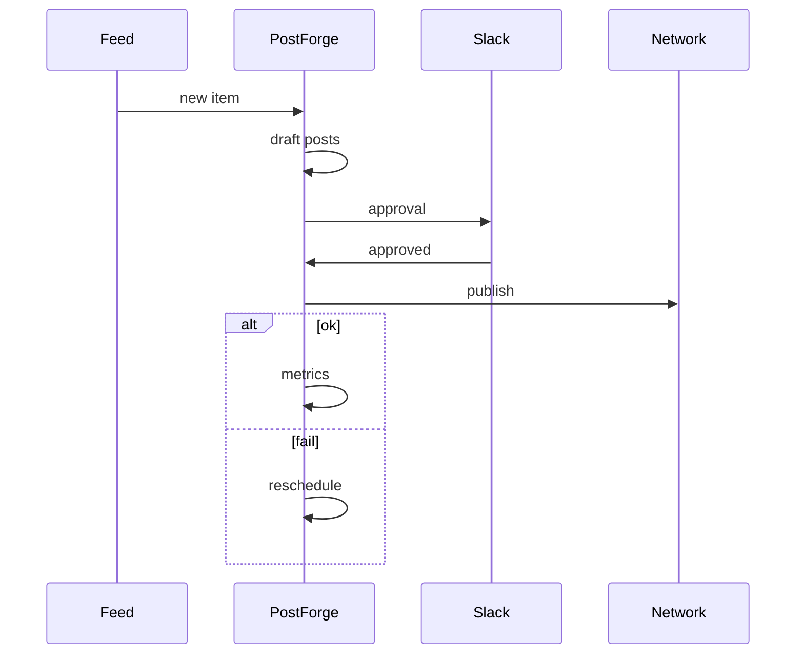

# PostForge Agent

*Strategist that watches product and changelog feeds, drafts weekly post calendars per brand voice, routes approvals in Slack, and reschedules when a network publish fails.*

> **Domain:** `postforge.io` (primary), `postforge.dev` (secondary)
> **Agentic Tier:** Tier 1, score 9/10
> **Market:** Creator tools and B2B marketing ops where multi channel posting stays fragmented (2026)

---

## Agentic Opportunity

PostForge Agent subscribes to RSS and webhook sources, proposes a full week of platform-specific captions with enforced length and hashtag rules, moves posts through a multi-step approval state machine, publishes via stored OAuth connections, and shifts time slots or retries with exponential backoff when rate limits or transient errors hit, without marketers refreshing a calendar UI all day.

---

## Problem Statement

- Copy pasting one campaign across LinkedIn, X, and Meta wastes time and drifts tone
- Agencies need approval logs; chat threads are weak audit artifacts
- Vertical SaaS builders want posting primitives without OAuth maze on day one
- Per network limits and retries differ; teams reinvent backoff policies

---

## Interaction Sequence



**Event Triggers:**
- Content
  - Changelog or blog RSS items
  - Product webhook for ship events
- Schedules
  - Cron for weekly calendar generation
  - Retry worker for failed publishes

**Human-in-the-Loop Gates:** Drafting and internal scheduling can run in shadow mode. Any public publish requires approval unless you allowlist low risk templates with daily caps. Client workspaces can enforce two step approval for external brands.

---

## 7-Day Agentic MVP Build Plan

| Day | Focus | Deliverable |
|-----|-------|-------------|
| 1 | Feed reader | RSS poller plus signature verified webhooks |
| 2 | Planner LLM | Week grid JSON with platform constraints |
| 3 | Voice bind | Map workspace voice YAML into prompts |
| 4 | Approval bridge | Slack interactive messages tied to post ids |
| 5 | Publisher reuse | Call existing adapters with idempotent keys |
| 6 | Failure handling | Exponential backoff plus alternate slot picker |
| 7 | Distribution | Agency onboarding PDF, Zapier or Make recipe doc |

---

## Simple Data Model

```
Workspace:
  id, name, owner_user_id, created_at

VoiceProfile:
  id, workspace_id, yaml, created_at

Campaign:
  id, workspace_id, title, created_at

Post:
  id, campaign_id, status, scheduled_at, published_at, platforms_json, created_at

Approval:
  id, post_id, step, approver_email, status, comment, created_at

Connection:
  id, workspace_id, provider, tokens_enc, created_at

ContentSource:
  id, workspace_id, type, url, last_item_id, created_at

AgentRun:
  id, workspace_id, trigger, posts_created, created_at

APIKey:
  id, workspace_id, key_hash, tier, created_at
```

---

## Revenue Model

| Tier | Price | Includes |
|-----|-------|----------|
| Free | $0 | Capped autonomous posts, one user |
| Pro | $34/month | Unlimited scheduled posts, three users |
| Agency | $99/month | Ten workspaces, approvals, priority email |
| Enterprise | Custom | SLA, custom networks, dedicated IPs |

---

## Stack

- **API:** Node (Express) or Python (FastAPI) matching parent service
- **Scheduler:** Cron worker with timezone aware queue
- **LLM:** GPT-4o class for calendar and caption variants
- **Secrets:** KMS or libsodium for OAuth tokens
- **Database:** PostgreSQL for posts, approvals, sources
- **Notifications:** Slack Bolt or email for approval prompts
- **Deploy:** Fly.io with horizontal workers

---

## Success Metrics

- Workspaces with agent enabled: target 150 by month 2
- Autonomous publishes per week: target 5k by month 3
- Publish failure rate excluding revoked tokens: target under 3%
- Approval turnaround under 4 hours: target 60% of agency posts
- Paid conversion from free agent trial: target 18 logos by day 30
