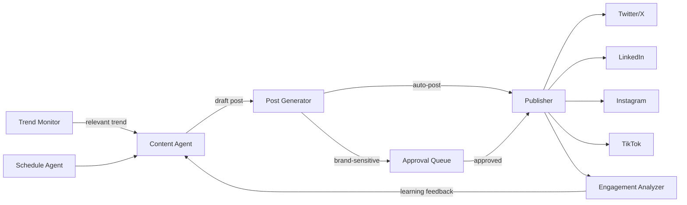

# **PostForge** - Autonomous Brand Content Agent (Agentic SaaS)

*Monitors trends, generates on-brand posts across all platforms, schedules optimal posting times, analyzes engagement, and iterates content strategy - fully autonomous content calendar management.*

> **Parent MicroSaaS:** `postforge`
> **Domain:** `postforge.io` (primary)
> **Agentic Tier:** Tier 2 - Score 7/10
> **Market:** 10M+ social media managers; creator economy; Buffer ($18/month) and Hootsuite ($99/month) validate scale

---

## Agentic Opportunity

The MicroSaaS parent generates posts on demand from topic descriptions. The Agentic SaaS layer autonomously manages the entire brand content calendar: it monitors industry trends and news, generates platform-optimized content, schedules for peak engagement times, cross-publishes across all social platforms, analyzes performance data, and iterates the content strategy based on what drives engagement.

---

## Problem Statement

- Social media managers spend 20-30 hours/week creating, scheduling, and analyzing content
- Buffer/Hootsuite require humans to create every post - they only automate scheduling and publishing
- Consistent brand voice across 5+ platforms requires significant coordination effort
- Most small brands go days without posting because content creation is a full-time job

---

## Autonomy Architecture



**Autonomy settings:**
- Promotional content: always requires human approval
- Educational/informational content: can auto-post with configurable confidence threshold
- Trending topic responses: human approval recommended
- Engagement replies: can auto-respond with configurable tone guardrails

---

## 7-Day Agentic MVP Build Plan

| Day | Focus | Deliverable |
|---|---|---|
| 1 | Brand voice calibration | Analyze existing content samples to learn brand tone, vocabulary, topics |
| 2 | Trend monitoring | RSS feeds + Google Trends + Twitter Trending API for relevant topics |
| 3 | Content generator | GPT-4o generates platform-specific posts (character limits, hashtags, format) |
| 4 | Social publishing APIs | Twitter/X API, LinkedIn API, Instagram Graph API, Buffer API as fallback |
| 5 | Approval queue + auto-post | Web UI for human review; confidence-based auto-posting rules |
| 6 | Engagement analytics | Fetch engagement metrics (likes, shares, clicks); track trend by post type |
| 7 | Content calendar view | Visual calendar of scheduled + published posts; performance overview |

---

## Simple Data Model

```
Brand:
  id, user_id, name, voice_description, topics[], competitor_handles[], approval_required_always (bool)

Post:
  id, brand_id, platform, content, media_urls[], scheduled_for, published_at, status, source_trend

EngagementMetric:
  id, post_id, platform, likes, shares, comments, clicks, reach, measured_at

ContentStrategy:
  id, brand_id, top_performing_types[], peak_engagement_times{}, updated_at

TrendSignal:
  id, source, topic, relevance_score, detected_at, used_for_post_id
```

---

## Revenue Model

| Tier | Price | Includes |
|---|---|---|
| Creator | $14.99/month | 3 platforms, 30 AI posts/month, manual approval for all |
| Growth | $39/month | All platforms, 150 posts/month, auto-post for info content, engagement analytics |
| Agency | $149/month | 10 brand accounts, 500 posts/month, white-label, team collaboration |
| Enterprise | Custom | Unlimited brands, API access, custom brand voice fine-tuning |

**vs. Buffer ($18/month manual scheduling):** Autonomous content generation and trend response justify 2-8x premium. Revenue multiple vs. MicroSaaS parent: 3-5x.

---

## Stack Recommendations

- **Backend:** Python (FastAPI) + Celery for scheduled post generation and publishing
- **LLM:** GPT-4o for content generation; use structured output for platform-specific formatting
- **Social APIs:** Twitter/X API v2, LinkedIn Marketing API, Instagram Graph API
- **Trend Monitoring:** feedparser (RSS), pytrends (Google Trends), GDELT for news
- **Storage:** PostgreSQL for posts and analytics; S3 for media assets
- **Frontend:** React + FullCalendar for content calendar view

---

## Success Metrics

- Brand accounts actively managed (target: 500 by month 6)
- Posts generated per day (target: 5,000 by month 6)
- Auto-post approval rate (target: over 80% posts published without edit)
- Engagement improvement vs. manual (target: 30% higher engagement on AI posts by month 3)
- Active agency accounts (target: 20 by month 9)
