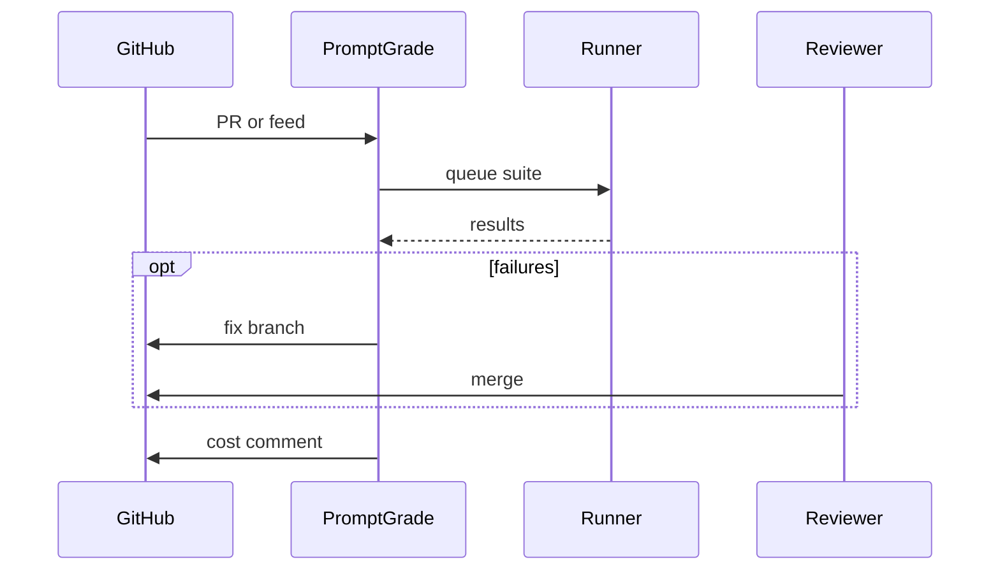

# PromptGrade Agent

*Release bot that watches model and provider changelogs, schedules suite runs on new versions, opens fix PRs for failures, and comments cost deltas on each prompt change.*

> **Domain:** `promptgrade.io` (primary), `promptgrade.dev` (secondary)
> **Agentic Tier:** Tier 1, score 9/10
> **Market:** LLM ops teams that need regression signal before model swaps land in production (2026)

---

## Agentic Opportunity

PromptGrade Agent subscribes to provider RSS and status pages, maps model announcements to affected suite IDs in your workspace, kicks off matrix runs on schedule or on merge, posts failing case excerpts as GitHub check annotations, proposes minimal prompt edits via branch PRs when auto-repair is enabled, and leaves a cost-delta comment on every PR touching evaluated prompt files.

---

## Problem Statement

- Model or temperature tweaks break prompts; teams learn in production
- Spreadsheet test cases do not wire cleanly into GitHub Actions
- Cost per suite is opaque when split across vendors
- Side by side UIs help humans but not merge gates

---

## Interaction Sequence



**Event Triggers:**
- Upstream
  - Provider RSS or API deprecations feed
  - Optional polling of model directory JSON
- Repo
  - Pull request touching prompt files or suite hash
  - Nightly cron for canary models list

**Human-in-the-Loop Gates:** Scheduled scans and read only reports are fully autonomous. Auto repair PRs and production model pin changes require reviewer approval. You can scope the bot to comment only mode per repository.

---

## 7-Day Agentic MVP Build Plan

| Day | Focus | Deliverable |
|-----|-------|-------------|
| 1 | GitHub App | Install flow with repo selection |
| 2 | Changelog parser | Map headlines to watched model ids |
| 3 | Run orchestrator | Call PromptGrade API with suite id matrix |
| 4 | Check runs | Publish pass fail to commit status API |
| 5 | PR comment | Attach artifact links and top failures table |
| 6 | Fix suggester | Patch template with golden case constraints |
| 7 | Distribution | GitHub Marketplace draft, sample workflow YAML |

---

## Simple Data Model

```
User:
  id, email, password_hash, created_at

Suite:
  id, user_id, name, cases_json, created_at

Run:
  id, suite_id, models_json, status, pass_rate, cost_usd, p95_ms, artifact_url, created_at

CaseResult:
  id, run_id, case_id, status, output_json, error, created_at

RepoBinding:
  id, user_id, repo_full_name, suite_ids_json, created_at

AgentRun:
  id, repo_binding_id, trigger, run_id, pr_number, created_at

APIKey:
  id, user_id, key_hash, tier, created_at
```

---

## Revenue Model

| Tier | Price | Includes |
|-----|-------|----------|
| Free | $0 | One repo, comment only, capped runs |
| Pro | $59/month | Five repos, auto run on PR |
| Team | $149/month | Fifteen repos, fix PR beta |
| Enterprise | Custom | Private runners, VPC, SLA |

---

## Stack

- **GitHub App:** Node (Probot) or Python with PyGithub
- **Runner client:** Calls existing PromptGrade worker API with backoff
- **LLM:** Same models under test for optional auto repair attempts
- **Storage:** Object storage for report artifacts already in parent
- **Database:** PostgreSQL for bindings, triggers, audit
- **Deploy:** Fly.io with queue for burst runs

---

## Success Metrics

- Repos with bot installed: target 80 by month 2
- Autonomous runs per week: target 10k by month 3
- Mean time from provider announce to first suite: target under 6 hours
- Fix PR merge rate when offered: target 40% or higher
- Flake rate on agent triggered runs: target under 2%
