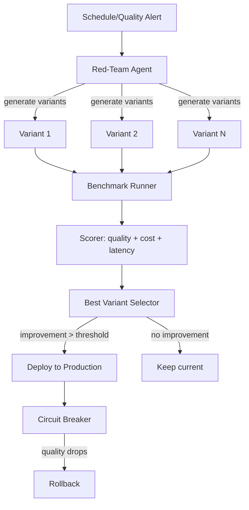

# **PromptGrade** - Autonomous Prompt Optimization Agent (Agentic SaaS)

*Red-teams your prompts, generates variants, benchmarks all on real metrics, and auto-deploys the best version to production with rollback capability.*

> **Parent MicroSaaS:** `promptgrade` (renamed from `promptbench`)
> **Domain:** `promptgrade.io` (primary), `promptgrade.ai` (secondary)
> **Agentic Tier:** Tier 2 - Score 8/10
> **Market:** 100K+ LLM application developers; every team with prompts in production

---

## Agentic Opportunity

The MicroSaaS parent lets developers manually run side-by-side prompt comparisons. The Agentic SaaS layer runs the full optimization cycle autonomously: it generates prompt variants, benchmarks all against quality/cost/latency metrics, selects the best, and can deploy to production with a rollback circuit breaker - all triggered on a schedule or when quality metrics degrade.

---

## Problem Statement

- Prompt quality degrades as models update without warning (silent regression)
- Developers benchmark prompts manually in spreadsheets - slow, inconsistent, unscalable
- No tool automatically monitors production prompts for quality degradation and auto-heals
- Prompt optimization requires expertise in prompt engineering that most developers lack

---

## Autonomy Architecture



**Autonomy levels:**
- Variant generation: fully autonomous
- Benchmarking: fully autonomous
- Production deployment: configurable (manual gate or automatic with circuit breaker)
- Rollback: fully automatic (triggered by quality metric threshold breach)

---

## 7-Day Agentic MVP Build Plan

| Day | Focus | Deliverable |
|---|---|---|
| 1 | Prompt version registry | Store prompt versions with metadata; track current production version |
| 2 | Variant generator | GPT-4o meta-prompting: generate N variants from original prompt |
| 3 | Benchmark runner | Parallel LLM calls with test cases; measure quality/cost/latency |
| 4 | Scorer | Quality (LLM-as-judge), cost (token counting), latency (ms), and custom metrics |
| 5 | Deployment integration | API endpoint to swap production prompt; webhook notification |
| 6 | Circuit breaker + rollback | Monitor production quality; auto-rollback on regression |
| 7 | Scheduled optimization | Cron-based weekly re-benchmarking; Slack/email report |

---

## Simple Data Model

```
Prompt:
  id, workspace_id, name, current_version_id, model_provider, model_name, created_at

PromptVersion:
  id, prompt_id, content, created_at, is_production, deployed_at, rolled_back_at

BenchmarkRun:
  id, prompt_id, versions_tested[], test_cases_count, started_at, completed_at, winner_version_id

BenchmarkResult:
  id, run_id, version_id, quality_score, avg_cost_usd, avg_latency_ms, pass_rate

ProductionMetric:
  id, prompt_id, version_id, timestamp, quality_score, sample_size, alert_triggered (bool)
```

---

## Revenue Model

| Tier | Price | Includes |
|---|---|---|
| Developer | Free | 3 prompts, 100 benchmark runs/month |
| Pro | $19.99/month | 20 prompts, 1,000 runs/month, scheduled optimization |
| Team | $49.99/month | 100 prompts, 10,000 runs/month, auto-deploy, circuit breaker |
| Enterprise | $199/month | Unlimited prompts and runs, SOC 2 audit trail, custom scorers |

**vs. manual spreadsheet workflow (free but slow):** Team + Enterprise justify pricing via time savings (engineers spending 4-8 hours/week on prompt maintenance). Revenue multiple vs. MicroSaaS parent: 5-8x.

---

## Stack Recommendations

- **Backend:** Python (FastAPI) + asyncio for parallel benchmark execution
- **LLM:** OpenAI GPT-4o (variant generation + LLM-as-judge scoring); Anthropic as benchmark target
- **Storage:** PostgreSQL for version registry and benchmark results
- **Queue:** Redis + Celery for async benchmark runs and scheduled optimization
- **Metrics:** Prometheus + Grafana for production quality monitoring dashboard
- **Deploy:** Fly.io for low-latency global API serving

---

## Success Metrics

- Prompts registered in production (target: 500 by month 6)
- Benchmark runs per day (target: 10,000 by month 6)
- Quality improvement per optimization cycle (target: over 15% average)
- Auto-deployments without incident (target: over 95% success rate)
- Circuit breaker activations (target: under 5% of auto-deployments)
