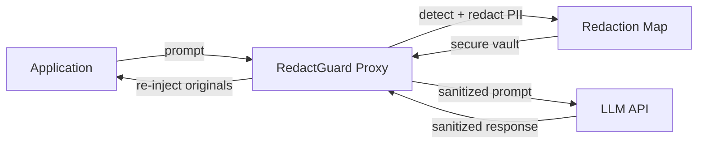

# **RedactGuard** - Autonomous Privacy Guardrail Agent (Agentic SaaS)

*Transparent PII redaction proxy embedded in every AI API call - zero human involvement in steady state.*

> **Parent MicroSaaS:** `redactguard`
> **Domain:** `redactguard.io` (primary), `redactguard.ai` (secondary)
> **Agentic Tier:** Tier 1 - Score 10/10 (highest of all 11 agents)
> **Market:** Every enterprise AI deployment (2026 mandate level for GDPR, CCPA, HIPAA)

---

## Agentic Opportunity

The MicroSaaS parent is a stateless API: send text, receive redacted text. The Agentic SaaS layer wraps every AI API call in the application stack automatically - developers change one URL, not their entire codebase. The agent intercepts, redacts, forwards, receives, and re-injects without any human involvement.

---

## Problem Statement

- GPT-4 and other LLMs will regurgitate PII from input prompts in their outputs
- Developers must manually strip PII before every AI API call - error-prone and incomplete
- GDPR Article 25, CCPA, and HIPAA all mandate data minimization at the point of processing
- No transparent proxy solution exists that works with OpenAI, Anthropic, Bedrock, and Gemini simultaneously

---

## Autonomy Architecture



**Autonomous loop:** Every outbound AI API call is automatically intercepted. Redaction happens in under 50ms. Re-injection of original values (where appropriate) uses a secure per-request vault. Full audit log is written to persistent storage with no human involvement.

**Human-in-Loop Gates:** None in standard operation. Alert-only for high-volume unusual patterns (potential data exfiltration signal).

---

## 7-Day Agentic MVP Build Plan

| Day | Focus | Deliverable |
|---|---|---|
| 1 | Proxy server scaffold | FastAPI reverse proxy; OpenAI-compatible endpoint |
| 2 | PII detection engine | Regex + spaCy NER for emails, phones, SSNs, names, addresses |
| 3 | Re-injection vault | Per-request placeholder map with TTL-based expiry |
| 4 | Multi-provider support | Anthropic, Bedrock, Gemini proxy adapters |
| 5 | Audit log + dashboard | Real-time stream of redaction events; PII type breakdown |
| 6 | SDK packaging | Python `pip install redactguard-sdk`; one-line integration |
| 7 | Deploy + docs | orchestiq.io/docs; Postman collection; security white paper |

---

## Simple Data Model

```
RedactionEvent:
  id, request_id, timestamp, pii_types_detected[], pii_count, latency_ms, provider, model

RedactionRule:
  id, name, pattern_type (regex|ner|custom), pattern, replacement_token, active

Session:
  id, api_key_hash, total_requests, total_pii_redacted, created_at
```

---

## Revenue Model

| Tier | Price | Includes |
|---|---|---|
| Developer | Free | 1,000 requests/month |
| Pro | $29/month | 100K requests/month, all providers, audit log |
| Enterprise | $99/month | 1M requests/month, SLA, compliance export, custom rules |
| PAYG | $0.0001/request | Above plan limits |

**vs. MicroSaaS parent ($29-99/month):** Agentic proxy mode can charge per-seat in enterprise at $199-499/month (embedded in production = high switching cost). Revenue multiple: 5-10x.

---

## Stack Recommendations

- **Proxy:** Python (FastAPI) + uvicorn; deploy on Fly.io or Railway for low-latency global edge
- **PII Detection:** spaCy NER + custom regex engine; Presidio (Microsoft OSS) as fallback
- **Vault:** Redis with TTL (per-request placeholder map)
- **Audit:** ClickHouse or TimescaleDB for high-throughput event logging
- **SDK:** `redactguard` Python package + Node.js `redactguard-node` package

---

## Success Metrics

- PII detection accuracy (target: over 98% recall on standard PII types)
- Proxy latency overhead (target: under 50ms p99)
- Requests processed per day (target: 1M by month 6)
- Enterprise customers with SOC 2 audit export enabled (target: 10 by month 9)
- Provider coverage (target: OpenAI, Anthropic, Bedrock, Gemini all supported by launch)
