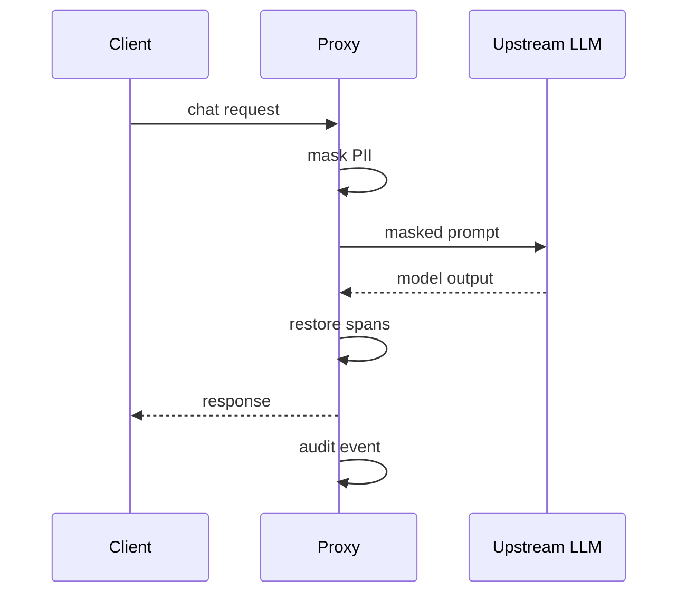

# RedactGuard Agent

*Always-on LLM proxy that redacts PII on every request, forwards to providers, and restores safe spans using a per-request vault.*

> **Domain:** `redactguard.io` (primary), `redactguard.dev` (secondary)
> **Agentic Tier:** Tier 1, score 10/10
> **Market:** Enterprise AI rollouts where GDPR, CCPA, and HIPAA-style minimization matter (2026)

---

## Agentic Opportunity

RedactGuard Agent sits in the network path: applications point OpenAI-compatible clients at the proxy endpoint, every payload is scanned and masked before the upstream model receives it, responses are post-processed using a short-lived per-request vault map, and every redaction event logs to an append-only audit stream without developers wrapping each call by hand.

---

## Problem Statement

- Models echo PII from prompts; one missed strip becomes a retention and training policy incident
- Regex-only client wrappers drift as formats and locales change
- Security teams need continuous proof of redaction volume and types, not ad-hoc screenshots
- Multi-provider stacks multiply integration work unless one gateway normalizes behavior

---

## Interaction Sequence



**Event Triggers:**
- Every HTTP request through the hosted proxy endpoint
- Optional canary traffic sample for shadow mode in staging

**Human-in-the-Loop Gates:** Steady state is fully autonomous. Humans receive alert-only workflows when volume or rare entity mix crosses anomaly thresholds you configure (possible exfiltration pattern). No human approves each chat turn.

---

## 7-Day Agentic MVP Build Plan

| Day | Focus | Deliverable |
|-----|-------|-------------|
| 1 | Proxy scaffold | FastAPI reverse proxy, OpenAI-shaped routes |
| 2 | Detectors | Regex plus optional NER for names and locations |
| 3 | Vault | Per-request placeholder map with TTL in Redis |
| 4 | Providers | Anthropic and second adapter behind same surface |
| 5 | Audit stream | Append-only events with type counts, no raw text on default tier |
| 6 | SDK | Python package with one-line base URL swap |
| 7 | Distribution | Public docs site, Postman collection, security one-pager PDF |

---

## Simple Data Model

```
RedactionEvent:
  id, request_id, timestamp, pii_types, pii_count, latency_ms, provider, model

RedactionRule:
  id, tenant_id, pattern_type, pattern, replacement_token, active, created_at

Session:
  id, api_key_hash, total_requests, total_pii_redacted, created_at

AuditExport:
  id, tenant_id, period_start, period_end, storage_url, created_at
```

---

## Revenue Model

| Tier | Price | Includes |
|-----|-------|----------|
| Free | $0 | Low monthly request cap, single provider |
| Pro | $49/month | Multi-provider, audit log, Slack alerts |
| Team | $149/month | Higher QPS, SSO roadmap, retention controls |
| Enterprise | Custom | VPC, BYOK, SLA, compliance pack |

---

## Stack

- **Proxy:** Python (FastAPI) plus uvicorn, deployed on Fly.io or Railway with regional routing
- **PII engine:** Regex plus spaCy or Presidio-style pipelines behind feature flags
- **Vault:** Redis with strict TTL keys per request id
- **Audit:** PostgreSQL or ClickHouse for high volume aggregates
- **SDK:** `redactguard` PyPI plus optional Node shim

---

## Success Metrics

- Proxy requests per day: target 500k by month 6
- p99 added latency: target under 50 ms over baseline network
- Recall on benchmark PII set: target 98% or higher for enabled types
- Enterprise tenants with export jobs: target 10 by month 9
- Provider coverage at launch: OpenAI plus one additional major API
