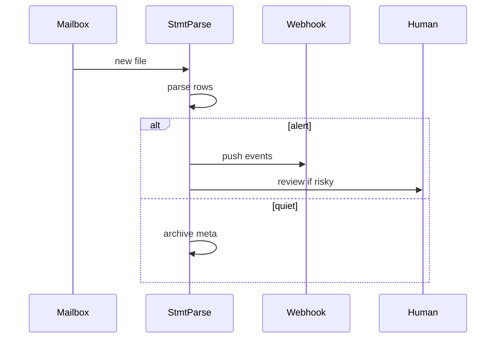

# StmtParse Agent

*Mailbox and folder watcher that ingests new statements on a schedule, flags subscription and price shifts, and drafts dispute or cancel checklists without monthly manual uploads.*

> **Domain:** `stmtparse.io` (primary), `stmtparse.dev` (secondary)
> **Agentic Tier:** Tier 1, score 9/10
> **Market:** Open banking and personal finance builders who need statement intelligence without per issuer parsers (2026)

---

## Agentic Opportunity

StmtParse Agent connects to IMAP, S3 drop zones, or partner export hooks, pulls new PDFs and CSVs as they arrive, runs the parser pipeline with issuer hints from headers or filenames, emits `subscription.found` and `anomaly.flagged` events to downstream systems, and surfaces human-readable action steps when spend patterns shift or unknown recurring charges appear.

---

## Problem Statement

- PDF and CSV layouts drift per issuer; bespoke parsers break on format tweaks
- Recurring charges hide in line items; users notice unwanted subscriptions late
- Teams want categorized spend and anomaly hints in one path, not three services
- PCI and minimization goals favor automation with clear retention and opt out controls

---

## Interaction Sequence



**Event Triggers:**
- Connectors
  - IMAP IDLE or polling for statement senders
  - Object storage notifications for drop folder uploads
- Schedules
  - Nightly sweep for missed attachments
  - Monthly rollup job for trend emails

**Human-in-the-Loop Gates:** Parsing, categorization, and webhook delivery run unattended. Draft letters that dispute charges or promise refunds require explicit approval. You can run alert only mode that never drafts customer facing text.

---

## 7-Day Agentic MVP Build Plan

| Day | Focus | Deliverable |
|-----|-------|-------------|
| 1 | Connector MVP | IMAP reader with encrypted credential vault |
| 2 | Router | Filename and header heuristics to issuer hint |
| 3 | Pipeline reuse | Call existing parse worker; idempotent job keys |
| 4 | Diff engine | Compare to last statement hash per account |
| 5 | Subscriptions | Recurrence detector on rolling window |
| 6 | Digest | Email or Slack summary with deep links |
| 7 | Distribution | Integration guide, Postman folder, fintech security brief |

---

## Simple Data Model

```
User:
  id, email, password_hash, created_at

Statement:
  id, user_id, issuer_hint, format, status, raw_url, created_at

Transaction:
  id, statement_id, date, merchant, amount, category, created_at

SubscriptionCandidate:
  id, statement_id, merchant, amount, interval, confidence

WebhookEndpoint:
  id, user_id, url, secret, events_json, created_at

Connector:
  id, user_id, type, config_enc, last_synced_at, created_at

AgentRun:
  id, connector_id, statement_id, outcome, created_at

APIKey:
  id, user_id, key_hash, tier, created_at
```

---

## Revenue Model

| Tier | Price | Includes |
|-----|-------|----------|
| Free | $0 | One connector, capped statements, short retention |
| Pro | $49/month | Multiple connectors, webhooks, standard retention |
| Scale | $199/month | Higher volume, custom issuer pack requests |
| Enterprise | Custom | On prem option, DPA, zero retention mode |

---

## Stack

- **Ingest:** Python (FastAPI) workers plus Celery for IMAP and storage watchers
- **Parsing:** Existing template packs plus PDF text extract pipeline
- **Storage:** Encrypted object storage with TTL per tier
- **LLM:** Optional opt in classification on Pro only
- **Database:** PostgreSQL for statements, transactions, connector state
- **Deploy:** Railway or Fly.io with isolated worker processes

---

## Success Metrics

- Statements parsed per month: target 15k by month 1
- Connector attached accounts: target 2k by month 3
- Parser success rate on supported issuers: target 92% or higher
- New subscription alerts acknowledged within 24h: target 70% of pilot users
- Paid workspaces: target 20 by day 30
