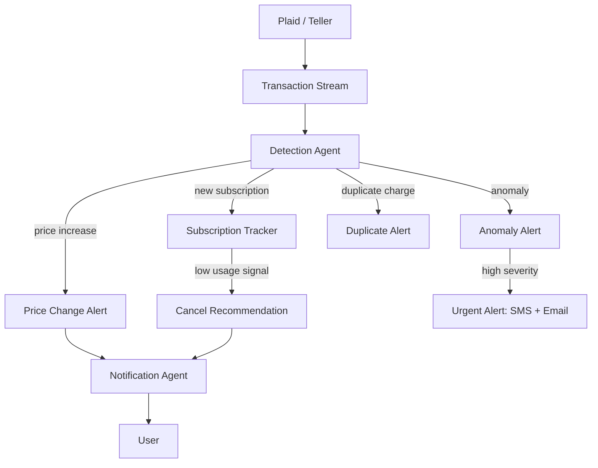

# **StmtParse** - Autonomous Financial Monitoring Agent (Agentic SaaS)

*Continuously monitors connected financial accounts, detects new subscriptions, price changes, and anomalies in real-time, and sends proactive alerts with actionable recommendations.*

> **Parent MicroSaaS:** `stmtparse` (renamed from `cardra`)
> **Domain:** `stmtparse.io` (primary), `stmtparse.ai` (secondary)
> **Agentic Tier:** Tier 3 - Score 6/10
> **Market:** Personal finance management (B2C: massive TAM); B2B financial operations (higher ARPU)

---

## Agentic Opportunity

The MicroSaaS parent parses credit card statement PDFs on demand. The Agentic SaaS layer connects to live financial accounts via open banking APIs (Plaid, Teller - enabled by CFPB 2025 open banking regulation), monitors all transactions in real-time, and proactively alerts users to subscription changes, anomalies, and optimization opportunities without requiring manual uploads.

---

## Problem Statement

- Average American has 4+ active subscriptions they've forgotten about (costing $273/month on average)
- Credit card companies notify of charges after the fact - no proactive anomaly detection
- Personal finance apps (Mint retired, YNAB) require manual categorization and review
- Small businesses overpay on vendor subscriptions due to lack of automated monitoring

---

## Autonomy Architecture



**Autonomy levels:**
- Transaction monitoring: fully autonomous
- Alert generation: fully autonomous
- Cancel recommendations: requires user confirmation
- Dispute initiation: requires explicit user action (regulatory requirement)

---

## 7-Day Agentic MVP Build Plan

| Day | Focus | Deliverable |
|---|---|---|
| 1 | Plaid integration | Account linking via Plaid Link; real-time transaction webhook |
| 2 | Subscription detector | Identify recurring charges by merchant + amount + frequency |
| 3 | Price change detector | Compare recurring charge amounts across billing cycles |
| 4 | Anomaly detection | Baseline spending by merchant category; alert on outliers |
| 5 | Duplicate charge detector | Flag identical merchant + amount within 7-day window |
| 6 | Notification system | SMS (Twilio) + email + push notifications; urgency levels |
| 7 | Savings dashboard | Show subscription cost, price change history, estimated annual savings |

---

## Simple Data Model

```
Account:
  id, user_id, plaid_account_id, institution_name, type, last_synced

Transaction:
  id, account_id, amount, merchant_name, category, date, is_recurring, subscription_id

Subscription:
  id, account_id, merchant_name, amount, frequency, first_seen, last_charged, status (active|cancelled)

Alert:
  id, account_id, type (new_sub|price_change|anomaly|duplicate), severity, message, resolved (bool), created_at

MonthlyReport:
  id, account_id, month, total_subscriptions, total_subscription_cost, savings_opportunity, generated_at
```

---

## Revenue Model

### B2C Option
| Tier | Price | Includes |
|---|---|---|
| Free | $0 | 1 account, subscription tracking only |
| Premium | $9.99/month | All accounts, anomaly alerts, price change detection, savings dashboard |

### B2B Option (Higher ARPU)
| Tier | Price | Includes |
|---|---|---|
| Startup | $49/month | Up to 5 corporate cards, anomaly alerts, monthly expense report |
| Business | $149/month | Unlimited cards, approval workflow for large purchases, API access |

**Regulatory note:** PCI DSS compliance required for storing payment card data. Plaid/Teller integration avoids direct card data handling but requires SOC 2 Type II for enterprise customers. Plan for 6-month compliance build before B2B enterprise launch.

---

## Stack Recommendations

- **Open Banking:** Plaid (US) + Teller (US, faster webhook support)
- **Backend:** Python (FastAPI) + Celery for transaction processing
- **Anomaly Detection:** statsmodels z-score for merchant spending baseline
- **Notifications:** Twilio (SMS), SendGrid (email), Firebase (push)
- **Storage:** PostgreSQL; never store raw card numbers (use Plaid account IDs only)
- **Compliance:** Start with Plaid's SOC 2 compliance cover; plan own SOC 2 for enterprise

---

## Success Metrics

- Accounts linked via Plaid (target: 5,000 by month 6)
- Subscriptions detected per account (target: 8 on average)
- Anomalies alerted before user noticed (target: over 70% proactive)
- Monthly savings shown to users (target: $50 average per user)
- B2B customers with corporate card monitoring (target: 20 by month 9)
