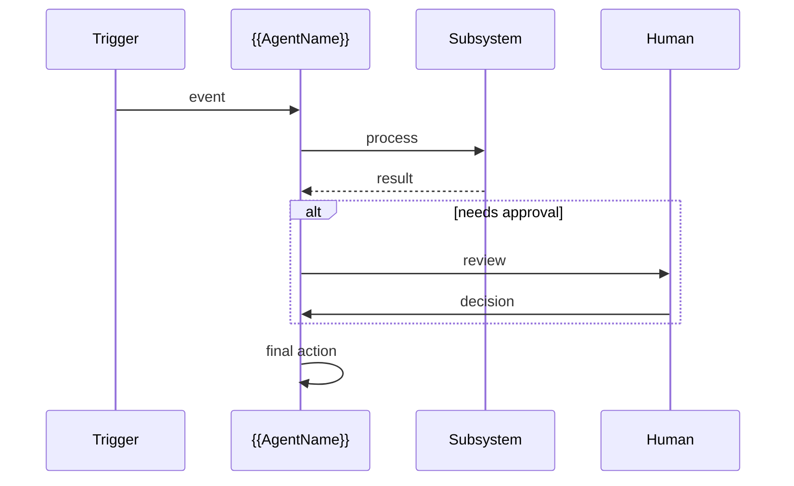

# {{ProjectName}} Agent

*{{One-line description of what the agent does autonomously and its core value.}}*

> **Domain:** `{{projectname}}.io` (primary), `{{projectname}}.dev` (secondary)
> **Agentic Tier:** Tier {{1/2/3}} - Score {{X}}/10
> **Market:** {{One-line market size or target context}}

---

## Agentic Opportunity

<!--
One paragraph. Describe what the agent does proactively and continuously.
Focus on the event-driven, autonomous behavior: what triggers it, what actions it takes,
and what outcome it delivers without requiring human polling.
-->

{{AgentName}} Agent runs continuously: it {{watches/monitors}} {{what trigger}}, {{takes autonomous action}}, and {{delivers outcome}} without requiring human polling.

---

## Problem Statement

- {{Pain point 1 that requires continuous monitoring, not one-shot API calls}}
- {{Pain point 2 that makes automation more valuable than manual API calls}}
- {{Pain point 3 showing why humans-in-the-loop are slow or error-prone here}}
- {{Why the agentic approach is uniquely suited to this domain}}

---

## Interaction Sequence

<!--
Mermaid sequenceDiagram. Rules:
- Short participant aliases; arrow labels 2-5 words max
- No full sentences in messages
- No \n inside the diagram block
- Show trigger, agent, optional human gate, outcome
-->



**Event Triggers:**
- {{Primary trigger, e.g., GitHub webhook on every PR touching config files}}
- {{Secondary trigger, e.g., scheduled full-repo audit weekly or on-demand}}

**Human-in-the-Loop Gates:** {{Describe where humans approve and where the agent acts fully autonomously.}}

---

## 7-Day Agentic MVP Build Plan

| Day | Focus | Deliverable |
|-----|-------|-------------|
| 1 | {{Day 1 focus}} | {{Concrete deliverable - what exists at end of day}} |
| 2 | {{Day 2 focus}} | {{Concrete deliverable}} |
| 3 | {{Day 3 focus}} | {{Concrete deliverable}} |
| 4 | {{Day 4 focus}} | {{Concrete deliverable}} |
| 5 | {{Day 5 focus}} | {{Concrete deliverable}} |
| 6 | {{Day 6 focus}} | {{Concrete deliverable}} |
| 7 | Distribution | {{Marketplace listing or install flow, e.g., GitHub Marketplace one-click install}} |

---

## Simple Data Model

```
{{Entity1}}:
  id, {{field1}}, {{field2}}, {{field3}}, created_at

{{Entity2}}:
  id, {{entity1}}_id, {{field1}}, {{field2}}, {{field3}}, timestamp

{{AuditOrRunEntity}}:
  id, {{entity1}}_id, event_type, actor, result, timestamp
```

---

## Revenue Model

| Tier | Price | Includes |
|------|-------|----------|
| Free | $0 | {{X repos/users}}, {{public only or basic feature}} |
| Pro | ${{X}}/month | {{Y repos/users}}, {{key agentic feature}}, {{notification type}} |
| Team | ${{X}}/month | {{Z repos/users}}, {{autonomous action mode}}, {{audit feature}} |
| Enterprise | Custom | Unlimited, {{compliance feature}}, custom rules, SLA |

---

## Stack

- **{{App type, e.g., GitHub App}}:** {{Framework, e.g., Node.js (Probot) or Python (Flask + PyGithub)}}
- **{{Core processing library}}:** {{what it does}}
- **LLM:** {{Model, e.g., GPT-4o for fix generation; structured output mode}}
- **Database:** {{PostgreSQL for audit trails; Redis for event queue}}
- **Deploy:** {{Railway or Render (always-on server required for webhook receiver)}}

---

## Success Metrics

- {{Primary adoption metric, e.g., repos with agent installed}}: target {{X}} by month 3
- {{Core value metric, e.g., errors caught before production}}: target {{X}}/week by month 6
- {{Autonomy quality metric, e.g., auto-fix acceptance rate}}: target {{X}}% or higher
- {{Enterprise metric, e.g., SOC 2 audit export active}}: target {{X}} by month 9
- {{Marketplace or rating metric}}: target {{X}} stars or {{X}} installs
