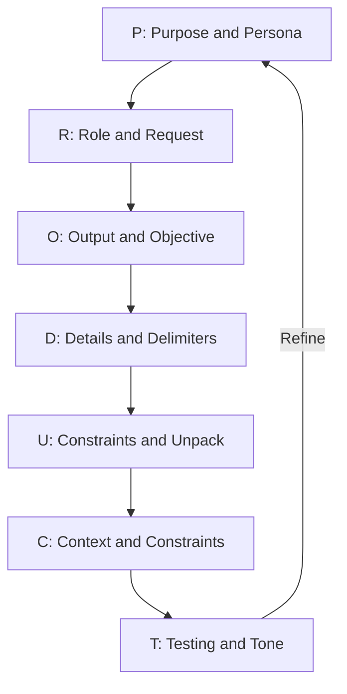
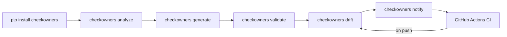
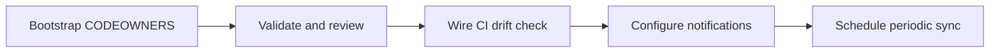

# The P.R.O.D.U.C.T. Prompting Framework for checkOwners Users

> "A good prompt is a lever; give it the right fulcrum and it can move an AI." (adapted from Archimedes)

This document applies the P.R.O.D.U.C.T. framework to the real operational tasks you face as a checkOwners user: bootstrapping ownership inference, reviewing drift reports, wiring CI, configuring notifications, and customizing the tool for your repo.

Use it as a prompting reference. Pick the task you need to accomplish, compose the prompt from the pillar values for that task, and paste it into Claude Code or any other AI assistant.

---

## The Framework Overview

**P.R.O.D.U.C.T.** transforms scattered intent into deterministic, high-quality AI outputs. Each letter is a required prompt pillar:

| Letter | Pillar | Core Question |
|--------|--------|---------------|
| **P** | **Purpose & Persona** | What is the goal and who should the AI be? |
| **R** | **Role & Request** | What authority and what core action? |
| **O** | **Output & Objective** | What format and why does success matter? |
| **D** | **Details & Delimiters** | What facts and how to structure them? |
| **U** | **User Constraints & Unpack** | What rules and how to reason? |
| **C** | **Context & Constraints** | What background and what limits? |
| **T** | **Testing & Tone** | How to validate and how to sound? |

---

## Framework Flow



---

## checkOwners User Workflow



---

## Prompt Anatomy

```
P: <Purpose> | <Persona>
R: <Role> | <Request>
O: <Output spec> | <Objective>
D: <Details and data> | <Delimiters>
U: <User constraints> | <Unpack directive>
C: <Context and continuity> | <Constraints>
T: <Testing hook> | <Tone>
```

---

## P: Purpose & Persona

**Purpose** declares your operational goal in one declarative line.
**Persona** assigns the AI a specific identity grounded in your domain so it makes the right trade-offs.

### Example 1: Bootstrap (repo with no CODEOWNERS)

```
P: Infer de-facto ownership for a monorepo that has never had a CODEOWNERS file
   and generate an accurate first draft.
   You are a senior platform engineer at a 200-person engineering org who owns
   the GitHub review routing policy for a 500k-LOC monorepo.
```

### Example 2: Drift Review

```
P: Interpret the drift report produced by checkowners drift and decide which
   stale entries to remove, which to reassign, and which to leave pending.
   You are a staff engineer who manages code review SLAs across 15 teams.
```

### Example 3: CI Integration

```
P: Wire checkowners drift into our GitHub Actions CI pipeline so every PR
   that touches CODEOWNERS-governed paths triggers a drift check.
   You are a DevOps engineer who owns the CI/CD platform for a 50-engineer org.
```

---

## R: Role & Request

**Role** establishes the AI's authority.
**Request** is the single, unambiguous action verb: what the AI must *do*.

### Example 1: Generate CODEOWNERS

```
R: CODEOWNERS maintainer | Run checkowners analyze and generate a
   .github/CODEOWNERS file, then summarize any paths with fewer than
   two inferred owners.
```

### Example 2: Interpret Drift Output

```
R: Ownership auditor | Parse the JSON output of checkowners drift,
   group findings by category (stale, missing, changed), and produce
   a prioritized remediation list.
```

### Example 3: Debug Missing Owner

```
R: Tool debugger | Explain why checkowners analyze returns no inferred
   owner for src/payments/ given the current config, and propose a fix.
```

---

## O: Output & Objective

**Output Spec** defines the exact deliverable: format, length, and structure.
**Objective** explains why success matters so the AI makes correct micro-decisions.

### Example 1: Initial CODEOWNERS File

```
O: A .github/CODEOWNERS file that passes checkowners validate with zero errors,
   plus a Markdown table listing every path with its top-2 inferred owners
   and their commit counts.
   Objective: replace 14-month-old manually maintained CODEOWNERS with an
   inference-backed file that routes PRs to the engineers who actually own the code.
```

### Example 2: Drift Remediation Report

```
O: A Markdown report with three sections: stale entries to remove,
   paths to reassign with suggested new owners, and paths needing
   human triage because checkowners cannot infer a clear owner.
   Objective: let the platform team resolve drift in a single async review
   without needing to run checkowners themselves.
```

### Example 3: CI Workflow File

```
O: A complete .github/workflows/checkowners.yml that uses checkowners-action,
   runs on push and pull_request, fails if drift_detected=true,
   and posts a summary comment on PRs.
   Objective: make CODEOWNERS drift visible in code review before it reaches main.
```

---

## D: Details & Delimiters

**Details & Data** supply concrete facts, config values, and real examples.
**Delimiters** mark sections so the AI can parse structured inputs reliably.

### Example 1: Bootstrap Config

```
D: Config file (.github/checkowners.yml):
   analysis:
     lookback_days: 180
     min_commits: 3
     top_n_owners: 2
   paths:
     exclude:
       - "*.lock"
       - "dist/**"
       - "vendor/**"
   output:
     header: "# Generated by checkOwners. Do not edit manually."
     include_unowned: false

   Repo facts: 12 active contributors, 500k LOC, no existing CODEOWNERS.

### ANALYZE OUTPUT (truncated) ###
{
  "inferred": {
    "src/api/": ["@alice", "@bob"],
    "src/db/": ["@carol"],
    "tests/": ["@bob", "@dave"]
  },
  "last_analyzed": "2026-04-04T10:00:00Z"
}
### END ###
```

### Example 2: Drift Report

```
D: Drift report from checkowners drift --json:
   {
     "stale": ["src/infra/", ".github/"],
     "missing": ["src/payments/", "src/auth/"],
     "changed": ["src/api/"],
     "drift_detected": true
   }
   Context: @org/infra team was dissolved 6 months ago.
   @carol left the company last month.

### DESIRED OUTPUT ###
Section 1: Remove (safe to delete entry)
Section 2: Reassign (suggest replacement owner)
Section 3: Triage needed (no clear inferred owner)
### END ###
```

### Example 3: CI Integration

```
D: Existing CI: GitHub Actions, ubuntu-latest runners, Python 3.11.
   Current workflow file: .github/workflows/ci.yml (lint, test, deploy).
   checkowners-action is published at: checkowners/checkowners-action@v1
   Required behavior: fail PR if drift_detected=true; post drift summary as PR comment.
   Do not block push to main (check only on pull_request event).
```

---

## U: User Constraints & Unpack

**User Constraints** encode non-negotiable rules about what the AI must and must not do.
**Unpack** forces step-by-step reasoning before the AI produces any output.

### Example 1: CODEOWNERS Generation

```
U: Constraints:
   - Do not add any owner with fewer than 3 commits in the analysis window.
   - Flag but do not auto-remove stale entries; leave them commented out with a note.
   - Every path in the generated file must map to at least one active contributor.
   - The file must not exceed 100 lines.
   Unpack: Before generating the file, list each path group, its inferred owners,
   and any ownership ambiguities, then confirm the plan before writing CODEOWNERS.
```

### Example 2: Drift Remediation

```
U: Constraints:
   - Do not suggest removing an entry without proposing a replacement owner.
   - Owners must be active GitHub handles in the org (not dissolved teams).
   - For "triage needed" paths, explain why checkowners could not infer an owner.
   Unpack: Walk through each drift category (stale, missing, changed) one at a time
   before producing the final report.
```

### Example 3: Debugging Missing Owner

```
U: Constraints:
   - Do not suggest changing the min_commits threshold without explaining the trade-off.
   - Do not suggest adding a manual CODEOWNERS entry as the primary fix.
   Unpack: First check whether the path matches any exclude glob; then check commit
   count in the lookback window; then check whether all committers are outside the org.
```

---

## C: Context & Constraints

**Context** threads background knowledge, history, and edge cases that change the right answer.
**Constraints** set absolute limits the AI must not violate.

### Example 1: Bootstrap (stale team problem)

```
C: The repo previously used a manually maintained CODEOWNERS that referenced
   @org/infra (dissolved 6 months ago) and @alice (left the company).
   checkowners drift has already identified these as stale entries.
   The eng-platform team (@org/eng-platform) now owns all infra paths.
   Constraint: the generated CODEOWNERS must pass checkowners validate
   with zero errors before it can be committed.
```

### Example 2: CI Integration (existing workflows)

```
C: The repo already has three workflow files; a fourth must not duplicate
   the checkout step already present in ci.yml.
   The org blocks PRs from merging if any required status check fails,
   so a false-positive drift alert would block all PRs.
   Constraint: only fail the check when drift_detected=true AND at least
   one stale entry references a dissolved team or departed contributor.
```

### Example 3: Custom Exclusions (monorepo)

```
C: The repo uses a non-standard structure: generated protobuf files live in
   src/proto/gen/ and are never directly committed by engineers.
   The vendor/ exclusion already covers third-party code.
   Constraint: do not infer ownership for any path under src/proto/gen/;
   add it to the exclude list in checkowners.yml.
```

---

## T: Testing & Tone

**Testing Hook** embeds self-grading rubrics or validation gates.
**Tone** prescribes the voice so the output is immediately usable.

### Example 1: CODEOWNERS Output

```
T: Validate: run checkowners validate on the generated file and confirm zero errors;
   run checkowners drift and confirm drift_detected=false.
   Tone: concise and direct; flag ownership ambiguities explicitly;
   do not soften findings with hedging language.
```

### Example 2: Drift Report

```
T: Validate: every suggested replacement owner must be a real GitHub handle
   that appears in the checkowners analyze output.
   Tone: terse; use a table for the remediation list; one sentence per finding.
```

### Example 3: CI Workflow

```
T: Validate: the workflow YAML must be valid GitHub Actions syntax (parseable by
   actionlint); the checkowners-action step must use a pinned version tag.
   Tone: annotate non-obvious workflow choices with a one-line comment;
   no other comments.
```

---

## Complete Example: Wiring checkOwners into GitHub Actions CI

This is a full P.R.O.D.U.C.T. prompt ready to paste into Claude Code.

### Prompt

```
P: Add checkowners drift detection to our GitHub Actions CI pipeline so every
   pull request that touches CODEOWNERS-governed paths triggers a drift check
   and posts a summary comment if drift is detected.
   You are a DevOps engineer who owns the CI/CD platform for a 50-engineer
   GitHub org and has experience publishing and consuming GitHub Actions.

R: CI platform engineer | Write a new GitHub Actions workflow file
   (.github/workflows/checkowners.yml) that uses checkowners-action,
   runs drift detection on pull_request events, fails the check when
   drift_detected=true, and posts a formatted PR comment with the drift summary.

O: A complete, valid .github/workflows/checkowners.yml with annotated
   non-obvious choices, plus a one-paragraph explanation of how to
   enable it as a required status check in branch protection settings.
   Objective: make CODEOWNERS drift visible during code review so stale entries
   are caught before they reach main and break review routing.

D: Existing setup:
   - Runner: ubuntu-latest, Python 3.11 available
   - checkowners-action published at checkowners/checkowners-action@v1
   - checkowners.yml config already committed at .github/checkowners.yml
   - Drift JSON output key: checkowners_drift (set in GITHUB_OUTPUT)
   - Required behavior: fail on pull_request if drift_detected=true;
     do NOT fail on push to main

### DESIRED WORKFLOW STRUCTURE ###
name: checkowners
on: [pull_request]
jobs:
  drift:
    steps:
      - checkout
      - run checkowners-action
      - post PR comment if drift detected
      - fail step if drift_detected=true
### END ###

U: Constraints:
   - Do not duplicate the checkout step if it already exists in the calling workflow.
   - Pin the action to a version tag (v1), not a commit SHA or latest.
   - The PR comment must include the three drift categories (stale, missing, changed)
     formatted as a collapsible Markdown details block.
   - Do not block push events; only gate pull_request.
   Unpack: First describe the event trigger and job structure, then the step sequence,
   then the comment-posting logic, before writing any YAML.

C: The org requires all required status checks to pass before merge.
   A false-positive drift alert would block all PRs, so the check must only fail
   when drift_detected=true in the action output.
   The checkowners.yml config excludes *.lock, dist/**, and vendor/**.
   Constraint: the workflow must not require any secrets beyond GITHUB_TOKEN
   (already available in all Actions runners by default).

T: Validate: the YAML must be parseable by actionlint with zero errors;
   the checkowners-action step must use a pinned version tag (not @latest).
   Tone: annotate non-obvious YAML choices with a single-line comment;
   no other inline comments; keep the file under 60 lines.
```

### Generated Output

```yaml
name: checkowners

on:
  pull_request:

jobs:
  drift:
    runs-on: ubuntu-latest
    permissions:
      contents: read
      pull-requests: write  # required to post PR comment

    steps:
      - uses: actions/checkout@v4
        with:
          fetch-depth: 0  # full history required for git blame analysis

      - name: Run checkOwners drift detection
        id: checkowners
        uses: checkowners/checkowners-action@v1
        with:
          mode: repo
          config: .github/checkowners.yml

      - name: Post drift summary comment
        if: fromJson(steps.checkowners.outputs.checkowners_drift).drift_detected
        uses: actions/github-script@v7
        with:
          script: |
            const drift = JSON.parse('${{ steps.checkowners.outputs.checkowners_drift }}');
            const body = [
              '### checkOwners Drift Detected',
              '<details><summary>Details</summary>',
              '',
              `**Stale:** ${drift.stale.join(', ') || 'none'}`,
              `**Missing:** ${drift.missing.join(', ') || 'none'}`,
              `**Changed:** ${drift.changed.join(', ') || 'none'}`,
              '',
              '</details>',
              '',
              'Run `checkowners sync` locally to resolve.'
            ].join('\n');
            github.rest.issues.createComment({
              issue_number: context.issue.number,
              owner: context.repo.owner,
              repo: context.repo.repo,
              body
            });

      - name: Fail if drift detected
        if: fromJson(steps.checkowners.outputs.checkowners_drift).drift_detected
        run: |
          echo "CODEOWNERS drift detected. Run checkowners sync to resolve."
          exit 1
```

**To enable as a required status check:** Go to Settings > Branches > Branch protection rules for `main`, add `drift` (the job name) under "Require status checks to pass before merging," and save.

---

## Advanced Patterns

### Chained Prompts for a Full checkOwners Adoption

Break a full adoption rollout into sequential prompts, each inheriting context from the prior step.



Each node is a separate AI session. The C pillar of each prompt names the completed output of the prior task as established context.

### Conditional Logic by Repo Type

Adjust the U and C pillars based on repo structure:

```
U (monorepo): exclude generated paths explicitly; set top_n_owners: 3 for large teams
U (small repo): set min_commits: 1 to catch all contributors; no vendor/ exclusion needed
C (team dissolved): route all stale entries to @org/eng-platform as the fallback owner
C (first bootstrap): accept include_unowned: true to surface all un-owned paths for triage
```

### Dynamic Validation Rubric

Embed a self-grading gate so the AI validates its own output before delivering it:

```
T: Before finishing, validate against this rubric and report results:
   - checkowners validate exits 0 on the generated CODEOWNERS file (boolean)
   - checkowners drift reports drift_detected=false after applying changes (boolean)
   - No owner in the file has fewer than min_commits commits in the window (boolean)
   - Workflow YAML passes actionlint with zero errors (boolean)
   Report as a JSON object: { "validate": true, "drift_clear": true, ... }
```

---

## Common Pitfalls and Fixes

| Anti-Pattern | Symptom | P.R.O.D.U.C.T. Fix |
|---|---|---|
| Vague Purpose | AI suggests generic git best practices instead of checkOwners-specific actions | Compress Purpose to one line naming the exact `checkowners` command and your repo context |
| Missing Persona | Generic advice with no awareness of team size, org structure, or CI constraints | Assign a specific platform engineering identity with org size and ownership responsibility |
| Loose Output Spec | AI returns prose instead of a CODEOWNERS file or workflow YAML | Specify the exact file name, format, line limit, and required sections |
| Sparse Details | AI hallucinates config values or invents owner handles | Paste your actual `checkowners.yml` and the JSON output of `checkowners analyze` into the D section |
| No Unpack Directive | AI skips path-group analysis and proposes a CODEOWNERS file with coverage gaps | Add "List each path group and its inferred owners before writing the file" to U |
| Absent Testing Hook | AI declares done without running `checkowners validate` | Add explicit `checkowners validate` and `checkowners drift` exit-code gates to T |

---

## Pre-Send Checklist

Before sending any P.R.O.D.U.C.T. prompt about checkOwners, verify:

- [ ] **P** names the exact `checkowners` command or output you are working with, and assigns a specific platform engineering persona
- [ ] **R** has one clear action verb and a scoped deliverable (one file, one report, one config change)
- [ ] **O** specifies the exact output format and names the success criterion in operational terms
- [ ] **D** includes your actual `checkowners.yml` config and the relevant JSON output (analyze or drift)
- [ ] **U** lists banned actions explicitly (do not remove stale entries without a replacement; do not change min_commits without justification)
- [ ] **C** names the repo's current state: CODEOWNERS age, known stale entries, team changes, exclusions
- [ ] **T** includes `checkowners validate` and `checkowners drift` as acceptance gates, plus a tone directive

---

## Conclusion

Every operational task in checkOwners maps onto a P.R.O.D.U.C.T. prompt. The framework is not overhead: it is the mechanism that turns a vague request ("fix our CODEOWNERS") into a precise, verifiable outcome.

Paste the relevant pillar values into Claude Code, run Plan Mode first (`Shift+Tab` twice), and let the AI reason through the task before producing output. Validate with `checkowners validate` and `checkowners drift` before committing anything.

Write the prompt once. Run it. Ship ownership that actually reflects who owns the code.
