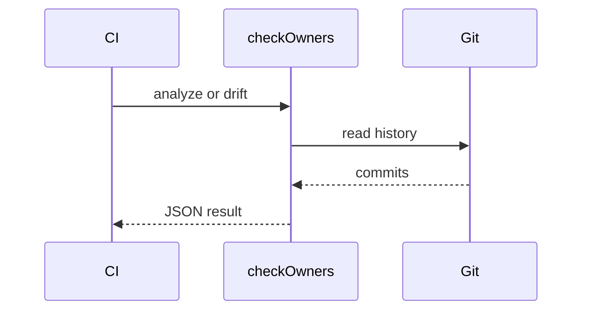

# checkOwners

*CODEOWNERS inference engine driven by git commit history with drift detection and CI integration.*

> **PyPI:** `checkowners` (confirmed available, HTTP 404)
> **npm:** `checkowners` (confirmed available, HTTP 404)

---

## Problem Statement

- CODEOWNERS files drift silently as teams grow and directories get restructured
- No existing tool infers ownership from commit history; `git-codeowners` validates syntax only
- Manual maintenance does not scale; teams write one-off scripts that never generalize
- Review routing fails silently when CODEOWNERS entries point to teams that no longer exist

checkOwners fixes this with a pure-git, no-LLM inference engine designed for CI-native use.

---

## Core Features

### Ownership Inference
- Analyzes git blame and commit history to determine de-facto file owners
- Configurable lookback window, minimum commit threshold, and top-N owners per path
- Excludes lock files, dist directories, and vendor paths by default

### CODEOWNERS Generation
- Generates a `.github/CODEOWNERS` file from inferred ownership data
- Adds a machine-generated header to prevent manual edits
- Optionally includes unowned paths for human triage

### Drift Detection
- Compares current `.github/CODEOWNERS` against inferred state
- Reports stale entries (owners who no longer commit), missing entries, and changed paths
- State machine modes: `commit` (per-commit check), `repo` (full scan), or `both`

### CI and Notifications
- Outputs JSON for GitHub Actions via `GITHUB_OUTPUT`
- Composite GitHub Action (`action.yml`) for zero-config CI integration
- Webhook notifications for drift events

---

## Interaction Sequence



---

## CLI Commands

```bash
# Infer ownership from commit history
checkowners analyze

# Generate CODEOWNERS file from inference
checkowners generate

# Print inferred owners to stdout
checkowners print

# Validate existing CODEOWNERS syntax
checkowners validate

# Detect drift between inferred and current CODEOWNERS
checkowners drift

# Send webhook notification on drift
checkowners notify

# Sync CODEOWNERS with inferred state (generate + commit)
checkowners sync

# Run as a GitHub Action step
checkowners github-action
```

---

## Configuration

```yaml
# .github/checkowners.yml
analysis:
  lookback_days: 180
  min_commits: 3
  top_n_owners: 2

paths:
  exclude:
    - "*.lock"
    - "dist/**"
    - "vendor/**"

output:
  header: "# Generated by checkOwners. Do not edit manually."
  include_unowned: false

drift:
  mode: commit            # repo | commit | both
  compare_to: auto

notifications:
  webhook_url: ""
  include_unchanged: false
```

---

## 7-Day Build Plan

| Day | Focus | Deliverable |
|-----|-------|-------------|
| 1 | Project scaffold | CLI entry point (Typer), config loader (`checkowners.yml`), test harness |
| 2 | Git analysis engine | `git log` + `git blame` parsing via GitPython; commit-to-path ownership map |
| 3 | CODEOWNERS generator | Path normalization; top-N owner selection; CODEOWNERS file writer |
| 4 | Drift detection | State machine comparing inferred vs. current CODEOWNERS; JSON diff output |
| 5 | GitHub Actions integration | `GITHUB_OUTPUT` writer; composite `action.yml`; CI example workflow |
| 6 | Notifications + validate | Webhook POST on drift; syntax-only validation command; `print` command |
| 7 | Packaging + publish | `pip install checkowners`, `npm install -g checkowners`, README, PyPI + npm release |

---

## Simple Data Model

```json
// ~/.checkowners/state.json  (auto-maintained)
{
  "inferred": {
    "src/api/": ["@alice", "@bob"],
    "src/db/": ["@carol"],
    "tests/": ["@bob", "@dave"]
  },
  "last_analyzed": "2026-03-28T10:00:00Z",
  "drift_detected": false
}
```

---

## Installation

```bash
# PyPI (Python CLI)
pip install checkowners

# npm (global binary)
npm install -g checkowners
```

---

## Stack

- **Language:** Python 3.11+
- **CLI framework:** Typer + Rich (colored drift output)
- **Git analysis:** GitPython + subprocess (`git log`, `git blame`)
- **GitHub integration:** PyGithub (Actions output via `GITHUB_OUTPUT`)
- **Config:** PyYAML (`.github/checkowners.yml`)
- **Packaging:** hatch for PyPI; composite GitHub Action (`action.yml`)

---

## Market Positioning

- **Target users:** GitHub teams managing mono-repos, platform engineering teams enforcing review routing policies
- **YC/A16Z alignment:** A16Z Big Ideas 2026: AI-native Git as a top developer-tools priority; checkOwners provides the ownership data layer that any AI code reviewer will need
- **Key differentiator:** The only CLI that infers CODEOWNERS from git blame + commit history with CI-native JSON output, drift detection state machine, and GitHub Actions composite action
- **Closest competitors:**
  - `git-codeowners` (PyPI, ~4K downloads/month): validates syntax only; no inference from history
  - `codeowners-validator` (GitHub Action): linting only; no inference or drift detection

---

## Success Metrics (6 months)

- PyPI downloads: target 5,000/month
- GitHub stars: target 500-2,000
- Active contributors: target 20+
- GitHub Marketplace installs: 200+ by month 3
