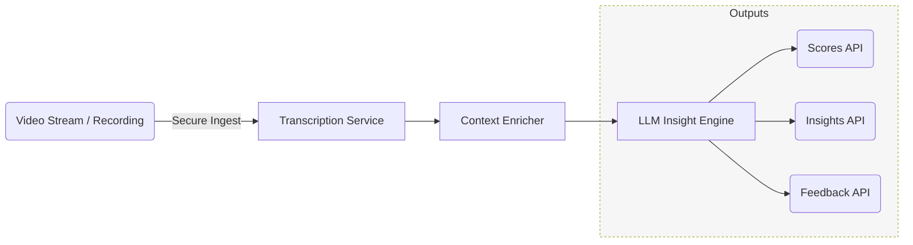

# **Avantri — API-First AI Recruitment Intelligence Platform**

*Re-imagining every interview as structured, actionable data.*

---

## 1  Executive Summary

Avantri is a **pure-API MicroSaaS** that turns live or recorded interviews into standardized, bias-reduced assessments and rich feedback loops—without forcing customers to adopt yet another UI. It plugs directly into the tools recruiters already use (video, calendars, ATS/HRIS) and returns machine-readable insights in seconds, enabling faster, fairer, and more engaging hiring processes.

---

## 2  Market Opportunity & Problem Statement

| Challenge                                      | Impact on Hiring Teams                | Impact on Candidates   |
| ---------------------------------------------- | ------------------------------------- | ---------------------- |
| Manual note-taking & disparate scoring methods | Slow, inconsistent decisions          | Limited transparency   |
| Interviewer bias & fatigue                     | Higher mis-hire risk, DEI blind spots | Perceived unfairness   |
| Lack of actionable feedback                    | Little process improvement            | “Black-box” rejections |
| Fragmented toolchain                           | High admin overhead                   | Disjointed experience  |

Recruiters spend *≈60%* of interview time on logistics and documentation instead of high-value engagement. Meanwhile, candidates rarely receive meaningful feedback, harming employer brand.

---

## 3  Solution Overview

### 3.1 Core Capabilities

1. **Conversation Capture**
   Ingests real-time audio/video streams *or* uploaded recordings via secure webhooks.
2. **LLM-Powered Insight Engine**

   * Transcription ➜ semantic chunking ➜ competency mapping
   * Sentiment, engagement, and behavioural signal extraction
   * Role-specific rubric scoring with customizable weightings
3. **Adaptive Feedback Generator**
   Produces multi-perspective summaries (recruiter, hiring manager, candidate) and coaching tips.
4. **Compliance & Privacy Layer**
   Fine-grained data-retention controls, regional model hosting, and audit trails.

### 3.2 Differentiators

| Avantri                                       | Typical “Interview Bots”              |
| --------------------------------------------- | ------------------------------------- |
| **API-only**; invisible in recruiter workflow | Proprietary UI that competes with ATS |
| Pluggable scoring rubrics per role & culture  | Fixed, one-size-fits-all metrics      |
| Multi-persona feedback (candidate-friendly)   | Recruiter-centric only                |
| Event-driven, usage-based billing             | Seat licensing                        |

---

## 4  Business Model Canvas (API Edition)

| Block                      | Details                                                                                                                                          |
| -------------------------- | ------------------------------------------------------------------------------------------------------------------------------------------------ |
| **Key Partners**           | Video-meeting platforms, ATS/HRIS vendors, background-check providers                                                                            |
| **Key Activities**         | Model refinement, API reliability/SLA, partner enablement                                                                                        |
| **Key Resources**          | Proprietary datasets of annotated interview signals, multi-cloud inference infrastructure                                                        |
| **Value Propositions**     |  • 75% faster note & score generation   • Bias-reduced, rubric-consistent evaluations   • Automatic, brand-enhancing candidate feedback |
| **Customer Relationships** | Dev-first docs, Slack community, dedicated CSM for ≥Enterprise tier                                                                              |
| **Channels**               | Self-serve portal, marketplace listings (ATS add-ons), partner resellers                                                                         |
| **Customer Segments**      |  • Tech scale-ups (rapid hiring sprints)   • Global enterprises (DEI compliance)   • Recruitment Process Outsourcers (volume hiring)    |
| **Cost Structure**         | Compute for transcription/LLM inference, annotation workforce for continual learning, partner rev-share                                          |
| **Revenue Streams**        | Tiered pay-as-you-go (minutes processed + advanced analytics add-ons), annual enterprise contracts                                               |

---

## 5  Product Specification

### 5.1 API Modules

| Module           | Endpoint Family                                                    | Purpose |
| ---------------- | ------------------------------------------------------------------ | ------- |
| **/sessions**    | Create, update, end interview sessions; receive secure ingest URLs |         |
| **/transcripts** | Retrieve or stream timestamped transcripts                         |         |
| **/scores**      | Get rubric-normalized scores (+ breakdown)                         |         |
| **/insights**    | Summaries, sentiment heat-maps, skill gap analysis                 |         |
| **/feedback**    | Candidate-safe narrative with actionable tips                      |         |
| **/webhooks**    | Event notifications (READY, ERROR, ARCHIVE)                        |         |

### 5.2 Architecture at a Glance

### 5.3 Security & Compliance Highlights

* **Zero-retention mode** (ephemeral processing) for privacy-sensitive industries
* **SOC 2 & GDPR** alignment from day one
* Role-based API tokens with least-privilege scopes
* Full encryption in transit *and* at rest

---

## 6  Primary Personas & Use Cases

| Persona               | “Jobs-to-be-Done” with Avantri                                                                 |
| --------------------- | ---------------------------------------------------------------------------------------------- |
| **Agency Recruiter**  | Automate note-taking, push scores into CRM, deliver differentiating candidate feedback reports |
| **Corporate TA Lead** | Standardize global interview rubrics, monitor DEI metrics, shorten time-to-hire                |
| **Startup Founder**   | Replace first-round screen with async Avantri assessments, saving founder time                 |
| **Candidate**         | Receive constructive feedback and resources for improvement                                    |

---

## 7  Minimum Viable Product (MVP)

| Sprint Week | Deliverable                                            | Acceptance Criteria                                 |
| ----------- | ------------------------------------------------------ | --------------------------------------------------- |
| **1**       | Session & ingest endpoints • OAuth & webhooks scaffold | Fluent 200/400/429 codes; secure URL expiry         |
| **2**       | Transcription + basic summary                          | ≤3× real-time latency; WER ≤15 % on diverse accents |
| **3**       | Rubric scoring engine (config via JSON)                | Scores correlate ≥0.7 with human benchmark set      |
| **4**       | Candidate feedback endpoint • Usage metering           | Feedback <1 min generation; billing events emitted  |

**Success Metric:** First customer processes 100 interviews with ≥90 % “very useful” feedback rating.

---

## 8  Expansion Roadmap

1. **Quarter 1** Automated panel-interview synchronisation, multilingual support
2. **Quarter 2** Predictive retention & performance analytics (post-hire signal correlation)
3. **Quarter 3** Voice biometrics opt-in for speaker authentication
4. **Quarter 4** Marketplace for community-contributed rubrics & prompt templates

---

## 9  Competitive Landscape Snapshot

| Player      | Go-to-Market            | API-First? | Candidate Feedback | Compliance Depth |
| ----------- | ----------------------- | ---------- | ------------------ | ---------------- |
| HireVue     | Enterprise direct sales | ❌          | Limited            | High             |
| Vervoe      | Self-serve SaaS         | ❌          | Basic              | Medium           |
| **Avantri** | Dev-first, partner-led  | **✅**      | Rich, customizable | **High**         |
| Pymetrics   | Enterprise              | ❌          | Minimal            | Medium           |

---

## 10  Key Metrics

* **Processing Latency** (ms)
* **Rubric–Human Correlation** (ρ)
* **Bias-Reduction Index** (Δ adverse impact)
* **Candidate NPS**
* **Gross Margin per Minute**

---

## 11  Risks & Mitigations

| Risk                       | Likelihood | Impact   | Mitigation                                                          |
| -------------------------- | ---------- | -------- | ------------------------------------------------------------------- |
| LLM hallucinations         | Med        | High     | Ensemble checks + human fallback threshold                          |
| Data-privacy breaches      | Low        | Critical | Regional isolation; automated PII scrubber                          |
| Rapid model cost inflation | Med        | Medium   | Dynamic routing to cost-efficient models; GPU reservation contracts |

---

## 12  Glossary

* **Rubric** A structured set of competencies and weightings against which responses are scored.
* **Bias-Reduction Index** Composite measure comparing score distributions across demographic groups.
* **Secure Ingest URL** Time-bound, single-use endpoint for uploading media streams.

---

### *Avantri turns every conversation into evidence-based hiring insight—through a single, elegant API.*
