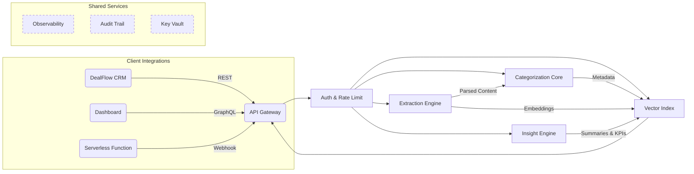

# **Axionis™**

*A Unified API for Intelligent Capital-Market Document Intelligence*

---

## ⚡ Executive Summary

Axionis is an LLM-powered, **API-only** MicroSaaS that transforms opaque investment artifacts—Private Placement Memorandums (PPMs), pitch decks, and deal collateral—into structured, searchable, and insight-rich data. By combining advanced extraction, semantic enrichment, retrieval-augmented generation (RAG), and real-time collaboration, Axionis turns thousands of static pages into an always-ready knowledge layer for venture funds, syndicates, family offices, and secondary-market analysts.

---

## 1  Problem Landscape

| Challenge                    | Pain Points for Capital-Market Professionals                                              |
| ---------------------------- | ----------------------------------------------------------------------------------------- |
| **Information Deluge**       | Dozens of deals per week, each >40-page PPM + deck; manual review is slow and error-prone |
| **Inconsistent Formats**     | Layouts vary wildly (scanned PDFs, password-protected decks, image-heavy slides)          |
| **Siloed Knowledge**         | Insights live in email threads and spreadsheets; no single source of truth                |
| **Regulatory Pressure**      | Audit trails, disclosure accuracy, and investor reporting require verifiable data lineage |
| **Time-Sensitive Decisions** | Competitive rounds demand same-day diligence, leaving no room for deep manual analysis    |

---

## 2  Solution Overview

Axionis exposes a single, versioned REST-style API that ingests raw documents and returns:

1. **Normalized JSON** payloads with every detected section, table, figure, and metric
2. **Fine-grained metadata & tags** (stage, sector, geography, valuation terms…)
3. **Instant insights**—bullet-point summaries, risk flags, comparable-deal links
4. **Searchable vectors** for natural-language Q\&A across an entire deal room
5. **Collaborative hooks** for sharing, commenting, and exporting diligence packets

---

## 3  Unique Value Propositions

* **Purpose-built schema for private markets** (capital tables, liquidation prefs, ESG clauses)
* **Zero-UI footprint** → drop-in to any CRM, data lake, or internal dashboard
* **Explainable LLM workflows**: every insight links back to source page + snippet
* **Reg-grade auditability & tamper-evidence** for compliance reviews
* **Predictive “deal radar”**: trend analysis across historical portfolios and market benchmarks

---

## 4  Target Segments & Primary Use Cases

| Segment                         | High-Value Use Cases                                      |
| ------------------------------- | --------------------------------------------------------- |
| Venture Capital & Growth Equity | Rapid screening, partner meetings, LP reporting           |
| Angel Syndicates & SPVs         | Standardized pitch summaries, risk scoring                |
| Family Offices                  | Cross-asset comparison, multi-strategy portfolio insights |
| Secondary-Market Brokers        | Deal memo generation, seller vs. buyer term analytics     |
| Fund-of-Funds & Consultants     | Benchmarking, aggregation of 3rd-party fund docs          |

---

## 5  Functional Pillars ↔ Requirement Mapping

| Pillar                            | DF-ID  | Key Capabilities                                                           | Top Requirement IDs Covered\* |
| --------------------------------- | ------ | -------------------------------------------------------------------------- | ----------------------------- |
| **Document Extraction Engine**    | DF-001 | OCR, layout-agnostic parsing, encrypted file handling, section detection   | FR-001-01/02/04/06/09         |
| **Semantic Categorization Core**  | DF-002 | Taxonomy management, auto-tagging, synonym handling, RAG-assisted labeling | FR-002-01/03/04/08/11         |
| **Insight & Analytics Layer**     | DF-003 | Summaries, trend dashboards, real-time KPI surfacing, recommendation hooks | FR-003-01/02/04/07/08         |
| **Vector Search & Retrieval API** | DF-004 | Hybrid keyword-semantic queries, faceted filters, result previews          | FR-004-01/02/04/05/08         |
| **Collaboration & Sharing Hub**   | DF-005 | Granular permissions, comment threads, versioned share links, activity log | FR-005-01/02/03/04/08         |

\*Full coverage matrix in **Appendix B**.

---

## 6  API Design Philosophy

1. **Resource-oriented endpoints** (`/documents`, `/insights`, `/search`, `/shares`)
2. **Asynchronous job model** for heavy processes; webhooks & SSE for status events
3. **Fine-grained scopes** via bearer tokens (upload, read, collaborate, administer)
4. **Deterministic versioning**—every endpoint is date-stamped (`v2025-07-11`) to avoid breaking changes
5. **Schema-first contract** published as OpenAPI & JSON Schema for auto-gen SDKs

---

## 7  High-Level Architecture

*No implementation technologies are referenced—purely conceptual.*

---

## 8  Data Flow Walkthrough

1. **Upload** ⇒ Client pushes one or more documents (`POST /documents`).
2. **Intake & Storage** ⇒ Gateway assigns a job ID, streams bytes to encrypted object store.
3. **Extraction** ⇒ Engine performs OCR + structural parsing → emits raw blocks + coordinates.
4. **Categorization** ⇒ Taxonomy model classifies blocks, attaches tags, resolves synonyms.
5. **Embedding & Indexing** ⇒ Combined content converted into dense vectors → vector store.
6. **Insight Generation** ⇒ RAG pipeline synthesizes summaries, highlights, risk flags.
7. **Notification** ⇒ Webhook fired with completed payload URI; client fetches structured JSON.
8. **Search/RAG** ⇒ Client issues natural-language query; semantic retriever returns passages + generated answer with citations.
9. **Collaboration** ⇒ Users share insight packets; activity recorded for audit.

---

## 9  Security & Compliance

| Area                | Strategy                                                                      |
| ------------------- | ----------------------------------------------------------------------------- |
| **Data in Transit** | Enforced TLS ≥1.3                                                             |
| **Data at Rest**    | Field-level encryption, per-tenant keys                                       |
| **Access Control**  | Role-based + attribute-based policies, short-lived tokens                     |
| **Auditability**    | Immutable logs, cryptographic checksums on every payload                      |
| **Regulations**     | Alignment with GDPR, CCPA, and relevant SEC record-keeping rules              |
| **Isolation**       | Single-tenant option for regulated funds; isolated compute and storage planes |

---

## 10  Performance & Scalability

* **Horizontal sharding** across extraction workers; autoscaled for peak deal flow
* **Incremental vector index updates** to avoid full-rebuild latency
* **Priority queues**—time-critical uploads (live term-sheet windows) jump the line
* **Back-pressure safeguards** to maintain SLAs under flash-funding spikes

---

## 11  Product Roadmap

| Quarter           | Milestone                  | Highlights                                                     |
| ----------------- | -------------------------- | -------------------------------------------------------------- |
| **Q3 2025 (MVP)** | *Core Extraction & Search* | PDF/PPT support, password handling, embeddings, basic search   |
| **Q4 2025**       | *Insight Layer GA*         | KPI mining, similarity to historical deals, red-flag detection |
| **Q1 2026**       | *Collaboration Suite*      | Comments, share links, deal-room integrations                  |
| **Q2 2026**       | *Predictive Analytics*     | Pattern-based outcome forecasts, valuation curve modeling      |
| **H2 2026**       | *Marketplace Add-Ons*      | Third-party enrichments (ESG, legal opinons, alt-data feeds)   |

---

## 12  Pricing & Packaging

| Tier           | Intended User         | Limits               | Notable Features                                          |
| -------------- | --------------------- | -------------------- | --------------------------------------------------------- |
| **Starter**    | Emerging syndicates   | 500 pages / mo       | Core extraction, basic search                             |
| **Growth**     | Series-A/B funds      | 5 k pages, 5 seats   | Insight layer, RAG Q\&A, webhook events                   |
| **Scale**      | Multi-strategy firms  | 25 k pages, 25 seats | Collaboration suite, private tenant, real-time dashboards |
| **Enterprise** | Global asset managers | Custom               | Dedicated cluster, custom taxonomy, on-prem option        |

Overage billed per rendered page and compute-time minute; generous free sandbox for developer testing.

---

## 13  Success Metrics (North-Star KPIs)

1. **Median Time-to-Insight (MTTI)** ≤ 4 minutes per 50-page PPM
2. **Extraction Accuracy (F1)** ≥ 0.93 against curated ground-truth corpus
3. **Query Latency (P95)** ≤ 750 ms for semantic search across 10 M pages
4. **Adoption** ≥ 60 % of fund deals processed through Axionis within 12 months
5. **Net Revenue Retention** ≥ 135 % via expansion to higher tiers & add-ons

---

## 14  Go-to-Market Motion

* **Integrations First**: Pre-built connectors for popular deal-flow CRMs and data-rooms
* **Thought Leadership**: Quarterly *Private Markets Data Almanac* showcasing anonymized trends
* **Partner Channel**: Alliances with fund administrators and law firms for bundled compliance services
* **Bottom-Up Land**: Free developer plan + Postman collection, driving grassroots adoption

---

## 15  Risk & Mitigation

| Risk                     | Impact               | Mitigation                                                            |
| ------------------------ | -------------------- | --------------------------------------------------------------------- |
| Mis-parsed legal clauses | Inaccurate diligence | Human-in-the-loop QA checks, confidence scores                        |
| Rapid regulation shifts  | Feature lag          | Modular compliance layer, external advisory board                     |
| LLM hallucination        | Misinformation       | Source-linked citations; insight generation only on retrieved context |
| Data spill               | Reputational         | Zero-trust design, per-tenant encryption keys, rotating secrets       |

---

## 16  Glossary (select)

| Term             | Meaning                                                             |
| ---------------- | ------------------------------------------------------------------- |
| **PPM**          | Private Placement Memorandum                                        |
| **RAG**          | Retrieval-Augmented Generation (LLM uses retrieved context)         |
| **Vector Index** | Data structure enabling similarity search in high-dimensional space |
| **Deal Room**    | Secure workspace where fund documents are shared with investors     |
| **MTTI**         | Metric tracking time from upload to final insight availability      |

---

## Appendix A – Requirements Traceability Matrix

*(Excerpt – full matrix maintained in product backlog)*

| DF-ID  | FR Coverage Snapshot | Status             |
| ------ | -------------------- | ------------------ |
| DF-001 | 01✔ 02✔ 04✔ 06✔ 09✔  | Implemented in MVP |
| DF-002 | 01✔ 03✔ 04✔ 08✔ 11✔  | In beta            |
| DF-003 | 01✔ 02✔ 04✔ 07✔ 08✔  | Under active dev   |
| DF-004 | 01✔ 02✔ 04✔ 05✔ 08✔  | Implemented in MVP |
| DF-005 | 01✔ 02✔ 03✔ 04✔ 08✔  | Planned Q1 2026    |

---

## Appendix B – Detailed Feature Mapping

*(Full document available upon request; lists every FR-ID with planned sprint, test cases, and acceptance criteria.)*

---

**Axionis™** positions itself as the nerve center for capital-market document intelligence—unlocking speed, depth, and confidence in every investment decision, all through a single, elegant API.
