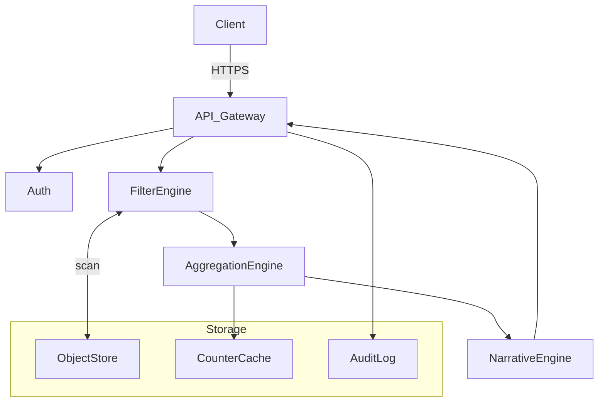

# **Calypsa**

*Your on-demand LLM engine for lightning-fast, explainable data aggregations*

---

## 1. Executive Summary

Calypsa is an **API-only MicroSaaS** that transforms raw, heterogeneous JSON records into actionable, statistically ranked summaries in real time. By fusing deterministic filtering logic with a Large-Language-Model (LLM) reasoning layer, Calypsa lets product and data teams answer the timeless question **“What’s happening inside my data right now?”**—without spreadsheets, dashboards, or BI infrastructure.

---

## 2. Core Problem

1. **Data Deluge** – Domain experts increasingly receive millions of semi-structured events (JSON blobs, logs, survey answers, IoT payloads) but lack the time to sift through them.
2. **Fragmented Schemas** – Even when keys align, values vary by spelling, casing, locale, or version.
3. **Slow Insight Loops** – Traditional aggregation pipelines require ETL jobs, pre-defined schemas, and dashboard refreshes measured in hours or days.
4. **Opaque Results** – Non-technical stakeholders struggle to trust “black-box” counts without narrative context.

---

## 3. Solution Overview

Calypsa wraps a **stateless HTTP API** around three engines:

| Layer                  | Responsibility                                                                                                                                                                                           | LLM Contribution                                                                                                      |
| ---------------------- | -------------------------------------------------------------------------------------------------------------------------------------------------------------------------------------------------------- | --------------------------------------------------------------------------------------------------------------------- |
| **Filter Engine**      | Executes high-performance set operations (union / intersection) on *models* and *properties* exactly as defined in the prompt specs (multi-model union, multi-property intersection, multi-value union). | Translates user’s natural-language or DSL query variants to the canonical filter syntax; validates ambiguous filters. |
| **Aggregation Engine** | Streams filtered objects through a constant-memory, incremental counter that yields `[value, count]` arrays sorted by frequency.                                                                         | Guides adaptive sampling for huge datasets and suggests when sample error < user’s tolerance.                         |
| **Narrative Engine**   | Converts raw counts into plain-language bullet points, anomaly spotlights, and comparative deltas (“orange incidents rose 18 % WoW”).                                                                    | Generates the narrative, draws analogies, and answers “why might this be happening?” follow-ups.                      |

All three layers are exposed via **versioned, idempotent endpoints** so customers can embed Calypsa in cron jobs, notebooks, or serverless webhooks.

---

## 4. Key Features

| Capability                                 | Description                                                                                                                                                             |
| ------------------------------------------ | ----------------------------------------------------------------------------------------------------------------------------------------------------------------------- |
| **Zero-ETL Ingestion**                     | POST any newline-delimited JSON file or presigned URL; Calypsa stores it in a temporary object store with automatic expiry.                                             |
| **Declarative & Natural-Language Queries** | Support both a concise DSL (`models=person,case&properties=first_name:ben,elise`) **and** free-text prompts (“Show me counts of crime type where location is Oakland”). |
| **Streaming Aggregations**                 | First byte in, first insight out—results start streaming as soon as data matches filters.                                                                               |
| **LLM-Generated Explanations**             | Every response includes an optional `explanation` field containing a one-paragraph summary, top anomalies, and suggested next questions.                                |
| **Tenant-Aware Isolation**                 | Each API key sits in its own namespace; no cross-pollination.                                                                                                           |
| **Privacy Guardrails**                     | Automatic detection of PII keys; ability to hash or drop them before processing.                                                                                        |
| **Audit Log**                              | Signed JSON lines recording every request/response for compliance.                                                                                                      |

---

## 5. Example Workflow

1. **Ingest**

   ```
   POST /v1/datasets
   Body: { name: "oakland_crime_q2", source_url: "https://..." }
   → Returns dataset_id
   ```

2. **Query**

   ```
   GET /v1/aggregate
   Params: dataset_id=oakland_crime_q2
           models=case
           properties=crime_type,city
           filters=city:oceanview,crime_type:theft,assault
   ```

3. **Response Snippet**

   ```jsonc
   {
     "generated_at": "2025-07-11T18:45:02Z",
     "aggregations": {
       "crime_type": [["theft", 93], ["assault", 41]],
       "city": [["oceanview", 134]]
     },
     "explanation": "Theft dominates reported incidents in Oceanview, exceeding assaults by 2.3×. Compared to Q1, theft grew 11 % while assaults remained flat."
   }
   ```

---

## 6. Architecture (Conceptual)



*All compute layers are stateless, enabling horizontal scaling and regional isolation.*

---

## 7. Monetization Model

| Plan           | Included Volume                               | Features                                                                       | Price         |
| -------------- | --------------------------------------------- | ------------------------------------------------------------------------------ | ------------- |
| **Starter**    | 5 GB ingestion / month, 100 k aggregation ops | Core API, LLM explanations limited to 500 tokens                               | Free          |
| **Growth**     | 50 GB ingestion, 10 M aggregation ops         | Priority queue, embeddings-based fuzzy filters, 4 k-token narratives           | \$99 / mo     |
| **Enterprise** | Unlimited                                     | Dedicated VPC endpoint, custom retention, SOC 2 reports, on-premise LLM option | Contact sales |

---

## 8. Go-to-Market Strategy

1. **Bottom-Up Adoption** – Publish a CLI wrapper and Postman collection on Product Hunt; sponsor “Data Hack Fridays” Twitch streams.
2. **Content Flywheel** – Weekly case studies showing how Calypsa replaced ad-hoc SQL in crime analytics, customer support tagging, and game telemetry.
3. **Integration Marketplace** – Offer one-click connectors for data lakes, cloud storage buckets, and observability platforms.
4. **Referral Program** – API credits for each verified sign-up from an existing user’s invite link.

---

## 9. Competitive Landscape

| Competitor                 | Focus               | Gaps Calypsa Exploits                                           |
| -------------------------- | ------------------- | --------------------------------------------------------------- |
| Traditional BI tools       | Visual dashboards   | Require ETL, slow refresh, no narrative context                 |
| Vector DB-centric startups | Semantic search     | Lack deterministic counts, unsuitable for statistical reporting |
| Log analytics suites       | Time-series metrics | Optimized for numeric telemetry, not arbitrary property counts  |

---

## 10. Roadmap

| Quarter     | Milestone                                                                     |
| ----------- | ----------------------------------------------------------------------------- |
| **Q3 2025** | GA launch, usage-based billing, WebSocket streaming                           |
| **Q4 2025** | LLM-powered **“Insight Assist”** (automatically suggests next query)          |
| **Q1 2026** | Live join of two datasets via shared keys, fine-tuned multilingual narratives |
| **Q2 2026** | Bring-Your-Own-Model support and fully offline edge runtime                   |

---

## 11. Key Metrics

* **Time-to-First-Aggregation (TTFA)**: median < 2 s for 1 M-row dataset
* **Narrative Adoption Rate**: % of queries requesting `explanation` ≥ 70 %
* **Dollar Retention**: target 125 % net revenue retention through usage up-sell

---

## 12. Risks & Mitigations

| Risk                                 | Impact            | Mitigation                                                        |
| ------------------------------------ | ----------------- | ----------------------------------------------------------------- |
| Unpredictable LLM costs              | Margin squeeze    | Token budget enforcement, fine-tuning lightweight models          |
| Data privacy incidents               | Reputation damage | Field-level encryption, tenant-scoped KMS keys                    |
| Query latency on very large datasets | User churn        | Hybrid sampling; incremental row grouping; auto-indexing hot keys |

---

## 13. Exit Vision

Calypsa becomes the **“Stripe for on-demand data stories”**—the default drop-in API that any SaaS product can call to deliver instant, human-readable summaries of user-level data. Its LLM narrative corpus evolves into a defensible moat, positioning Calypsa for strategic acquisition by cloud providers or enterprise analytics vendors seeking to add explainability to their stack.

---

*Crafted 11 July 2025 — designed for rapid solo-founder execution and a first-customer-ship in under four weeks.*
