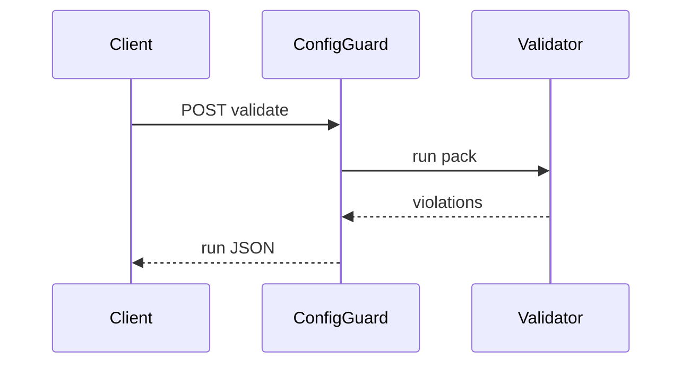

# ConfigGuard

*Config and schema validation API: CI webhooks, OpenAPI checks, LLM-assisted explanations, and team dashboards.*

> **Domain:** `configguard.io` (primary), `configguard.dev` (secondary)
> **Market:** Developer infrastructure; shift-left validation for platform teams (2026)

---

## Problem Statement

- Broken YAML in k8s or Terraform fails late; teams want PR-time validation with shared rule packs
- API schema drift breaks mobile clients; OpenAPI diffs should gate releases
- LLM explanations help juniors but must be optional and policy-controlled
- Self-hosted linters lack org-wide dashboards and audit history

---

## Core Features

### Checks
- Upload config or spec; run packs: Kubernetes, Terraform HCL subset, OpenAPI

### CI Integration
- GitHub webhook; status checks with annotated file and line

### Explanations
- Optional LLM plain-English summary of failures with redaction pre-step

### Dashboard
- Trend of violations per repo; mute known issues with expiry

---

## Interaction Sequence



---

## API Design

### Core Endpoints

```
POST /api/v1/projects
POST /api/v1/validate
GET  /api/v1/runs/{id}
POST /api/v1/hooks/github
GET  /api/v1/projects/{id}/trends
GET  /api/v1/usage
GET  /api/v1/health
```

### Request Example
```json
{
  "project_id": "prj_01HXYZ",
  "filename": "deployment.yaml",
  "content_base64": "...",
  "pack": "kubernetes"
}
```

### Response Example
```json
{
  "run_id": "run_01HABC",
  "ok": false,
  "violations": [{"line": 42, "rule": "no-latest-tag", "severity": "error"}]
}
```

---

## 7-Day Build Plan

| Day | Focus | Deliverable |
|-----|-------|-------------|
| 1 | Validate core | kubeval or kubeconform wrapper |
| 2 | OpenAPI | Spectral-like rules subset |
| 3 | Runs storage | Postgres |
| 4 | GitHub App | Check runs API |
| 5 | LLM explain | Optional path |
| 6 | Stripe | Free private repos cap |
| 7 | Launch | Show HN, platform engineering Slack, Indie Hackers |

---

## Simple Data Model

```
User:
  id, email, password_hash, created_at

Project:
  id, user_id, name, default_packs_json, created_at

Run:
  id, project_id, commit_sha, ok, violations_json, created_at

Mute:
  id, project_id, fingerprint, expires_at, created_at

APIKey:
  id, user_id, key_hash, tier, created_at

Usage:
  id, api_key_id, endpoint, count, date
```

---

## Revenue Model

| Tier | Price | Includes |
|------|-------|----------|
| Free | $0/month | 3 private projects, 2k runs |
| Pro | $49/month | 30 projects, 50k runs, LLM explain |
| Team | $149/month | unlimited projects, SSO roadmap |
| Enterprise | Custom | VPC, custom packs, SLA |

Pay-as-you-go: $8 per 10k runs after limits.

---

## Go-to-Market

- **Launch channels:**
  - Hacker News
  - Product Hunt
  - Reddit r/kubernetes, r/devops
- **Direct outreach:** 20 platform engineers at mid-size SaaS
- **Content hook:** “GitHub status check from Kubernetes YAML validation API”
- **Early adopter incentive:** Team tier 50% off first year for first 8 companies

---

## Stack

- **Backend:** Python (FastAPI)
- **Database:** PostgreSQL
- **Linters:** kubeconform, openapi-spec-validator, python-hcl2
- **Auth:** API keys + GitHub App tokens
- **Deploy:** Fly.io
- **Payments:** Stripe

---

## Market Positioning

- **Target users:** Platform engineering, DevOps, and API teams enforcing standards in CI
- **YC/A16Z alignment:** AI-augmented developer tools; governance as guardrails (2026)
- **Key differentiator:** Hosted validation plus PR integration plus optional LLM explain in one product
- **Closest competitors:**
  - Checkov, kube-score: OSS; no SaaS dashboard and LLM layer
  - Custom scripts: flexible; high maintenance

---

## Success Metrics (First 90 Days)

- Projects: 350 by month 1
- Paid: 18 by day 30
- MRR: $1,900 by month 3
- Runs: 400k by month 1
- False positive rate feedback: under 25% of flagged runs
