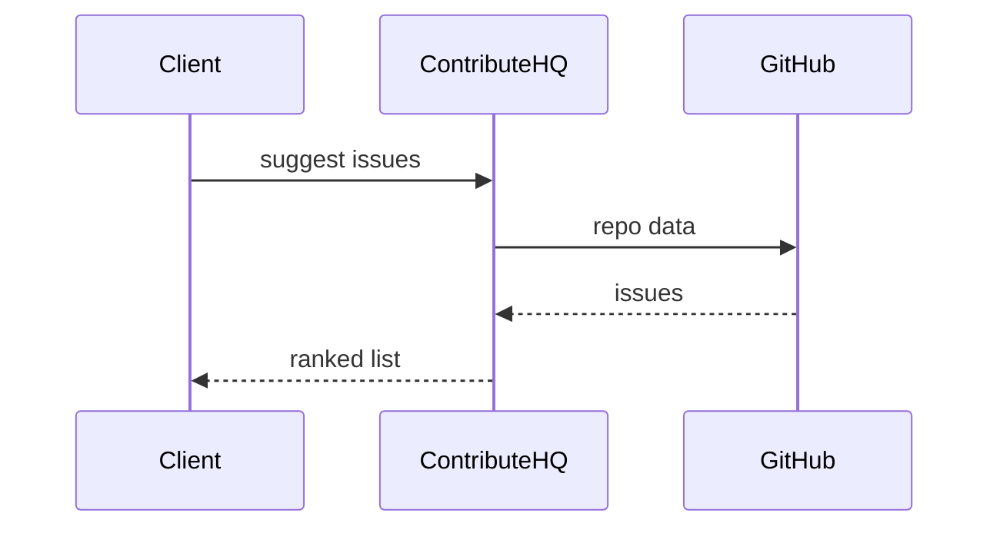

# ContributeHQ

*OSS contributor operations API: onboarding kits, starter issues, activity metrics, and nudges for maintainers.*

> **Domain:** `contributehq.io` (primary), `contributehq.dev` (secondary)
> **Market:** Developer relations and open-source program offices; maintainer burnout is structural (2026)

---

## Problem Statement

- New contributors bounce when `good first issue` labels are stale or undocumented
- Maintainers lack a single place for contributor agreements, build docs, and task routing
- Sponsors and employers want impact metrics beyond star counts
- Email nudges from raw GitHub API scripts break when tokens expire

---

## Core Features

### Repo Connectors
- GitHub App install; read issues, PRs, contributors

### Kits
- Templated onboarding checklist per repo with environment setup links

### Routing
- Match contributor skills to issues via labels and optional profile survey

### Metrics
- Time to first PR, repeat contributor rate, bus factor hints (advisory)

---

## Interaction Sequence



---

## API Design

### Core Endpoints

```
POST /api/v1/orgs
POST /api/v1/repos
GET  /api/v1/repos/{id}/issues/suggested
POST /api/v1/contributors/{id}/nudge
GET  /api/v1/repos/{id}/metrics
GET  /api/v1/usage
GET  /api/v1/health
```

### Request Example
```json
{
  "repo_full_name": "acme/widget",
  "contributor_skills": ["rust", "cli"]
}
```

### Response Example
```json
{
  "suggestions": [
    {"issue": 124, "title": "Add --json flag", "fit": 0.88}
  ]
}
```

---

## 7-Day Build Plan

| Day | Focus | Deliverable |
|-----|-------|-------------|
| 1 | GitHub App | OAuth install flow |
| 2 | Issue sync | Webhooks |
| 3 | Skill matcher | Label heuristic v1 |
| 4 | Kits | CRUD |
| 5 | Email nudges | Transactional provider |
| 6 | Stripe | Free 1 repo; Pro org |
| 7 | Launch | Maintainer Twitter, DevRel newsletters, Indie Hackers |

---

## Simple Data Model

```
Org:
  id, name, owner_user_id, created_at

Repo:
  id, org_id, full_name, install_id, created_at

Contributor:
  id, github_login, skills_json, created_at

Kit:
  id, repo_id, steps_json, created_at

Nudge:
  id, contributor_id, repo_id, template_id, sent_at

APIKey:
  id, org_id, key_hash, tier, created_at

Usage:
  id, api_key_id, endpoint, count, date
```

---

## Revenue Model

| Tier | Price | Includes |
|------|-------|----------|
| Free | $0/month | 1 repo, 500 API calls |
| Pro | $59/month | 10 repos, 50k calls |
| OSPO | $199/month | 50 repos, SSO roadmap |
| Enterprise | Custom | dedicated workers, SLA |

Pay-as-you-go: $10 per 10k calls after limits.

---

## Go-to-Market

- **Launch channels:**
  - Hacker News
  - Product Hunt
  - Maintainer podcasts as guests
- **Direct outreach:** 25 maintainers of 2k to 20k star projects
- **Content hook:** “Skill-matched starter issues refreshed from live GitHub data”
- **Early adopter incentive:** Pro free 6 months for first 10 orgs

---

## Stack

- **Backend:** Python (FastAPI)
- **Database:** PostgreSQL
- **GitHub:** App + webhooks
- **Auth:** JWT + org API keys
- **Deploy:** Fly.io
- **Payments:** Stripe

---

## Market Positioning

- **Target users:** OSS maintainers, devtool companies, and OSPO teams
- **YC/A16Z alignment:** Developer community health as revenue lever (2026)
- **Key differentiator:** Maintainer-first API combining kits, routing, and metrics, not only analytics dashboards
- **Closest competitors:**
  - GitHub native insights: shallow for cross-repo programs
  - Spreadsheets: free; high friction

---

## Success Metrics (First 90 Days)

- Repos connected: 300 by month 1
- Paid orgs: 14 by day 30
- MRR: $1,600 by month 3
- Suggested issues accepted: 20% click-to-PR conversion (goal)
- Maintainer-reported spam nudges: near zero
