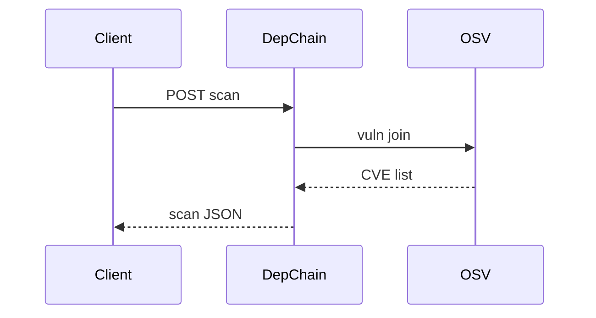

# DepChain

*Dependency risk API: SBOM-friendly package metadata, license flags, and update impact hints for CI.*

> **Domain:** `depchain.io` (primary), `depchain.dev` (secondary)
> **Market:** Software supply chain security; SBOM mandates expanding (2026)

---

## Problem Statement

- `npm ls` and friends are noisy; security teams want summarized risk per repo commit
- License collisions block releases; legal review is late and expensive
- Transitive updates break builds; teams lack a lightweight “what changed” diff API
- Full SCA suites are enterprise priced for indie services

---

## Core Features

### Scan Ingestion
- POST lockfiles or SBOM JSON (CycloneDX); parse versions and hashes

### Policy Checks
- Deny known bad versions; flag GPL in commercial tier configs (advisory, not legal advice)

### Diff API
- Compare two snapshots; list added, removed, upgraded packages with severity hints from OSV

---

## Interaction Sequence



---

## API Design

### Core Endpoints

```
POST /api/v1/scans
GET  /api/v1/scans/{id}
POST /api/v1/scans/{id}/policy-check
POST /api/v1/diff
GET  /api/v1/usage
GET  /api/v1/health
```

### Request Example
```json
{
  "ecosystem": "npm",
  "lockfile_base64": "...",
  "repo": "acme/web"
}
```

### Response Example
```json
{
  "scan_id": "scn_01HXYZ",
  "vulns": [{"package": "lodash", "cve": "CVE-2024-XXXX", "severity": "high"}],
  "licenses": {"MIT": 120, "Apache-2.0": 15}
}
```

---

## 7-Day Build Plan

| Day | Focus | Deliverable |
|-----|-------|-------------|
| 1 | npm parser | Lockfile v2 |
| 2 | OSV client | Join CVE data |
| 3 | Policy YAML | Evaluator |
| 4 | Diff | Graph compare |
| 5 | GitHub Action doc | Sample workflow |
| 6 | Stripe | Free 50 scans; Pro CI volume |
| 7 | Launch | Show HN, security Twitter, Indie Hackers |

---

## Simple Data Model

```
User:
  id, email, password_hash, created_at

Scan:
  id, user_id, ecosystem, hash, result_json, created_at

Policy:
  id, user_id, yaml, created_at

Diff:
  id, user_id, from_scan_id, to_scan_id, delta_json, created_at

APIKey:
  id, user_id, key_hash, tier, created_at

Usage:
  id, api_key_id, endpoint, count, date
```

---

## Revenue Model

| Tier | Price | Includes |
|------|-------|----------|
| Free | $0/month | 50 scans, public repos only |
| Pro | $49/month | 2,000 scans, private repos |
| Team | $149/month | 10k scans, org policies |
| Enterprise | Custom | SSO, air-gapped export, SLA |

Pay-as-you-go: $0.02 per scan after limits.

---

## Go-to-Market

- **Launch channels:**
  - Hacker News
  - Product Hunt
  - r/devops, r/golang
- **Direct outreach:** 20 seed-stage eng leads
- **Content hook:** “OSV-enriched diff between two lockfiles in CI”
- **Early adopter incentive:** Team tier 50% off first year for first 10 companies

---

## Stack

- **Backend:** Go or Rust
- **Database:** PostgreSQL
- **Vuln data:** OSV API
- **Auth:** API keys
- **Deploy:** Fly.io
- **Payments:** Stripe

---

## Market Positioning

- **Target users:** Platform engineers, security-minded indie SaaS, and agency dev shops
- **YC/A16Z alignment:** Supply chain security as default feature in CI (2026)
- **Key differentiator:** Diff-first API with policy YAML tuned for small teams
- **Closest competitors:**
  - Snyk, Dependabot: incumbents; heavier account motion
  - OSV raw: free; integration work remains

---

## Success Metrics (First 90 Days)

- Scans: 25k by month 1
- Paid orgs: 18 by day 30
- MRR: $1,800 by month 3
- False positive reports per 1k findings under 30 (tuning goal)
- GitHub Action stars or forks: 200
