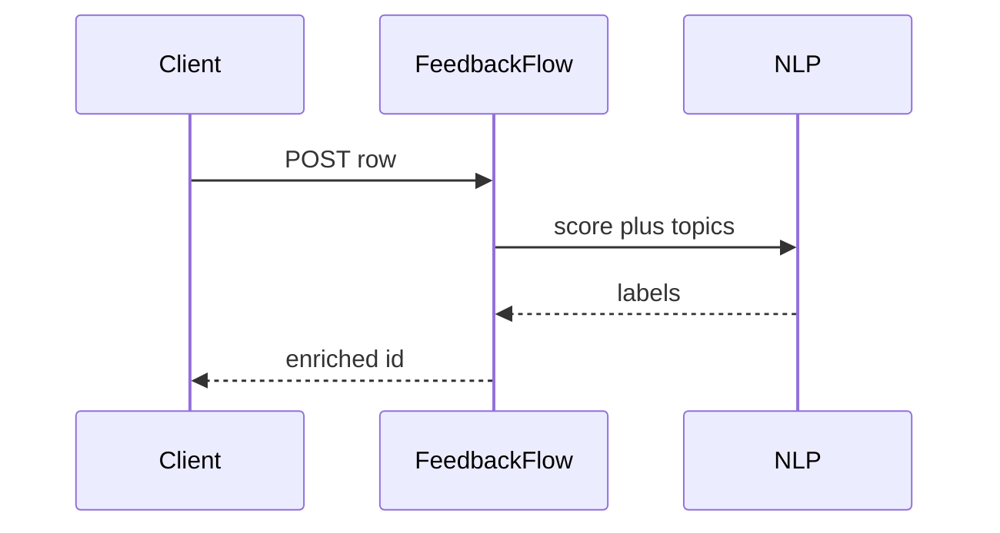

# FeedbackFlow

*Voice-of-customer API: ingest reviews, tickets, and surveys; run sentiment, topics, and threshold alerts.*

> **Domain:** `feedbackflow.io` (primary), `feedbackflow.dev` (secondary)
> **Market:** Product analytics for teams too small for full Qualtrics or Medallia stacks (2026)

---

## Problem Statement

- Feedback sits in Zendesk, App Store, and Typeform with no unified schema
- PMs manually read; qualitative insights do not reach engineering with structured payloads
- Spikes in negative sentiment need paging before churn shows up in revenue charts
- Indie products want a single webhook to push new feedback rows and get tags back

---

## Core Features

### Ingestion
- Connectors: CSV upload, webhook, Zendesk export URL (rotating)
- Normalized record: text, source, user hash optional, timestamp

### NLP Pipeline
- Sentiment score; topic clusters; keyword bursts
- Optional LLM summary per day (Pro)

### Alerts
- Rule: if negative ratio over N in window, POST alert webhook with top excerpts redacted

---

## Interaction Sequence



---

## API Design

### Core Endpoints

```
POST /api/v1/sources
POST /api/v1/feedback
GET  /api/v1/feedback?query=
GET  /api/v1/topics
POST /api/v1/rules
GET  /api/v1/reports/daily
GET  /api/v1/usage
GET  /api/v1/health
```

### Request Example
```json
{
  "source": "ios_app_store",
  "text": "Love the app but crashes on export",
  "rating": 3,
  "occurred_at": "2026-03-28T10:00:00Z"
}
```

### Response Example
```json
{
  "id": "fb_01HXYZ",
  "sentiment": -0.22,
  "topics": ["export", "stability"]
}
```

---

## 7-Day Build Plan

| Day | Focus | Deliverable |
|-----|-------|-------------|
| 1 | Auth + projects | API keys |
| 2 | Ingest | Webhook + CSV |
| 3 | Sentiment | VADER baseline; LLM optional |
| 4 | Topics | Simple clustering |
| 5 | Alerts | Rule eval job |
| 6 | Stripe | Free 2k rows; Pro higher |
| 7 | Launch | Product Hunt, Indie Hackers, PM Slack groups |

---

## Simple Data Model

```
User:
  id, email, password_hash, created_at

Project:
  id, user_id, name, created_at

Feedback:
  id, project_id, source, text_hash, text_enc, rating, sentiment, topics_json, created_at

Rule:
  id, project_id, config_json, created_at

Alert:
  id, project_id, rule_id, payload_json, created_at

APIKey:
  id, user_id, key_hash, tier, created_at

Usage:
  id, api_key_id, endpoint, count, date
```

---

## Revenue Model

| Tier | Price | Includes |
|------|-------|----------|
| Free | $0/month | 2,000 feedback rows, 7 day history |
| Pro | $59/month | 50k rows, 1 year history, LLM summaries |
| Team | $149/month | 250k rows, SSO roadmap |
| Enterprise | Custom | VPC, PII handling review, SLA |

Pay-as-you-go: $10 per 10k rows after limits.

---

## Go-to-Market

- **Launch channels:**
  - Product Hunt
  - Indie Hackers
  - Reddit r/ProductManagement
- **Direct outreach:** 25 PMs at B2C apps with public reviews
- **Content hook:** “One webhook: sentiment plus topics on every new review”
- **Early adopter incentive:** Pro free 90 days for first 12 integrations

---

## Stack

- **Backend:** Python (FastAPI)
- **Database:** PostgreSQL
- **Search:** OpenSearch optional
- **Auth:** API keys
- **Deploy:** Fly.io
- **Payments:** Stripe

---

## Market Positioning

- **Target users:** Product managers, founders, and CX leads at early-stage companies
- **YC/A16Z alignment:** Voice-of-customer automation; qualitative at API speed (2026)
- **Key differentiator:** Unified schema plus alert rules across ad-hoc sources
- **Closest competitors:**
  - Dovetail: research hub; heavier UI workflow
  - Manual spreadsheets: free; no real-time alerts

---

## Success Metrics (First 90 Days)

- Projects: 320 by day 30
- Paid: 17 by day 30
- MRR: $1,600 by month 3
- Rows processed: 400k by month 1
- Alert precision: user-marked false positives under 20%
