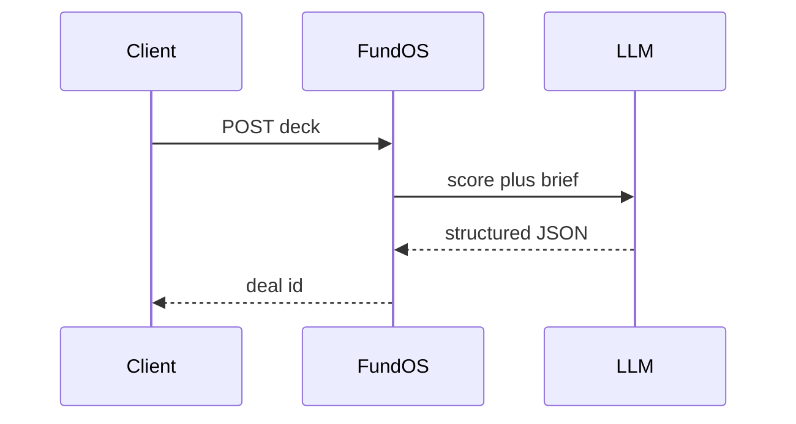

# FundOS

*Deal intake and pitch deck scoring API: upload a fund thesis, embed a gatekeeper form, and receive structured screening briefs with evidence-linked Fit Scores.*

> **Domain:** `fundos.io` (primary), `fundos.dev` (secondary)
> **Market:** VC and angel investing tooling; GP bandwidth constraints are universal; $2B-plus deal ops software addressable market (2026)

---

## Problem Statement

- Deal flow inboxes overflow; associates filter noise manually without a shared rubric
- Pitch deck quality assessment is inconsistent across partners because there is no structured scoring
- Founders submit unstructured cold emails; data entry to CRM is manual and duplicate work
- Portfolio update requests end up in spreadsheets; LP reporting becomes a quarterly scramble

---

## Core Features

### Pitch Deck Grader
- Founder uploads PDF; API returns a 0 to 100 Fit Score with dimension breakdowns
- Evidence-linked rationale: each score point cites a deck slide or text span
- Freemium widget usable by founders before a fund subscribes

### Gatekeeper
- Embeddable intake form with adaptive conditional fields per thesis configuration
- Auto-decline path with helpful feedback for off-thesis submissions
- Webhook on submission with normalized deal JSON

### Thesis Compiler
- Upload SOPs, IC memos, or partner notes; returns a YAML rubric with thresholds and disqualifiers
- Version controlled; prior rubric versions retained for consistency tracking

### Deal Brief
- Structured screening brief JSON from deck plus submitted data
- Assumption labeling when evidence is missing from submitted materials

---

## Interaction Sequence



---

## API Design

### Core Endpoints

```
POST /api/v1/decks
GET  /api/v1/decks/{id}/score
POST /api/v1/thesis
GET  /api/v1/thesis/{id}
POST /api/v1/deals
GET  /api/v1/deals/{id}/brief
GET  /api/v1/usage
GET  /api/v1/health
```

### Request Example
```json
{
  "thesis_id": "ths_01HXYZ",
  "deck_base64": "...",
  "company": "Acme AI",
  "founder_email": "founder@acme.ai"
}
```

### Response Example
```json
{
  "deal_id": "deal_01HABC",
  "fit_score": 74,
  "dimensions": {
    "market_size": 82,
    "team_signal": 71,
    "thesis_alignment": 69
  },
  "brief": "Acme AI targets an underserved vertical...",
  "assumptions": ["Revenue claimed but no P&L included"]
}
```

---

## 7-Day Build Plan

| Day | Focus | Deliverable |
|-----|-------|-------------|
| 1 | PDF ingest | Upload and text extract pipeline |
| 2 | Thesis compiler | YAML rubric from uploaded fund documents |
| 3 | Scorer | LLM fit score with evidence span references |
| 4 | Gatekeeper widget | Embeddable intake form plus auto-decline path |
| 5 | Deal brief | Structured JSON brief endpoint |
| 6 | Stripe | Freemium plus Pro tiers with usage metering |
| 7 | Launch | VC ops communities, emerging manager Slack groups, Product Hunt |

---

## Simple Data Model

```
User:
  id, email, password_hash, role, created_at

Thesis:
  id, user_id, yaml, version, created_at

Deal:
  id, user_id, company, founder_email, status, fit_score, brief_json, created_at

Deck:
  id, deal_id, filename, raw_text_hash, page_count, created_at

EvidenceSpan:
  id, deck_id, score_dimension, text_excerpt, page_num, created_at

APIKey:
  id, user_id, key_hash, tier, created_at

Usage:
  id, api_key_id, endpoint, count, date
```

---

## Revenue Model

| Tier | Price | Includes |
|------|-------|----------|
| Free | $0/month | Pitch Deck Grader, 10 deals per month, watermarked exports |
| Pro | $199/month | 200 deals, IC brief, thesis compiler, evidence links |
| Team | $599/month | 5 users, versioned playbooks, CRM webhook |
| Enterprise | Custom | Dedicated tenant, SSO, SLA, custom connectors |

Pay-as-you-go: $5 per deck processed after plan limits.

---

## Go-to-Market

- **Launch channels:**
  - Product Hunt
  - VC ops and emerging manager Slack communities
  - Hacker News (Show HN angle: "Pitch deck grader grounded in your fund thesis")
  - GCP Marketplace (later)
- **Direct outreach:** 25 solo GPs and Fund I managers running lean teams
- **Content hook:** "Fit Score in 60 seconds from a PDF and three pages of thesis notes"
- **Early adopter incentive:** Pro free for 60 days for first 10 funds onboarding a thesis

---

## Stack

- **Backend:** Python (FastAPI) plus Celery workers for PDF jobs
- **LLM:** Gemini or GPT-4o with routing for scoring and brief generation
- **Document parsing:** pdfplumber plus optional GCP Document AI for structured extraction
- **Database:** PostgreSQL plus pgvector for evidence retrieval
- **Deploy:** GCP Cloud Run or Fly.io with auto-scaling workers
- **Payments:** Stripe usage-based metering

---

## Market Positioning

- **Target users:** Solo GPs, emerging managers (Fund I and II), lean VC ops and analyst teams
- **YC/A16Z alignment:** AI-assisted investing infrastructure; GP as orchestrator of agents (2026)
- **Key differentiator:** Playbook-governed scoring with evidence spans and assumption flags versus generic deck summarizers
- **Closest competitors:**
  - Visible, Affinity: CRM-first with no thesis-gated auto-scoring
  - Generic LLM assistants: no rubric enforcement, no evidence linking

---

## Success Metrics (First 90 Days)

- Decks graded via freemium: target 5,000 by month 1
- Paid workspaces: target 15 by day 30
- MRR: $4,000 by month 3
- Screening brief generation time: target under 60 seconds at p90
- Partner rating of brief quality (good or better): target 80%
