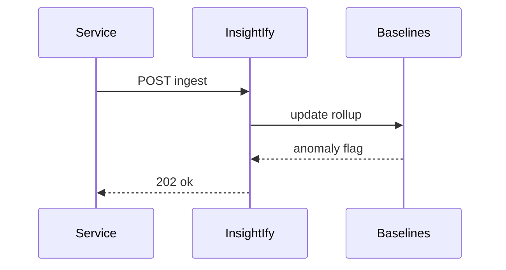

# InsightIfy

*Log and metric anomaly API: ingest streams, baseline behavior, alert via webhooks when patterns break.*

> **Domain:** `insightify.io` (primary), `insightify.dev` (secondary)
> **Market:** Observability adjacency for teams that outgrew grep but resist full APM cost (2026)

---

## Problem Statement

- Datadog bills spike; small services only need anomaly hints, not full APM
- Cron jobs parsing logs are fragile; threshold tuning is manual
- Developers want a single POST to ship JSON events and get alerts
- On-call needs context snippets, not only “something broke”

---

## Core Features

### Ingestion
- JSON event or log line batch ingest with optional structured fields (`service`, `level`, `trace_id`)

### Baselines
- Rolling statistical models per metric key; seasonality naive v1; smarter later

### Alerts
- Webhooks with example lines and link to query ID; mute windows; rate limit per service

---

## Interaction Sequence



---

## API Design

### Core Endpoints

```
POST /api/v1/ingest
POST /api/v1/metrics
GET  /api/v1/alerts
POST /api/v1/rules
GET  /api/v1/query/{id}
GET  /api/v1/usage
GET  /api/v1/health
```

### Request Example
```json
{
  "service": "checkout",
  "events": [
    {"ts": "2026-03-28T12:00:01Z", "level": "error", "msg": "timeout upstream"}
  ]
}
```

### Response Example
```json
{
  "accepted": 1,
  "ingest_id": "ing_01HXYZ"
}
```

---

## 7-Day Build Plan

| Day | Focus | Deliverable |
|-----|-------|-------------|
| 1 | Ingest API | Buffer to object storage or column store |
| 2 | Query | Basic time-range filter |
| 3 | Metrics rollups | 1m buckets |
| 4 | Anomaly v1 | Z-score on error rate per service |
| 5 | Alerts | Webhook dispatch |
| 6 | Stripe | Free 100MB; Pro retention |
| 7 | Launch | Show HN, SRE communities, Indie Hackers |

---

## Simple Data Model

```
User:
  id, email, password_hash, created_at

Project:
  id, user_id, name, created_at

IngestBatch:
  id, project_id, bytes, created_at

MetricBucket:
  id, project_id, key, ts, value

Alert:
  id, project_id, rule_id, payload_json, created_at

Rule:
  id, project_id, config_json, created_at

APIKey:
  id, user_id, key_hash, tier, created_at

Usage:
  id, api_key_id, endpoint, count, date
```

---

## Revenue Model

| Tier | Price | Includes |
|------|-------|----------|
| Free | $0/month | 100 MB ingest, 7 day retention |
| Pro | $39/month | 10 GB, 30 day retention, 10 rules |
| Team | $119/month | 100 GB, 90 day retention, SSO roadmap |
| Enterprise | Custom | Unlimited retention options, VPC |

Pay-as-you-go: $0.15 per GB ingested after limits.

---

## Go-to-Market

- **Launch channels:**
  - Product Hunt
  - Hacker News
  - Reddit r/devops
- **Direct outreach:** 20 founders running 5 to 20 microservices without APM
- **Content hook:** “Error rate z-score alerts with one ingest POST”
- **Early adopter incentive:** Team tier 3 months free for first 10 design partners

---

## Stack

- **Backend:** Go or Python
- **Database:** ClickHouse or TimescaleDB
- **Queue:** Kafka optional later; Redis first
- **Auth:** API keys
- **Deploy:** Fly.io or AWS
- **Payments:** Stripe

---

## Market Positioning

- **Target users:** Small platform teams, indie SaaS, and side projects needing cheap anomaly hints
- **YC/A16Z alignment:** AI-assisted ops; pragmatic observability downsizing (2026)
- **Key differentiator:** Ingest to alert path with minimal UI requirement
- **Closest competitors:**
  - Axiom, Honeycomb: deeper products; higher learning curve and cost
  - Cron + grep: free; brittle

---

## Success Metrics (First 90 Days)

- Projects: 300 by day 30
- Paid: 16 by day 30
- MRR: $1,200 by month 3
- Ingest volume: 500 GB by month 1
- Alert noise score: thumbs down rate under 15%
