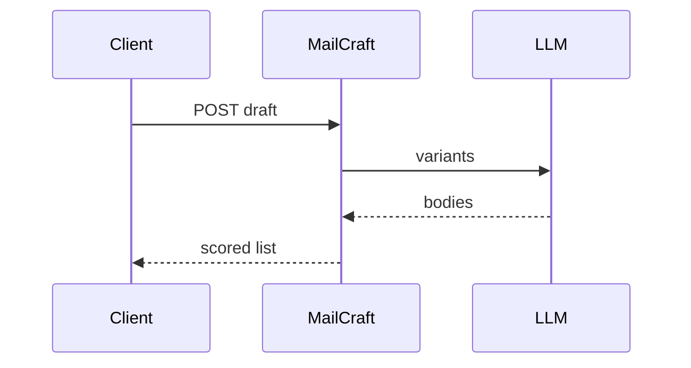

# MailCraft

*AI-assisted email drafting API: brand voice, compliance hints, and A/B variants for support and marketing teams.*

> **Domain:** `mailcraft.io` (primary), `mailcraft.dev` (secondary)
> **Market:** Generative workplace writing; GTM teams want API access, not only chat UIs (2026)

---

## Problem Statement

- Support macros rot; agents paste unsafe promises without legal review patterns
- Marketing wants on-brand variants fast; legal wants disclaimers enforced via templates
- LLM playgrounds leak PII; teams need redaction pre-step integration hooks
- No shared scoring rubric for tone and clarity across languages

---

## Core Features

### Draft Generation
- Input: bullet facts, intent (`refund`, `upsell`, `status_update`), locale
- Output: 3 variants with readability score and banned phrase scan

### Brand Voice
- YAML voice pack per workspace: formality, taboo words, required closings

### Safety
- Optional RedactGuard-compatible preflight hook ID (partnership story) or built-in regex pack

---

## Interaction Sequence



---

## API Design

### Core Endpoints

```
POST /api/v1/drafts
POST /api/v1/voice
GET  /api/v1/voice/{id}
POST /api/v1/drafts/{id}/score
GET  /api/v1/usage
GET  /api/v1/health
```

### Request Example
```json
{
  "intent": "refund",
  "facts": ["Order 8821", "Arrived damaged", "Customer prefers store credit"],
  "locale": "en-US",
  "voice_id": "voice_acme_support"
}
```

### Response Example
```json
{
  "variants": [
    {"id": "v1", "body": "Hi ...", "readability": 8.2},
    {"id": "v2", "body": "Hello ...", "readability": 7.9}
  ]
}
```

---

## 7-Day Build Plan

| Day | Focus | Deliverable |
|-----|-------|-------------|
| 1 | Auth + voice YAML | Parser; validation |
| 2 | Draft worker | LLM call; variant fan-out |
| 3 | Scoring | Heuristic + optional judge model |
| 4 | Banned phrases | Rule engine |
| 5 | Logs | Store prompts hashed; retention policy |
| 6 | Stripe | Free low credits; Pro bundles |
| 7 | Launch | Product Hunt, support leader newsletters, Indie Hackers |

---

## Simple Data Model

```
User:
  id, email, password_hash, created_at

VoiceProfile:
  id, user_id, yaml, created_at

DraftJob:
  id, user_id, intent, input_json, output_json, created_at

Score:
  id, draft_job_id, variant_id, metrics_json, created_at

APIKey:
  id, user_id, key_hash, tier, created_at

Usage:
  id, api_key_id, endpoint, count, date
```

---

## Revenue Model

| Tier | Price | Includes |
|------|-------|----------|
| Free | $0/month | 100 draft credits, single voice |
| Pro | $39/month | 5,000 credits, 5 voices |
| Team | $99/month | 25k credits, review workflow API |
| Enterprise | Custom | VPC, retention controls, SLA |

Pay-as-you-go: $8 per 1k credits after limits.

---

## Go-to-Market

- **Launch channels:**
  - Product Hunt
  - Indie Hackers
  - Support Driven community
- **Direct outreach:** 20 heads of support at Series A SaaS
- **Content hook:** “Three on-brand refund emails from bullet facts”
- **Early adopter incentive:** Team tier 50% off first quarter for first 8 logos

---

## Stack

- **Backend:** Python (FastAPI)
- **Database:** PostgreSQL
- **Auth:** API keys
- **LLM:** OpenAI or Anthropic with routing
- **Deploy:** Fly.io
- **Payments:** Stripe meters

---

## Market Positioning

- **Target users:** Support and success teams, CRM integrators, and internal tools engineers
- **YC/A16Z alignment:** Generative workplace tools with governance hooks (2026)
- **Key differentiator:** Voice YAML plus compliance-style phrase rules as first-class API inputs
- **Closest competitors:**
  - ChatGPT Team: general; weak structured brand enforcement
  - TextExpander: snippets; not generative at scale

---

## Success Metrics (First 90 Days)

- Workspaces: 250 by day 30
- Paid: 18 by day 30
- MRR: $1,400 by month 3
- Draft credits consumed: 400k by month 1
- Banned phrase violations blocked: tracked rate in dashboard
