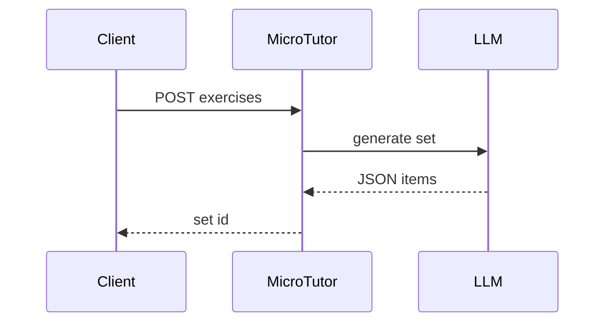

# MicroTutor

*Tutor admin API: generate practice exercises, summarize session notes, and serve editable lesson plan templates tuned to subject and student level.*

> **Domain:** `microtutor.io` (primary), `microtutor.dev` (secondary)
> **Market:** EdTech tooling for freelance and agency tutors; 15M-plus tutors globally spend 30 percent of billable prep time on admin (2026)

---

## Problem Statement

- Tutors generate exercises by hand per student per session; no reusable subject-and-level schema
- Session notes live in scattered docs or handwritten pages with no structured sharing path
- Lesson plans vary widely across sessions; templates tuned to seniority levels do not exist out of the box
- Admin overhead cuts into per-session profit; tutors want automation that preserves teaching time

---

## Core Features

### Exercise Generator
- Input: subject, student level, count, optional topic keywords
- Output: JSON exercise set with questions, difficulty tags, and answer keys
- Level-aware: vocabulary, complexity, and format adapt from beginner to advanced

### Session Note Taker
- Accepts raw text or Whisper-compatible audio transcription
- Returns structured summary: topics covered, student struggles, recommended follow-ups
- Per-student history for longitudinal context

### Lesson Plan Templates
- Community library indexed by subject and level with CRUD for private templates
- Editable markdown with variable slots (student name, date, focus area)

### Webhooks
- `exercise.generated`, `note.summarized` events with signed payloads

---

## Interaction Sequence



---

## API Design

### Core Endpoints

```
POST /api/v1/exercises
GET  /api/v1/exercises/{id}
POST /api/v1/notes
GET  /api/v1/notes/{id}/summary
GET  /api/v1/templates
POST /api/v1/templates
GET  /api/v1/usage
GET  /api/v1/health
```

### Request Example
```json
{
  "subject": "algebra",
  "level": "grade_8",
  "count": 5,
  "topics": ["linear equations", "graphing"]
}
```

### Response Example
```json
{
  "exercise_set_id": "ex_01HXYZ",
  "exercises": [
    {"question": "Solve for x: 2x + 3 = 11", "difficulty": "medium", "answer": "x = 4"}
  ]
}
```

---

## 7-Day Build Plan

| Day | Focus | Deliverable |
|-----|-------|-------------|
| 1 | Auth and workspace | JWT; tutor profile and student CRUD |
| 2 | Exercise gen | OpenAI call with subject and level schema |
| 3 | Note taker | Whisper-compatible input plus structured summary |
| 4 | Templates | CRUD plus community library with subject index |
| 5 | Webhooks | Delivery with retry policy and event log |
| 6 | Stripe | Free twenty exercises; Pro unlimited |
| 7 | Launch | Tutor Facebook groups, Product Hunt, Indie Hackers |

---

## Simple Data Model

```
Tutor:
  id, email, password_hash, subjects_json, created_at

Student:
  id, tutor_id, name, level, notes, created_at

ExerciseSet:
  id, tutor_id, student_id, subject, level, exercises_json, created_at

SessionNote:
  id, tutor_id, student_id, raw_text, summary_json, created_at

LessonTemplate:
  id, tutor_id, subject, level, body_md, public, created_at

APIKey:
  id, tutor_id, key_hash, tier, created_at

Usage:
  id, api_key_id, endpoint, count, date
```

---

## Revenue Model

| Tier | Price | Includes |
|------|-------|----------|
| Free | $0/month | 20 exercises, 5 notes, community templates |
| Pro | $19/month | Unlimited exercises, unlimited notes, private templates |
| Studio | $59/month | 10 tutor seats, shared templates, webhooks |
| Enterprise | Custom | White-label, LMS integration, SLA |

Pay-as-you-go: $0.05 per exercise generated after plan limits.

---

## Go-to-Market

- **Launch channels:**
  - Product Hunt
  - Indie Hackers
  - Tutor Facebook groups and LinkedIn communities
  - Reddit r/tutors and r/Teachers
- **Direct outreach:** 20 DMs to freelance tutors posting on Reddit or Superprof
- **Content hook:** "Generate 10 algebra exercises for a Grade 8 student in one API call"
- **Early adopter incentive:** Pro free for 90 days for first 20 tutors who share a session note screenshot

---

## Stack

- **Backend:** Node.js (Express) or Python (FastAPI)
- **LLM:** OpenAI GPT-4o for exercise generation and note summaries
- **Transcription:** OpenAI Whisper for voice note input on Pro
- **Database:** PostgreSQL
- **Deploy:** Fly.io or Railway
- **Payments:** Stripe usage-based billing

---

## Market Positioning

- **Target users:** Freelance tutors, small tutoring agencies, edtech builders embedding AI into lesson tooling
- **YC/A16Z alignment:** AI tools for knowledge workers; education infrastructure (2026)
- **Key differentiator:** Tutor-native schema (subject, student level, session history) versus a generic LLM chatbox
- **Closest competitors:**
  - ChatGPT: general purpose; no student context, no structured output schema
  - Teachable: course-first; no per-session exercise generation or note taking API

---

## Success Metrics (First 90 Days)

- API signups: target 400 by day 30
- Paid conversions: target 30 by day 30
- MRR: $900 by month 3
- Exercises generated: target 50,000 by month 1
- Session note accuracy rating: target 85% good or better from tutor spot checks
