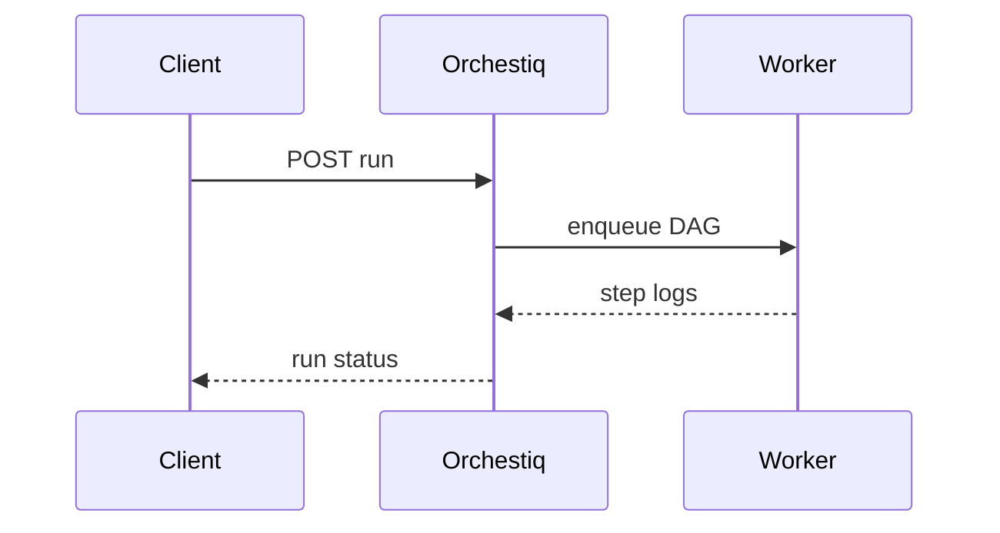

# Orchestiq

*Multi-agent workflow API: define agents, steps, human approvals, and audit logs for production agentic apps.*

> **Domain:** `orchestiq.io` (primary), `orchestiq.dev` (secondary)
> **Market:** Agent orchestration; Deloitte-scale forecasts show fast growth in agentic automation spend (2026)

---

## Problem Statement

- LangGraph and CrewAI are code-first; product teams want hosted orchestration with retries and audit
- Single LLM calls are easy; coordinating tools, memory, and human gates across tenants is not
- Compliance teams ask for immutable run logs; ad-hoc scripts in notebooks fail audits
- Billing per run is unclear when steps fan out to multiple models and tools

---

## Core Features

### Workflow Definition
- YAML or JSON DAG: nodes for LLM, tool HTTP call, branch, human approval
- Versioned definitions; promote staging to production with semver

### Execution Engine
- Async runs with step-level status, input and output redaction options
- Automatic retries for transient tool failures; dead-letter queue for inspection

### Human-in-the-Loop
- Pause tokens; resume API after approver action; Slack or email notify hooks

---

## Interaction Sequence



---

## API Design

### Core Endpoints

```
POST /api/v1/workflows
POST /api/v1/workflows/{id}/run
GET  /api/v1/runs/{id}
POST /api/v1/runs/{id}/approve
GET  /api/v1/runs/{id}/steps
GET  /api/v1/usage
GET  /api/v1/health
```

### Request Example
```json
{
  "workflow_id": "wf_01HXYZ",
  "input": {"ticket_id": "T-4412"},
  "idempotency_key": "run-20260328-01"
}
```

### Response Example
```json
{
  "run_id": "run_01HABC",
  "status": "awaiting_approval",
  "pending_step": "legal_review"
}
```

---

## 7-Day Build Plan

| Day | Focus | Deliverable |
|-----|-------|-------------|
| 1 | Tenants + auth | API keys; workflow CRUD |
| 2 | Runner MVP | Sequential LLM + HTTP tool nodes |
| 3 | Persistence | Step table; run status machine |
| 4 | Approvals | Pause and resume tokens |
| 5 | Observability | Structured logs export JSON |
| 6 | Stripe | Metered steps per run |
| 7 | Launch | Show HN, AI engineer Slack groups, outreach to internal tooling teams |

---

## Simple Data Model

```
Tenant:
  id, name, owner_user_id, created_at

Workflow:
  id, tenant_id, name, definition_json, version, created_at

Run:
  id, workflow_id, status, input_json, output_json, created_at, completed_at

Step:
  id, run_id, name, kind, status, logs_json, created_at

Approval:
  id, run_id, step_id, approver, decision, created_at

APIKey:
  id, tenant_id, key_hash, tier, created_at

Usage:
  id, api_key_id, endpoint, count, date
```

---

## Revenue Model

| Tier | Price | Includes |
|------|-------|----------|
| Free | $0/month | 200 steps, 1 workflow, community support |
| Pro | $79/month | 50k steps, 20 workflows, email support |
| Scale | $249/month | 300k steps, SSO roadmap, priority queue |
| Enterprise | Custom | VPC, SLA, dedicated support |

Pay-as-you-go: $0.0008 per step after limits.

---

## Go-to-Market

- **Launch channels:**
  - Product Hunt
  - Indie Hackers
  - Hacker News
  - Reddit r/LangChain
- **Direct outreach:** 20 emails to platform teams piloting agents internally
- **Content hook:** “Human approval gates in your agent DAG with one API”
- **Early adopter incentive:** Scale tier 50% off for first 10 design partners

---

## Stack

- **Backend:** Python (FastAPI) or Go (Gin)
- **Database:** PostgreSQL
- **Queue:** Redis, SQS, or Temporal Cloud
- **Auth:** API keys; OIDC for dashboard
- **Deploy:** Fly.io or AWS
- **Payments:** Stripe meters

---

## Market Positioning

- **Target users:** AI platform engineers and product teams shipping multi-step agents to production
- **YC/A16Z alignment:** Agentic orchestration as infrastructure layer (2026)
- **Key differentiator:** Hosted DAG runner with approvals, audit, and usage-based billing in one product
- **Closest competitors:**
  - In-house Temporal plus glue: powerful; high build cost
  - Dify, Flowise: more UI-centric; less API-native for embedding

---

## Success Metrics (First 90 Days)

- Tenants: 200 by day 30
- Paid: 15 by day 30
- MRR: $2,800 by month 3
- Steps executed: 2M by month 1
- Approval resume latency p95 under 5 minutes (customer-side)
