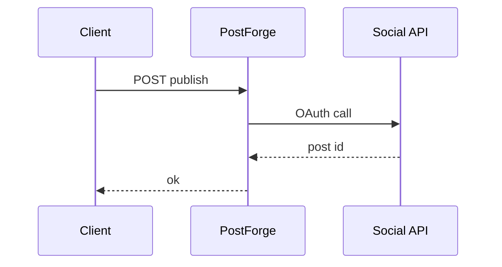

# PostForge

*Social content API: generate, schedule, and publish posts across networks with brand voice presets and approval workflow.*

> **Domain:** `postforge.io` (primary), `postforge.dev` (secondary)
> **Market:** Creator tools and B2B marketing ops; multi-channel posting remains fragmented (2026)

---

## Problem Statement

- Copy-pasting the same campaign into LinkedIn, X, and Meta wastes time and drifts tone
- Agencies need client approval logs; Notion threads are not audit-friendly
- Developers building vertical apps want posting primitives without OAuth maze per network on day one
- API rate limits and retries differ per platform; teams reinvent backoff logic

---

## Core Features

### Content Generation
- Template prompts with brand voice YAML; optional image brief for paired creative tools
- Variant generation: A/B captions per platform constraints (length, hashtag rules)

### Scheduling and Publishing
- Unified schedule table; timezone aware
- Adapters: LinkedIn, X, Meta Pages (expand over time); webhook on publish success or failure

### Approvals
- Multi-step approval state machine per post; comment thread stored as structured messages

---

## Interaction Sequence



---

## API Design

### Core Endpoints

```
POST /api/v1/campaigns
POST /api/v1/posts
POST /api/v1/posts/{id}/schedule
POST /api/v1/posts/{id}/approve
GET  /api/v1/calendar?from=&to=
GET  /api/v1/usage
GET  /api/v1/health
```

### Request Example
```json
{
  "campaign_id": "cmp_01HXYZ",
  "platforms": ["linkedin", "twitter"],
  "topic": "Launching PostForge API",
  "voice_id": "brand_default"
}
```

### Response Example
```json
{
  "post_id": "pst_01HABC",
  "variants": [
    {"platform": "linkedin", "text": "We shipped ..."},
    {"platform": "twitter", "text": "Shipped: ..."}
  ],
  "status": "draft"
}
```

---

## 7-Day Build Plan

| Day | Focus | Deliverable |
|-----|-------|-------------|
| 1 | OAuth vault | Encrypt tokens; workspace model |
| 2 | LinkedIn adapter | Post create MVP |
| 3 | X adapter | Post create MVP |
| 4 | Scheduler | Cron worker; retry policy |
| 5 | Approvals | State transitions; email notifications |
| 6 | Stripe | Free 10 posts; Pro unlimited |
| 7 | Launch | Product Hunt, creator Twitter, agency outreach |

---

## Simple Data Model

```
Workspace:
  id, name, owner_user_id, created_at

VoiceProfile:
  id, workspace_id, yaml, created_at

Campaign:
  id, workspace_id, title, created_at

Post:
  id, campaign_id, status, scheduled_at, published_at, platforms_json, created_at

Approval:
  id, post_id, step, approver_email, status, comment, created_at

Connection:
  id, workspace_id, provider, tokens_enc, created_at

APIKey:
  id, workspace_id, key_hash, tier, created_at

Usage:
  id, api_key_id, endpoint, count, date
```

---

## Revenue Model

| Tier | Price | Includes |
|------|-------|----------|
| Free | $0/month | 10 scheduled posts, 1 user, community support |
| Pro | $34/month | Unlimited posts, 3 users, both adapters |
| Agency | $99/month | 10 workspaces, approvals, priority email |
| Enterprise | Custom | SLA, custom networks, dedicated IPs |

Pay-as-you-go: $0.05 per published post after fair use on Free.

---

## Go-to-Market

- **Launch channels:**
  - Product Hunt
  - Indie Hackers
  - Hacker News
  - Reddit r/marketing, r/SocialMediaMarketing
- **Direct outreach:** 20 DMs to micro agencies posting manually today
- **Content hook:** “One POST: LinkedIn + X copy variants with schedule”
- **Early adopter incentive:** Agency tier 2 months free for first 10 shops

---

## Stack

- **Backend:** Node.js (Express) or Python (FastAPI)
- **Database:** PostgreSQL
- **Auth:** JWT + API keys
- **Secrets:** KMS or libsodium for OAuth tokens
- **Deploy:** Fly.io
- **Payments:** Stripe

---

## Market Positioning

- **Target users:** Indie creators, small agencies, and developers embedding social in vertical SaaS
- **YC/A16Z alignment:** Creator economy infra; API-first GTM (2026)
- **Key differentiator:** Variant generation plus approvals plus publish adapters in one API, not only Buffer-style UI
- **Closest competitors:**
  - Buffer, Hootsuite: strong UIs; API as secondary; pricing ladders fast
  - Raw network APIs: flexible; heavy OAuth and policy upkeep

---

## Success Metrics (First 90 Days)

- Workspaces: 300 by day 30
- Paid: 18 by day 30
- MRR: $1,000 by month 3
- Successful publishes: 15k by month 1
- Publish failure rate under 3% excluding user revoked tokens
