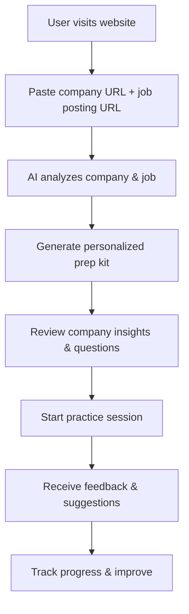

# **PrepWise**

### *Web App for Interview Preparation & Practice*

---

## 1. Elevator Pitch

> **PrepWise** is a web application that helps job seekers prepare for interviews by analyzing company information and job postings to generate personalized interview questions and practice sessions. Users simply paste a company URL and job posting, and instantly receive a curated interview prep kit with role-specific guidance, probable technical questions, and an interactive practice mode that simulates real interviews.

---

## 2. Problem Statement

| Pain Point                            | Current Reality                                                                                                    | Negative Impact                                                                |
| ------------------------------------- | ------------------------------------------------------------------------------------------------------------------ | ------------------------------------------------------------------------------ |
| **Scattered information**             | Candidates manually search company sites, Glassdoor reviews, and GitHub repos.                                    | Hours of prep spent on low-value information.                                 |
| **Generic prep resources**            | Blog lists or YouTube videos seldom reflect the specific stack or culture of the target employer.                  | Mismatch between practice questions and actual interview focus.                |
| **One-size-fits-all practice**        | Generic interview prep tools ignore the actual job description and company context.                               | Poor preparation for senior or niche roles.                                   |
| **Fragmented tools**                  | Separate tools for research, question generation, and practice sessions.                                          | Complex workflows that waste time and reduce effectiveness.                    |

---

## 3. Core Value Proposition

1. **Company-Specific Insights** – Analyzes public company data and role requirements to surface probable interview topics
2. **Interactive Practice Sessions** – Simulates real interviews with company-specific questions and feedback
3. **Time-Saving Precision** – Reduces prep time from hours to minutes while improving effectiveness
4. **Simple Web Interface** – No technical knowledge required; works on any device

---

## 4. Primary Personas

| Persona                   | Goals                                                        | Key Workflow                                                 |
| ------------------------- | ------------------------------------------------------------ | ------------------------------------------------------------ |
| **Job Seeker**            | Quickly identify likely questions and practice concise answers. | Paste company/job URLs, get prep kit, practice with AI.     |
| **Career Coach**          | Provide targeted interview prep for multiple clients.        | Use bulk analysis for multiple companies and roles.          |
| **Bootcamp Graduate**     | Prepare for first technical interviews with confidence.      | Focus on entry-level roles and common question patterns.     |
| **Career Changer**        | Understand new industry expectations and terminology.        | Get industry-specific questions and cultural insights.       |

---

## 5. Core Features

| Feature                      | Description                                                                                                                       |
| ------------------------------- | --------------------------------------------------------------------------------------------------------------------------------- |
| **Company Analysis**           | Scrapes company websites, job postings, and public information to understand culture and requirements.                           |
| **Job Description Parsing**    | Extracts required skills, experience levels, and company-specific requirements from job postings.                                |
| **Question Generation**        | Creates role-specific technical, behavioral, and system design questions based on company and job analysis.                      |
| **Interactive Practice**       | AI-powered interview simulation with realistic questions and real-time feedback.                                                |
| **Progress Tracking**          | Tracks practice sessions, identifies weak areas, and suggests improvement strategies.                                            |
| **Resource Library**           | Curated reading materials, coding challenges, and industry insights relevant to the target role.                                |

---

## 6. User Journey



---

## 7. Web Application Features

| Feature                    | Description                                                                                | Priority |
| -------------------------- | ------------------------------------------------------------------------------------------ | -------- |
| **URL Input**              | Simple form to paste company and job posting URLs                                          | High     |
| **Analysis Dashboard**     | Company insights, role requirements, and interview focus areas                              | High     |
| **Question Bank**          | Curated questions organized by category (technical, behavioral, system design)             | High     |
| **Practice Mode**          | Interactive interview simulation with AI interviewer                                       | High     |
| **Progress Tracking**      | Session history, improvement areas, and readiness scores                                    | Medium   |
| **Resource Library**       | Links to relevant articles, practice problems, and industry resources                       | Medium   |
| **Export Options**         | Download prep materials as PDF or share with others                                        | Low      |

---

## 8. Simple Architecture

```
┌────────────┐      ┌────────────┐      ┌─────────────┐
│ Web        │───►│ Company    │───►│ Question    │
│ Interface  │    │ Analyzer   │    │ Generator   │
└────────────┘    └────────────┘    └─────────────┘
                         │
                         ▼
                 ┌─────────────────┐
                 │ Practice        │
                 │ Simulator       │
                 └─────────────────┘
                  │        │
        ┌─────────┘        └───────────┐
        ▼                               ▼
┌─────────────┐                ┌─────────────────┐
│ Progress    │                │ Resource        │
│ Tracker     │                │ Library         │
└─────────────┘                └─────────────────┘
```

---

## 9. Privacy & Security

| Aspect                   | Approach                                                                         |
| ----------------------- | -------------------------------------------------------------------------------- |
| **Data Handling**        | No personal data stored; all analysis done in real-time                          |
| **Company Information**  | Only public information from company websites and job postings                   |
| **User Privacy**         | Optional account creation; practice sessions can be anonymous                     |
| **Content Safety**       | All generated content reviewed for appropriateness and accuracy                   |

---

## 10. Monetization Strategy

| Tier           | Features & Limits                                               | Price    | Target Customer                             |
| -------------- | --------------------------------------------------------------- | -------- | ------------------------------------------- |
| **Free**       | 3 prep kits/month, basic practice sessions, limited questions   | $0       | Individual job seekers                      |
| **Pro**        | Unlimited prep kits, advanced practice, detailed feedback       | $19/mo   | Active job seekers, career changers         |
| **Coach**      | Bulk analysis, client management, progress reports              | $49/mo   | Career coaches, bootcamps                   |
| **Enterprise** | Custom branding, API access, dedicated support                 | $199/mo  | Recruiting firms, HR departments            |

---

## 11. Go-To-Market Plan

1. **Content Marketing** – Create blog posts about interview preparation and company research
2. **Social Media** – Share interview tips and success stories on LinkedIn and Twitter
3. **Partnerships** – Partner with career coaches, bootcamps, and job boards
4. **Free Trials** – Offer 7-day free trial of Pro features to drive conversions
5. **Referral Program** – Give users credits for referring friends who sign up

---

## 12. Competitive Landscape

| Competitor           | Focus                     | Gap PrepWise Addresses                                    |
| -------------------- | ------------------------- | --------------------------------------------------------- |
| LeetCode Premium     | Coding practice only      | PrepWise covers behavioral, system design, and company-specific prep |
| Pramp                | Live peer practice        | PrepWise is available 24/7 with AI, no scheduling needed  |
| Interviewing.io      | Live expert practice      | PrepWise is more affordable and accessible                |
| Generic interview prep | One-size-fits-all content | PrepWise personalizes based on specific company and role  |

---

## 13. Key Metrics & KPIs

* **Prep Kit Success Rate** — % of users reporting ≥80% topic match in actual interviews
* **Practice Session Completion** — % of users who complete full practice sessions
* **Conversion Rate** — % of free users who upgrade to paid plans
* **User Satisfaction** — Average rating from user feedback (target ≥4.5/5)
* **Revenue Growth** — Monthly recurring revenue growth rate

---

## 14. 7-Day Launch Plan

**Day 1-2: Core Development**
- Build basic web interface for URL input
- Implement company and job posting analysis
- Create question generation system

**Day 3-4: Practice Features**
- Build interactive practice mode with AI
- Implement feedback and scoring system
- Add progress tracking

**Day 5-6: Polish & Monetization**
- Add user accounts and payment processing
- Implement tiered features and limits
- Create resource library

**Day 7: Launch**
- Deploy to web hosting
- Create landing page with examples
- Begin marketing outreach

---

## 15. Risks & Mitigations

| Risk                                           | Likelihood | Impact | Mitigation                                                             |
| ---------------------------------------------- | ---------- | ------ | ---------------------------------------------------------------------- |
| AI generates inaccurate or misleading guidance | Medium     | High   | Human review of generated content, user feedback loops                 |
| Company websites block scraping                | Medium     | Medium | Fallback to manual input, use public APIs where available             |
| Competition from larger players                | High       | Medium | Focus on personalization and ease of use, build strong user community |
| User data privacy concerns                     | Low        | High   | Clear privacy policy, minimal data collection, transparent practices   |

---

## 16. Future Extensions

* **Video Practice Sessions** – Record and analyze video responses
* **Company-Specific Insights** – Deeper analysis of company culture and interview processes
* **Skill Gap Analysis** – Identify areas for improvement and suggest learning resources
* **Interview Scheduling** – Integrate with calendar apps for interview reminders
* **Success Tracking** – Help users track interview outcomes and improve over time

---

### **Why PrepWise?**

Because generic interview prep is outdated. Personalization, company-specific insights, and accessible practice are the new interview superpowers. PrepWise provides all three through a simple web interface that anyone can use to prepare for their next career opportunity.

---

> *"Preparation is the key to confidence. Make it personal and effective."* – PrepWise Mission
