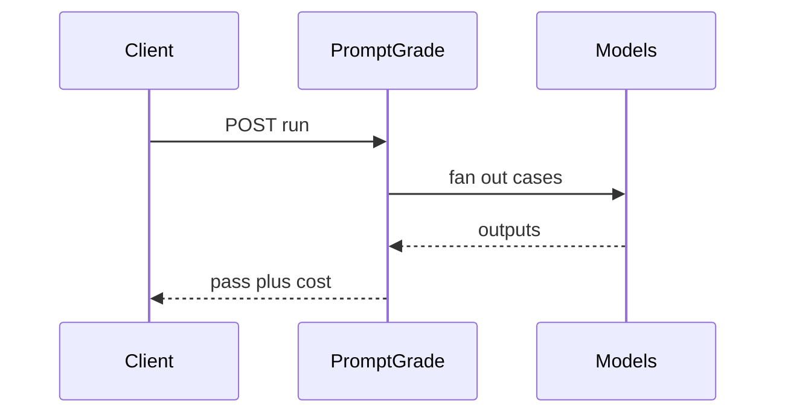

# PromptGrade

*Prompt regression API: run suites across models, compare cost, latency, and pass rate in CI-friendly JSON.*

> **Domain:** `promptgrade.io` (primary), `promptgrade.dev` (secondary)
> **Market:** LLM ops and evaluation; every AI team needs regression before model swaps (2026)

---

## Problem Statement

- Changing models or temperatures breaks prompts; teams discover regressions in production instead of CI
- Spreadsheets of test cases do not integrate with GitHub Actions or custom deploy scripts
- Cost per suite run is opaque when spread across providers
- Side-by-side UIs help humans but not automated gates

---

## Core Features

### Suites and Runs
- Define prompt templates with variables; attach assertions (JSON schema, substring, LLM-as-judge flag)
- Run suite against one or many models: OpenAI, Anthropic, Gemini, Ollama endpoint
- Output: pass rate, p95 latency, estimated cost, failing case IDs

### Comparison and History
- Diff two runs on the same suite hash; highlight newly failing cases
- Trend chart data via API for dashboards

### Sharing
- Signed report URLs for stakeholders (read-only)

---

## Interaction Sequence



---

## API Design

### Core Endpoints

```
POST /api/v1/suites
POST /api/v1/suites/{id}/run
GET  /api/v1/runs/{id}
GET  /api/v1/runs/{id}/report
GET  /api/v1/usage
GET  /api/v1/health
```

### Request Example
```json
{
  "suite_id": "suite_01HXYZ",
  "models": ["gpt-4o-mini", "claude-3-5-sonnet-latest"],
  "variables": {"locale": "en-US"}
}
```

### Response Example
```json
{
  "run_id": "run_01HABC",
  "pass_rate": 0.94,
  "cost_usd": 0.42,
  "p95_latency_ms": 980,
  "failures": ["case_12", "case_19"]
}
```

---

## 7-Day Build Plan

| Day | Focus | Deliverable |
|-----|-------|-------------|
| 1 | Auth + suite CRUD | API keys; store cases JSON |
| 2 | Runner | Provider adapters; concurrency limits |
| 3 | Assertions | Schema + substring evaluators |
| 4 | Judge mode | Optional second model call with budget |
| 5 | Reports | HTML + JSON artifacts in object storage |
| 6 | Stripe | Free small runs; Pro higher concurrency |
| 7 | Launch | Show HN, Indie Hackers, outreach to AI infra startups |

---

## Simple Data Model

```
User:
  id, email, password_hash, created_at

Suite:
  id, user_id, name, cases_json, created_at

Run:
  id, suite_id, models_json, status, pass_rate, cost_usd, p95_ms, artifact_url, created_at

CaseResult:
  id, run_id, case_id, status, output_json, error, created_at

APIKey:
  id, user_id, key_hash, tier, created_at

Usage:
  id, api_key_id, endpoint, count, date
```

---

## Revenue Model

| Tier | Price | Includes |
|------|-------|----------|
| Free | $0/month | 200 case runs, 1 concurrent, community support |
| Pro | $59/month | 20k runs, 5 concurrent, judge mode |
| Team | $149/month | 100k runs, 15 concurrent, shared suites |
| Enterprise | Custom | Private runners, VPC, SLA |

Pay-as-you-go: $0.003 per case run after limits.

---

## Go-to-Market

- **Launch channels:**
  - Product Hunt
  - Indie Hackers
  - Hacker News
  - Reddit r/LangChain, r/OpenAI (within rules)
- **Direct outreach:** 20 emails to eng leads posting about model migrations
- **Content hook:** “GitHub Action: fail build when prompt suite pass rate drops”
- **Early adopter incentive:** Team tier 50% off for first 15 companies

---

## Stack

- **Backend:** Python (FastAPI)
- **Database:** PostgreSQL
- **Auth:** API keys; GitHub OAuth optional for report links
- **Queue:** Redis worker for parallel runs
- **Deploy:** Fly.io
- **Payments:** Stripe usage meters

---

## Market Positioning

- **Target users:** AI engineers, ML platform teams, and prompt engineers who need CI-native regression
- **YC/A16Z alignment:** Model evaluation infrastructure; reliability layer for AI apps (2026)
- **Key differentiator:** Suite plus multi-model matrix plus cost and latency in one API response
- **Closest competitors:**
  - Braintrust: strong platform; broader than regression-only API
  - OpenAI evals: vendor-scoped; less portable across providers

---

## Success Metrics (First 90 Days)

- API signups: 320 by day 30
- Paid: 22 by day 30
- MRR: $2,500 by month 3
- Case runs: 300k by month 1
- Flake rate on runs under 2% (internal SLO)

