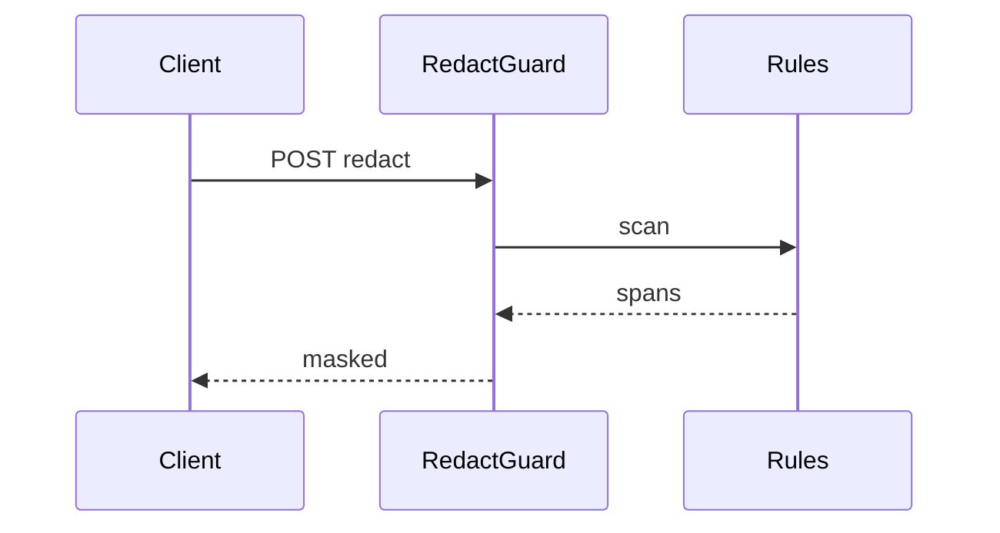

# RedactGuard

*PII and secrets redaction API: detect and mask sensitive spans before LLM calls, logs, or storage.*

> **Domain:** `redactguard.io` (primary), `redactguard.dev` (secondary)
> **Market:** Privacy tech for AI pipelines; developer need to minimize sensitive payloads (2026)

---

## Problem Statement

- Engineers paste user text into LLM prompts and accidentally ship emails, phones, and card patterns to third parties
- Regex-only homegrown filters miss international formats and context-heavy leaks (addresses in prose)
- Compliance reviews ask for audit logs of what was redacted; ad-hoc scripts leave no trail
- Latency budgets require streaming-friendly redaction for chat proxies

---

## Core Features

### Detection and Masking
- Entity types: email, phone, credit card, SSN-style numbers, IBAN, API keys (common prefixes), custom regex list
- Replacement tokens: `[EMAIL]`, `[PHONE]` or hashed placeholders for reversible tier (Enterprise)
- Optional NER assist on Pro for names and locations (user opt-in, region locked)

### Policy Packs
- Named policies per environment: `prod_strict`, `dev_lenient`
- Allowlist for internal domains or test cards

### Audit and Formats
- Audit log: counts per entity type, no raw text stored on default tier
- JSON and plain text endpoints; multipart for small files

---

## Interaction Sequence



---

## API Design

### Core Endpoints

```
POST /api/v1/redact
POST /api/v1/redact/batch
GET  /api/v1/policies
POST /api/v1/policies
GET  /api/v1/usage
GET  /api/v1/health
```

### Request Example
```json
{
  "text": "Reach me at jane@acme.com or 415-555-0100",
  "policy": "prod_strict"
}
```

### Response Example
```json
{
  "redacted_text": "Reach me at [EMAIL] or [PHONE]",
  "spans": [
    {"type": "email", "start": 12, "end": 26},
    {"type": "phone", "start": 30, "end": 42}
  ]
}
```

---

## 7-Day Build Plan

| Day | Focus | Deliverable |
|-----|-------|-------------|
| 1 | Core detector | Regex engine; unit tests on fixtures |
| 2 | API + auth | API keys; POST /redact |
| 3 | Policies | Policy CRUD; merge rules |
| 4 | Batch | Up to N docs per request with size caps |
| 5 | Audit | Aggregate metrics rows; no content on default |
| 6 | Stripe | Free 5k chars/day; Pro higher |
| 7 | Launch | Show HN, security newsletters, outreach to AI proxy startups |

---

## Simple Data Model

```
User:
  id, email, password_hash, created_at

Policy:
  id, user_id, name, rules_json, created_at

RedactionJob:
  id, user_id, policy_id, char_count, entities_json, created_at

APIKey:
  id, user_id, key_hash, tier, created_at

Usage:
  id, api_key_id, endpoint, count, date
```

---

## Revenue Model

| Tier | Price | Includes |
|------|-------|----------|
| Free | $0/month | 50k characters/month, 2 policies, community support |
| Pro | $49/month | 5M characters, NER add-on region, email support |
| Team | $149/month | 25M characters, 10 seats, SSO roadmap |
| Enterprise | Custom | On-prem, reversible tokens, DPA, SLA |

Pay-as-you-go: $2 per extra 1M characters.

---

## Go-to-Market

- **Launch channels:**
  - Product Hunt
  - Indie Hackers
  - Hacker News
  - Reddit r/netsec, r/LLMDevs
- **Direct outreach:** 25 emails to founders building AI support copilots
- **Content hook:** “Strip PII before your LLM call with one POST”
- **Early adopter incentive:** Pro free 90 days for first 12 B2B API users

---

## Stack

- **Backend:** Go (Gin) or Python (FastAPI)
- **Database:** PostgreSQL
- **Auth:** API keys
- **NER optional:** spaCy or cloud NER behind feature flag
- **Deploy:** Fly.io
- **Payments:** Stripe

---

## Market Positioning

- **Target users:** Developers building AI features, logging pipelines, and support tools that must minimize sensitive payloads
- **YC/A16Z alignment:** Privacy-preserving AI; security as default (2026)
- **Key differentiator:** Fast text API with policy packs and audit counts tuned for LLM preflight, not only DLP appliances
- **Closest competitors:**
  - Microsoft Presidio (OSS): powerful; self-host burden; not a hosted metered API out of the box
  - DIY regex: free until incident

---

## Success Metrics (First 90 Days)

- API signups: 400 by day 30
- Paid: 20 by day 30
- MRR: $1,800 by month 3
- Characters processed: 500M by month 1
- False negative reports triaged within 48h SLA (internal)
