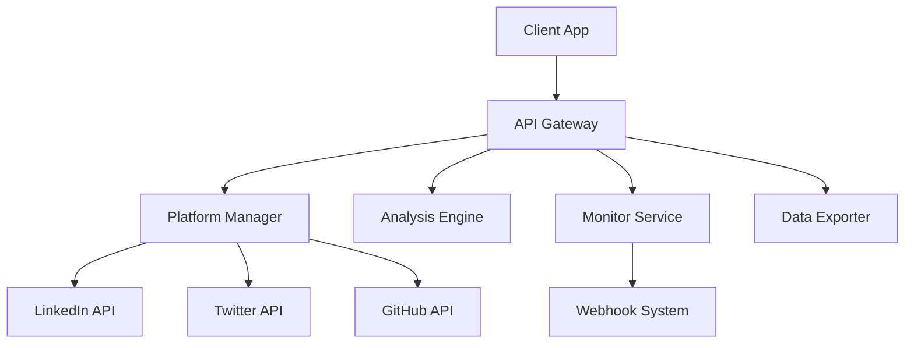

## **Problem Statement**

Managing social media across multiple platforms is fragmented and time-consuming:

- **Manual Management**: No easy way to batch unfollow, remove followers, or manage connections
- **Data Silos**: Each platform keeps your data separate with limited export options  
- **No Cross-Platform Insights**: Can't see connections that exist across multiple platforms
- **Information Overload**: Important updates get lost in constant social media activity

---

## **Solution: SocialBridge API**

SocialBridge is a simple API that connects to your social media accounts and provides unified management capabilities. Perfect for developers building social tools and marketers managing multiple accounts.

---

## **Core Features**

### **1. Connection Management**
```json
POST /api/v1/connections/remove
{
  "platform": "instagram",
  "criteria": "inactive_6months",
  "dry_run": true
}

GET /api/v1/connections/export
{
  "platform": "all",
  "format": "csv"
}
```

### **2. Cross-Platform Analysis**
```json
GET /api/v1/analysis/overlap
{
  "platforms": ["linkedin", "twitter", "github"]
}

GET /api/v1/analysis/network
{
  "platform": "linkedin",
  "depth": 2
}
```

### **3. Activity Monitoring**
```json
POST /api/v1/monitor/setup
{
  "platform": "linkedin",
  "keywords": ["job change", "promotion"],
  "webhook": "https://your-app.com/webhook"
}
```

---

## **API Endpoints**

| Endpoint | Method | Description |
|----------|--------|-------------|
| `/api/v1/auth` | POST | Authenticate with social platforms |
| `/api/v1/connections` | GET | List all connections |
| `/api/v1/connections/remove` | POST | Batch remove connections |
| `/api/v1/connections/export` | GET | Export connection data |
| `/api/v1/analysis/overlap` | GET | Find cross-platform connections |
| `/api/v1/analysis/network` | GET | Get network insights |
| `/api/v1/monitor/setup` | POST | Set up activity monitoring |
| `/api/v1/monitor/events` | GET | Get recent activity events |
| `/api/v1/webhook` | POST | Receive activity notifications |

---

## **Simple Architecture**



---

## **Target Users**

- **Developers** building social media tools and dashboards
- **Marketers** managing multiple social media accounts
- **Agencies** handling client social media management
- **Influencers** with large followings across platforms
- **Recruiters** tracking professional network changes

---

## **Monetization Plan**

### **Free Tier (Launch Day)**
- 1,000 API calls/month
- 2 platform connections
- Basic connection management
- Community support

### **Starter Tier ($29/month)**
- 10,000 API calls/month
- 5 platform connections
- Cross-platform analysis
- Email support

### **Pro Tier ($99/month)**
- 100,000 API calls/month
- Unlimited platforms
- Advanced analytics
- Priority support
- Custom webhooks

### **Enterprise Tier ($299/month)**
- Unlimited API calls
- Dedicated support
- Custom integrations
- SLA guarantees

---

## **7-Day Launch Plan**

### **Day 1-2: Core API Development**
- Set up API framework
- Implement authentication for LinkedIn and Twitter
- Create basic connection listing endpoints

### **Day 3-4: Management Features**
- Add batch connection removal
- Implement data export functionality
- Create cross-platform analysis

### **Day 5-6: Monitoring & Testing**
- Add activity monitoring
- Implement webhook system
- Test with real accounts

### **Day 7: Launch & Marketing**
- Deploy API
- Create documentation
- Launch on Product Hunt and developer communities

---

## **Go-to-Market Strategy**

### **Week 1: Developer Launch**
- Post on Reddit (r/Python, r/webdev, r/socialmedia)
- Share on Hacker News
- Create Twitter thread about the API
- Reach out to 50 developers via LinkedIn/email

### **Week 2-4: Marketing Expansion**
- Write blog posts about social media automation
- Create sample integrations and code examples
- Partner with social media tool developers
- Offer free credits for early adopters

---

## **Key Metrics**

- **API calls per day**
- **Number of signups**
- **Platform connections per user**
- **Customer retention rate**
- **Revenue per customer**

---

## **Success Criteria**

### **Week 1 Success Metrics**
- 50 developer signups
- 1,000 API calls
- 5 paying customers
- $150 in revenue

### **Month 1 Success Metrics**
- 200 developer accounts
- 50,000 API calls per day
- 25 paying customers
- $2,500 monthly recurring revenue

---

## **Risk Mitigation**

| Risk | Mitigation |
|------|------------|
| Platform API changes | Monitor API updates, have fallback plans |
| Low adoption | Focus on developer pain points, iterate quickly |
| Competition | Emphasize simplicity and ease of use |
| Data privacy concerns | Clear privacy policy, no data retention |

---

## **Call to Action**

SocialBridge makes social media management simple for developers and marketers. Connect your accounts once, then use our API to manage everything programmatically.

**Start your free trial at api.socialbridge.com**

---

*Built for developers who want to automate their social media presence.*
