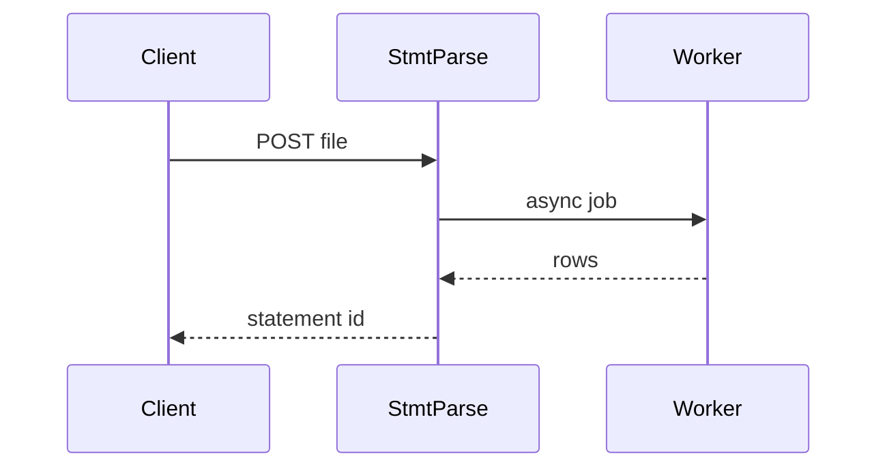

# StmtParse

*Credit statement parsing API: transactions, subscription detection, spend summaries, and webhooks for fintech builders.*

> **Domain:** `stmtparse.io` (primary), `stmtparse.dev` (secondary)
> **Market:** Open banking and personal finance APIs; developers need statement intelligence without building parsers per issuer (2026)

---

## Problem Statement

- PDF and CSV statement layouts differ per issuer; in-house parsers break when banks tweak formats
- Recurring charges hide in line items; users discover unwanted subscriptions late
- Fintech teams want categorized spend and anomaly flags in one response, not three microservices
- PCI and data minimization pressure favors ephemeral processing options and clear retention policies

---

## Core Features

### Ingestion and Parsing
- Upload PDF, CSV, or plain text; async job returns normalized transaction list (date, merchant, amount, type)
- Issuer hint parameter to select template pack (Chase, Amex, generic)
- Idempotent job IDs for safe retries from mobile clients

### Insights
- Subscription candidates: repeating merchant, amount tolerance, interval inference
- Category tagging: rule pack plus optional LLM assist on Pro (user opt-in)
- Month-level totals, top merchants, simple anomaly rules (spike vs trailing average)

### Webhooks
- `statement.parsed`, `subscription.found`, `anomaly.flagged` events with signed payloads

---

## Interaction Sequence



---

## API Design

### Core Endpoints

```
POST /api/v1/statements
GET  /api/v1/statements/{id}
GET  /api/v1/statements/{id}/summary
GET  /api/v1/statements/{id}/subscriptions
POST /api/v1/webhooks
GET  /api/v1/usage
GET  /api/v1/health
```

### Request Example
```json
{
  "format": "pdf",
  "file_base64": "...",
  "issuer_hint": "chase"
}
```

### Response Example
```json
{
  "id": "stmt_01HXYZ",
  "status": "succeeded",
  "transaction_count": 47,
  "total_spend": 1200.5,
  "subscriptions": [
    {"merchant": "Netflix", "amount": 15.99, "interval": "monthly"}
  ]
}
```

---

## 7-Day Build Plan

| Day | Focus | Deliverable |
|-----|-------|-------------|
| 1 | Auth + upload | API keys; multipart and base64 ingest; blob storage |
| 2 | Parser worker | PDF text extract + one issuer template (YAML rules) |
| 3 | CSV path | Column mapping config; same normalized output schema |
| 4 | Subscriptions | Recurrence detector; summary endpoint |
| 5 | Webhooks | Signatures; retry policy; event types |
| 6 | Stripe | Free page-limits; Pro full docs |
| 7 | Launch | Indie Hackers fintech thread, Show HN, 15 outreach to PF app devs |

---

## Simple Data Model

```
User:
  id, email, password_hash, created_at

Statement:
  id, user_id, issuer_hint, format, status, raw_url, created_at

Transaction:
  id, statement_id, date, merchant, amount, category, created_at

SubscriptionCandidate:
  id, statement_id, merchant, amount, interval, confidence

WebhookEndpoint:
  id, user_id, url, secret, events_json, created_at

APIKey:
  id, user_id, key_hash, tier, created_at

Usage:
  id, api_key_id, endpoint, count, date
```

---

## Revenue Model

| Tier | Price | Includes |
|------|-------|----------|
| Free | $0/month | 5 statements, 10 pages each, 30 day retention, community support |
| Pro | $49/month | 200 statements, 50 pages each, 1 year retention, webhooks |
| Scale | $199/month | 2,000 statements, SLA email, dedicated issuer pack requests |
| Enterprise | Custom | On-prem option, custom DPA, zero-retention mode |

Pay-as-you-go: $0.25 per statement after plan limits.

---

## Go-to-Market

- **Launch channels:**
  - Product Hunt
  - Indie Hackers
  - Hacker News
  - Reddit r/fintech, r/personalfinance
- **Direct outreach:** 20 emails to founders building card analytics side projects
- **Content hook:** “One POST: subscriptions + totals from a Chase PDF”
- **Early adopter incentive:** Pro free for 60 days for first 10 shipped integrations

---

## Stack

- **Backend:** Python (FastAPI)
- **Database:** PostgreSQL
- **Auth:** API keys; optional JWT for dashboard
- **Storage:** Encrypted object storage; retention TTL per tier
- **Deploy:** Railway or Fly.io
- **Payments:** Stripe usage meters

---

## Market Positioning

- **Target users:** Fintech developers, indie PF apps, accountants prototyping automation
- **YC/A16Z alignment:** Financial data infrastructure; AI-assisted classification; SMB and consumer fintech (2026)
- **Key differentiator:** Statement-normalized API plus subscription inference plus webhooks in one product
- **Closest competitors:**
  - Veryfi, DocuPipe: broader doc AI; often higher contract floor
  - DIY parsers: cheap until format drift; no unified insight layer

---

## Success Metrics (First 90 Days)

- API signups: 300 by day 30
- Paid: 20 by day 30
- MRR: $2,000 by month 3
- Statements parsed: 15,000 by month 1
- Parser success rate above 92% on supported issuers (measured)
