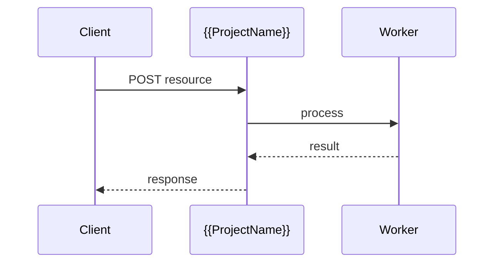

# {{ProjectName}}

*{{One-line description of what the API/service does and its core value.}}*

> **Domain:** `{{projectname}}.io` (primary), `{{projectname}}.dev` (secondary)
> **Market:** {{One-line market size or target context, e.g., "42M developers; $4.5B API tools market (2026)"}}

---

## Problem Statement

<!--
3-5 bullet points. Each = one specific, concrete pain point.
Write from the customer's perspective. No marketing fluff.
-->

- {{Specific pain point 1 that the target user faces today}}
- {{Specific pain point 2 that existing solutions fail to address}}
- {{Specific pain point 3 that creates friction or costs}}
- {{Why the problem is growing or under-served}}

---

## Core Features

<!--
Group features by capability area. Each group = one H3 heading.
Use nested bullets for sub-features. Inline if only one item per group.
-->

### {{Feature Group 1 Name}}
- {{Feature 1a with concrete detail}}
- {{Feature 1b with concrete detail}}

### {{Feature Group 2 Name}}
- {{Feature 2a}}
- {{Feature 2b}}

### {{Feature Group 3 Name}}
{{Inline single feature if only one item.}}

---

## Interaction Sequence



---

## API Design

### Core Endpoints

```
POST /api/v1/{{resource}}
GET  /api/v1/{{resource}}/{id}
PUT  /api/v1/{{resource}}/{id}
DELETE /api/v1/{{resource}}/{id}
GET  /api/v1/usage
GET  /api/v1/health
```

### Request Example
```json
{
  "{{field1}}": "{{value1}}",
  "{{field2}}": "{{value2}}"
}
```

### Response Example
```json
{
  "{{result_field1}}": "{{value}}",
  "{{result_field2}}": [
    {"{{key}}": "{{value}}"}
  ]
}
```

---

## 7-Day Build Plan

| Day | Focus | Deliverable |
|-----|-------|-------------|
| 1 | {{Day 1 focus}} | {{Concrete deliverable - what exists at end of day}} |
| 2 | {{Day 2 focus}} | {{Concrete deliverable}} |
| 3 | {{Day 3 focus}} | {{Concrete deliverable}} |
| 4 | {{Day 4 focus}} | {{Concrete deliverable}} |
| 5 | {{Day 5 focus}} | {{Concrete deliverable}} |
| 6 | {{Day 6 focus}} | {{Concrete deliverable}} |
| 7 | Launch | Product Hunt post, Indie Hackers launch, first 10 customer outreach |

---

## Simple Data Model

```
{{Entity1}}:
  id, {{field1}}, {{field2}}, {{field3}}, created_at

{{Entity2}}:
  id, {{entity1}}_id, {{field1}}, {{field2}}, status, created_at

APIKey:
  id, user_id, key_hash, tier, created_at

Usage:
  id, api_key_id, endpoint, count, date
```

---

## Revenue Model

| Tier | Price | Includes |
|------|-------|----------|
| Free | $0/month | {{X}} {{unit}}/month, {{basic feature}}, community support |
| Pro | ${{X}}/month | {{Y}} {{unit}}/month, {{key feature}}, email support |
| Team | ${{X}}/month | {{Z}} {{unit}}/month, {{advanced feature}}, {{SLA or dashboard}} |
| Enterprise | Custom | Unlimited, custom rules, SLA, dedicated support |

Pay-as-you-go: ${{X}} per {{unit}} after plan limits.

---

## Go-to-Market

- **Launch channels:**
  - Product Hunt (day 7 launch)
  - Indie Hackers (build-in-public thread from day 1)
  - Hacker News (Show HN on launch day)
  - {{Relevant subreddit or community}}
- **Direct outreach:** {{X}} targeted cold emails/DMs to {{specific persona}} in week 1
- **Content hook:** {{Specific blog post or demo angle, e.g., "Add X to your app in 5 minutes"}}
- **Early adopter incentive:** {{e.g., 3 months free Pro for first 20 signups}}

---

## Stack

- **Backend:** {{Python (FastAPI) / Node.js (Express) / Go (Gin)}}
- **Database:** {{PostgreSQL / SQLite / DynamoDB}}
- **Auth:** {{API key via header / JWT}}
- **{{Key library or service}}:** {{what it does}}
- **Deploy:** {{Railway / Render / Fly.io}} (zero-ops for solo launch)
- **Payments:** Stripe (usage-based billing)

---

## Market Positioning

- **Target users:** {{specific developer persona, team size, and their role}}
- **YC/A16Z alignment:** {{which 2026 trend this maps to}}
- **Key differentiator:** {{one sentence on what makes this the best choice for the target user}}
- **Closest competitors:**
  - {{Competitor 1}}: {{what they do and how they fall short}}
  - {{Competitor 2}}: {{what they do and how they fall short}}

---

## Success Metrics (First 90 Days)

- API signups: target {{X}} (free tier) by day 30
- Paid conversions: target {{X}} paying customers by day 30
- MRR target: ${{X}} by month 3
- API calls processed: target {{X}} by end of month 1
- {{Product-specific metric, e.g., accuracy rate, GitHub Marketplace installs}}

