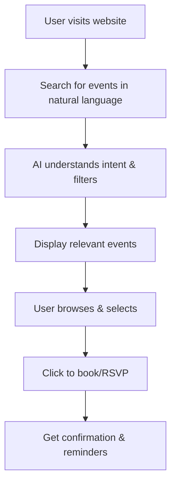

## **Vanyr — Smart Event Discovery Web App**

### Executive Summary

Vanyr is a web application that helps people discover local events by intelligently filtering and recommending activities based on their preferences. Instead of scrolling through endless event listings, users simply describe what they're looking for in natural language ("pub quizzes next Sunday within 5 km, wheelchair accessible, max $10 cover") and receive a curated list of relevant events with booking links.

---

## 1. Problem Landscape

| Pain Point                                                                                    | Why Current Solutions Fail                                                                                                                                  |
| --------------------------------------------------------------------------------------------- | ----------------------------------------------------------------------------------------------------------------------------------------------------------- |
| **Information Overload** – thousands of duplicate or irrelevant events in city-wide listings  | Broad marketplace apps optimize for *inventory*, not *relevance*. Filtering is clunky; users resort to manual searches or social media groups. |
| **Context Blindness** – lack of personalization for schedule, mobility, interests, or budgets | Existing feeds ignore user preferences, real-time constraints, and nuanced intents ("after-work", "introvert-friendly").       |
| **Discovery Gap for Niche Events** – small organizers buried beneath large venues              | Long-tail events (pub quizzes, improv jams, language exchanges) rarely surface in generic rankings or social algorithms.                                    |

---

## 2. Vision & Value Proposition

> **"Find the perfect event for any moment—with context, confidence, and one simple search."**

* **Intelligent Filtering:** Natural language search understands user intent and constraints
* **Personalized Recommendations:** Learns from user preferences and past attendance
* **Real-Time Updates:** Fresh event data with notifications for new or changed events
* **Simple Web Interface:** Works on any device, no app download required

---

## 3. Core Features

| Feature                  | Description                                                                                                                           | Priority |
| --------------------------- | ------------------------------------------------------------------------------------------------------------------------------------- | -------- |
| **Natural Language Search**   | Users describe what they want in plain English ("family-friendly events this weekend under $20") | High     |
| **Smart Filtering**          | Filters by location, time, price, accessibility, and user preferences                               | High     |
| **Event Aggregation**        | Pulls events from multiple sources (ticketing sites, community calendars, social media)            | High     |
| **Personalized Feed**        | Shows events based on user preferences and past behavior                                            | Medium   |
| **Booking Integration**      | Direct links to purchase tickets or RSVP for events                                                 | High     |
| **Notifications**            | Alerts for new events matching user criteria                                                        | Medium   |
| **Social Features**          | Share events with friends, see what others are attending                                            | Low      |

---

## 4. User Journey



---

## 5. Web Application Features

| Feature                    | Description                                                                                | Priority |
| -------------------------- | ------------------------------------------------------------------------------------------ | -------- |
| **Search Interface**        | Simple text input for natural language queries                                              | High     |
| **Event Cards**            | Clean, informative display of event details with images                                     | High     |
| **Filter Panel**            | Advanced filters for location, time, price, accessibility                                   | High     |
| **User Profiles**           | Save preferences, favorite venues, past events                                              | Medium   |
| **Event Details**           | Comprehensive event information, reviews, photos                                            | High     |
| **Booking Flow**            | Seamless integration with ticketing platforms                                               | High     |
| **Mobile Responsive**       | Optimized for mobile devices and tablets                                                    | High     |

---

## 6. Simple Architecture

```
┌────────────┐      ┌────────────┐      ┌─────────────┐
│ Web        │───►│ Event      │───►│ Search      │
│ Interface  │    │ Aggregator │    │ Engine      │
└────────────┘    └────────────┘    └─────────────┘
                         │
                         ▼
                 ┌─────────────────┐
                 │ Recommendation  │
                 │ Engine          │
                 └─────────────────┘
                  │        │
        ┌─────────┘        └───────────┐
        ▼                               ▼
┌─────────────┐                ┌─────────────────┐
│ Booking     │                │ Notification    │
│ Integration │                │ System          │
└─────────────┘                └─────────────────┘
```

---

## 7. Event Sources & Data

| Source Type                | Examples                                    | Integration Method                    |
| -------------------------- | ------------------------------------------- | ------------------------------------- |
| **Ticketing Platforms**    | Eventbrite, Ticketmaster, Meetup           | API integration or web scraping       |
| **Community Calendars**    | City websites, local newspapers, churches   | RSS feeds and calendar imports        |
| **Social Media**           | Facebook Events, Instagram, Twitter         | API access and hashtag monitoring     |
| **Venue Websites**         | Local theaters, restaurants, community centers | Regular web scraping and updates      |
| **User Submissions**       | Community members adding local events       | Simple web form with moderation       |

---

## 8. Monetization Strategy

| Tier                 | Target Users                             | Features & Limits                              | Price    |
| -------------------- | ---------------------------------------- | ------------------------------------------- | -------- |
| **Free**             | General users, casual event-goers         | Basic search, limited filters, ads           | $0       |
| **Premium**          | Active event-goers, professionals         | Advanced filters, no ads, priority support   | $9.99/mo |
| **Business**         | Event organizers, venues                  | Analytics, promotion tools, bulk upload      | $49/mo   |
| **Enterprise**       | Large venues, event companies             | Custom integration, white-label options      | $199/mo  |

**Additional Revenue Streams:**
- Commission from ticket sales (5-10%)
- Featured event placement ($5-20 per event)
- Local business advertising
- Event organizer tools and analytics

---

## 9. Competitive Landscape

| Competitor             | Focus                     | Gap Vanyr Addresses                                   |
| ---------------------- | ------------------------- | ---------------------------------------------------- |
| Generic event apps     | Broad listings only        | Vanyr provides intelligent filtering and personalization |
| Social media events    | Limited discovery tools    | Vanyr aggregates multiple sources with smart search   |
| Local business apps    | Restaurant/bar focused     | Vanyr covers all event types with unified interface   |

---

## 10. Go-To-Market Roadmap

| Phase          | Milestone                                                                                     | Success KPI                                    |
| -------------- | --------------------------------------------------------------------------------------------- | ---------------------------------------------- |
| **Week 1**     | Launch MVP with basic search and event display                                               | 100 users, 50 events listed                    |
| **Week 2-4**   | Add user accounts, preferences, and booking integration                                      | 500 users, 5% conversion to premium            |
| **Month 2-3**  | Expand to multiple cities, add advanced features                                             | 2,000 users, 10% conversion rate               |
| **Month 4-6**  | Partner with event organizers, add business tools                                            | 10,000 users, $5,000 monthly revenue           |

---

## 11. Key Metrics & Success Indicators

| Metric                                       | Target @ 3 months | Target @ 6 months |
| -------------------------------------------- | ----------------- | ----------------- |
| **Active Users**                             | 2,000             | 10,000            |
| **Event Coverage** (vs. total city events)   | 60%               | 80%               |
| **Search Accuracy** (relevant results)       | 75%               | 85%               |
| **Booking Conversion**                       | 15%               | 25%               |
| **Monthly Revenue**                          | $2,000            | $10,000           |
| **User Retention** (30-day)                  | 40%               | 60%               |

---

## 12. 7-Day Launch Plan

**Day 1-2: Core Development**
- Build basic web interface with search functionality
- Implement event data aggregation from 2-3 major sources
- Create simple event display and filtering

**Day 3-4: Search & Intelligence**
- Add natural language processing for search queries
- Implement basic recommendation algorithm
- Build user preference system

**Day 5-6: Monetization & Polish**
- Add user accounts and premium features
- Implement payment processing
- Create booking integration with major platforms

**Day 7: Launch**
- Deploy to web hosting
- Create landing page with examples
- Begin local marketing and partnerships

---

## 13. Risk & Mitigation

| Risk                      | Impact                                      | Mitigation                                                                                 |
| ------------------------- | ------------------------------------------- | ------------------------------------------------------------------------------------------ |
| **Limited Event Data**    | Poor user experience with few events        | Start with major platforms, encourage user submissions, partner with local organizers     |
| **Search Accuracy**       | Users can't find relevant events            | Continuous improvement of search algorithm, user feedback loops                           |
| **Competition**           | Larger players enter the market             | Focus on local markets, build strong user community, unique features                      |
| **Revenue Model**         | Low conversion to paid plans                | Clear value proposition, free trial, multiple revenue streams                             |

---

## 14. Future Extensions

* **AI-Powered Recommendations** – Machine learning to suggest events based on user behavior
* **Group Planning** – Coordinate events with friends and family
* **Event Creation Tools** – Help users create and promote their own events
* **Virtual Events** – Support for online and hybrid events
* **Local Business Integration** – Special offers and deals from nearby businesses
* **Accessibility Features** – Detailed accessibility information for venues and events

---

## 15. Marketing Strategy

1. **Local Partnerships** – Work with local businesses, venues, and event organizers
2. **Social Media** – Share interesting events and user success stories
3. **Content Marketing** – Blog posts about local events, city guides, event planning tips
4. **Referral Program** – Reward users for bringing friends to the platform
5. **Local SEO** – Optimize for "events near me" and city-specific searches

---

## 16. Call for Early Adopters

Event organizers, local businesses, and active community members are invited to join as early partners. Contributors who help populate the platform with quality events receive premium access and promotional opportunities.

---

> **Vanyr** aims to be the go-to platform for discovering amazing local events—making it easy for everyone to find their perfect night out, day trip, or community gathering.
