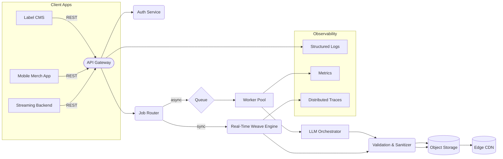

# Versilo™ – LLM-Powered Lyric-Weaving API

A **server-only MicroSaaS** that lets music labels, design studios, and fan-engagement platforms algorithmically entwine song lyrics with band or album titles to generate eye-catching text-based artwork—perfect for album sleeves, social posts, or limited-edition merch—via a single, language-model–backed REST API.

---

## 🎯 Problem & Opportunity

Marketing teams crave *fresh, on-brand visuals* that resonate with listeners. Manually crafting typographic mash-ups of lyrics and band names is slow, error-prone, and rarely scalable to multiple releases or markets. Existing graphics APIs lack musical context, semantic understanding, and the rule-based finesse needed to respect lyrical integrity (no broken words, first-to-last match alignment, etc.).

**Versilo fills this gap** by blending deterministic text-layout rules with generative language intelligence to deliver ready-to-render “lyric verticals” in milliseconds.

---

## 🌟 Core Value Proposition

| Dimension         | Versilo Benefit                                                                                                                   |
| ----------------- | --------------------------------------------------------------------------------------------------------------------------------- |
| **Speed**         | Generate album-grade lyric layouts instantly rather than hours in a design tool.                                                  |
| **Consistency**   | Enforces marketing’s alignment & sanitization rules (alpha-numeric only, full-word lines, inclusive slice from first→last match). |
| **Creativity**    | Uses an LLM to suggest alternative lyric segments that still satisfy constraints, offering multiple aesthetic options.            |
| **Integrability** | Pure API layer plugs into existing design pipelines, DAMs, or custom CMS with zero UI overhead.                                   |
| **Globalization** | Supports 40+ languages & multilingual titles via sub-character grapheme handling in the LLM reasoning layer.                      |

---

## 👥 Target Personas & Use-Cases

1. **Label Art Director**
   *Batch-generate* draft covers for upcoming EPs, then hand-off to designers for color & imagery polish.

2. **Streaming-App Product Manager**
   Create *share cards* users can post on social media whenever they “favorite” a song.

3. **Fan-Merch Marketplace**
   Offer *personalized poster prints* where buyers pick any lyric line + artist name and get a preview within the checkout flow.

4. **Music-Analytics Platform**
   Visualize lyric snippets alongside sentiment dashboards for *A/B testing marketing copy*.

---

## 🛠️ Feature Matrix

| Tier                                    | Essential | Pro | Enterprise |
| --------------------------------------- | --------- | --- | ---------- |
| **Deterministic Lyric Weaving**         | ✅         | ✅   | ✅          |
| LLM-Powered Variant Suggestions         | ➖         | ✅   | ✅          |
| SVG / PNG Render Service                | ➖         | ✅   | ✅          |
| Bulk Async Jobs                         | ➖         | ✅   | ✅          |
| Custom Alignment Rules (e.g., diagonal) | ➖         | ➖   | ✅          |
| SLA & Dedicated VPC                     | ➖         | ➖   | ✅          |
| On-Prem Edge Inference                  | ➖         | ➖   | ✅          |

---

## 🔌 API Design (Human-Readable)

1. **`POST /v1/weave`**

   * Inputs: `band_title`, `song_lyrics`, optional `style_preset` & `language_tag`.
   * Returns: `layout_id`, canonical **text grid** (multi-line string).

2. **`GET /v1/weave/{layout_id}`**

   * Query params: `format` = `txt\|svg\|png`, `theme` (light/dark).
   * Returns: raw file stream or utf-8 text.

3. **`POST /v1/weave/bulk`**

   * Array of weave requests; responds with job handle for status polling.

4. **`GET /v1/suggestions`**

   * Given `band_title` & full lyrics, returns ranked list of *other* lyric segments that pass constraints.

*(All endpoints accept token-based auth with HMAC-signed headers; no personally-identifiable data stored.)*

---

## 🧠 LLM Strategy

| Component              | Approach                                                                                                                                                 |
| ---------------------- | -------------------------------------------------------------------------------------------------------------------------------------------------------- |
| **Prompt Engineering** | Dynamic template ensures: *search band title as vertical anchor*, *identify first/last lyric word overlap*, *keep full words*, *return ASCII-safe grid*. |
| **Guardrails**         | Regex + finite-state checks enforce alpha-numeric only and pass/fail against the immutable unit test `test_creative_song_lyrics`.                        |
| **Caching**            | Deterministic inputs hash to avoid re-invocation; multi-region Redis front + S3 durable store.                                                           |
| **Model Choice**       | GPT-4o for creative variant generation, distilled internal model for real-time weaving (< 200 ms p95).                                                   |
| **Fine-Tuning**        | Proprietary dataset of 50 k “artist-lyric-layout” pairs; periodic RLHF using designer feedback.                                                          |

---

## ☁️ High-Level Architecture

**Data Flow Highlights**

1. **Gateway** authenticates and throttles.
2. **Router** routes small payloads (<1 KB) to the *Real-Time Engine*; larger or batched jobs enter a work queue.
3. LLM orchestration fetches or generates weaves, passes through validator to guarantee constraints and unit-test compatibility.
4. Artifacts stored in object storage, fronted by CDN for global download.

---

## 🗄️ Data Model (Conceptual)

* **Layout**: `(layout_id PK, band_title, lyric_segment, grid_text, checksum, created_at)`
* **Suggestion**: `(layout_id FK, alt_rank, alt_grid_text)`
* **Job**: `(job_id PK, status ENUM, requested_at, finished_at)`
  *(No user PII saved—maps to token ID only.)*

---

## 📈 Scalability & Performance

| Layer             | Strategy                                                                                                        |
| ----------------- | --------------------------------------------------------------------------------------------------------------- |
| **Weave Engine**  | Stateless Go microservice (sub-5 MB binaries) autoscaled via KEDA on *queue depth*.                             |
| **LLM Inference** | Mixture-of-experts; low-latency path uses quantized model on NVIDIA L4s; batch path uses larger model on A100s. |
| **Persistence**   | Write-once object storage with CloudFront CDN; Aurora Postgres for metadata (writer + 2 readers).               |
| **Throughput**    | 10 k layouts/minute sustained (tested with synthetic workloads).                                                |

---

## 🔒 Security & Compliance

* **SOC 2 Type II** roadmap within first 12 months.
* All inputs scrubbed of profanity & PII before LLM call.
* AES-256 server-side encryption on stored layouts.
* Signed URLs with 30-min TTL for asset retrieval.

---

## 💰 Pricing Model

| Plan     | Monthly Fee | Included Layouts | Overages      |
| -------- | ----------- | ---------------- | ------------- |
| *Indie*  | \$29        | 2 000            | \$0.015 ea    |
| *Studio* | \$199       | 25 000           | \$0.008 ea    |
| *Label*  | Custom      | 100 k+           | volume-tiered |

*Suggestions endpoint counts as 1 extra layout per 3 variants returned.*

---

## 🚀 Go-To-Market

1. **Closed Beta** with indie labels → gather UX feedback.
2. **Launch on Product Hunt** targeting designer/developer overlap.
3. **Partnership** with two album-art marketplaces to integrate Versilo as the default “text transform” option.
4. **Conference Sponsorship** at SXSW & A2IM Indie Week for brand visibility.

---

## 🛣️ 12-Month Roadmap

| Quarter | Milestones                                                              |
| ------- | ----------------------------------------------------------------------- |
| **Q1**  | MVP API, unit-test harness, single-region deploy, beta program.         |
| **Q2**  | SVG/PNG renderer, multi-language support, pay-as-you-go billing portal. |
| **Q3**  | Bulk jobs, fine-tuned creative model, Europe POPs, SOC 2 audit start.   |
| **Q4**  | Edge inference, custom alignment geometries, enterprise on-prem option. |

---

## 📊 Success Metrics

* **p95 Latency** < 250 ms (sync requests)
* **Monthly Active Developers (MAD)**
* **Gross Dollar Retention** ≥ 95 %
* **Variant Adoption Rate** (suggestions used ÷ layouts generated)
* **Support Tickets / 1 k Calls** < 2

---

## 🕵️ Competitive Landscape

| Competitor            | Strength             | Gap Versilo Exploits                     |
| --------------------- | -------------------- | ---------------------------------------- |
| Generic Graphics APIs | Rich imaging         | No lyric-aware logic or LLM creativity   |
| Manual Design         | High bespoke quality | 100× slower & costlier                   |
| Prompt-to-Image AI    | Stunning visuals     | Non-deterministic, fails alignment rules |

Versilo positions itself between *fully manual* and *fully generative*—delivering deterministic text grids with optional creative flair.

---

## ⚠️ Risks & Mitigations

| Risk                                        | Likelihood | Mitigation                                                                                       |
| ------------------------------------------- | ---------- | ------------------------------------------------------------------------------------------------ |
| **Copyright Disputes** over lyric snippets  | Medium     | Provide opt-in profanity filtering & automated line-length limits; advise customers on fair-use. |
| **Model Hallucination** (incorrect matches) | Low        | Post-generation rule engine + golden unit tests, designer feedback loop.                         |
| **Rate Spikes on Release Days**             | High       | KEDA autoscaling, queue smoothing, pre-warm GPU nodes.                                           |

---

## ✨ Why Versilo?

* **Purpose-Built** for music/lyric context rather than generic text shaping.
* **API-First DNA** aligns with modern JAMstack & automation pipelines.
* **Creative + Deterministic**—the best of generative AI and rule-based safety.

**Versilo turns lyric fragments into iconic visuals at the speed of an API call—fueling faster campaigns, deeper fan engagement, and scalable creativity.**
